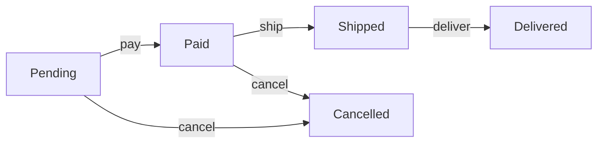

# 10 — Fase 3 (Avançadas): Tickets Detalhados

> Lista completa de tickets para a **Fase 3 (Avançadas)** do Arqel. Features diferenciadoras que posicionam Arqel como line leader em inovação vs Filament e Nova.

## Índice

1. [Visão geral da fase](#1-visão-geral-da-fase)
2. [AI fields (AI)](#2-ai-fields-ai)
3. [Real-time (RT)](#3-real-time-rt)
4. [Workflow engine (WF)](#4-workflow-engine-wf)
5. [Record versioning (VERS)](#5-record-versioning-vers)
6. [Semantic search (SEARCH)](#6-semantic-search-search)
7. [OpenAPI generation (OPENAPI)](#7-openapi-generation-openapi)
8. [Visual tools (VIZ)](#8-visual-tools-viz)
9. [Docs e release (DOCS-V3, GOV-V3)](#9-docs-e-release-docs-v3-gov-v3)
10. [Ordem sugerida de execução](#10-ordem-sugerida-de-execução)

## 1. Visão geral da fase

**Objetivo** (ver `07-roadmap-fases.md` §5): features diferenciadoras — AI-native, real-time collaboration, workflow engine, semantic search, record versioning — que posicionam Arqel como inovador vs Filament e Nova.

**Duração:** 7-10 meses com 3-5 devs.

**Total de tickets Fase 3:** ~70, distribuídos:

| Pacote | Tickets | % |
|---|---|---|
| AI | 15 | 21% |
| RT (Real-time) | 12 | 17% |
| WF (Workflow) | 10 | 14% |
| VERS (Versioning) | 8 | 11% |
| SEARCH (Semantic) | 7 | 10% |
| OPENAPI | 5 | 7% |
| VIZ (Visual tools) | 8 | 11% |
| DOCS-V3 + GOV-V3 | 5 | 7% |

**Critérios de saída** (ver `07-roadmap-fases.md` §5.3):
- AI fields em produção com ≥3 providers (Claude, OpenAI, Ollama)
- Real-time collaboration demo funciona com 5+ users simultâneos
- Workflow engine substitui patterns custom em ≥5 apps pilot
- Record versioning com diff viewer funcional
- 8.000+ GitHub stars
- Menções em Laravel News, PHP Package of the Week
- Enterprise adoption (≥2 empresas Fortune 500 ou equivalente)
- **v1.0.0 estável lançado com LTS**

**Release esperado ao fim:** v1.0.0 (stable, LTS)

---

## 2. AI fields (AI)

### [AI-001] Esqueleto do pacote `arqel-dev/ai`

**Tipo:** feat • **Prioridade:** P0 • **Estimativa:** S • **Camada:** php • **Depende de:** [FIELDS-001] (Fase 1)

**Contexto**

Cobre RF-IN-01 e RF-F-11. AI-assisted fields — translation, summarization, classification, generation, extraction. Principal diferenciador vs Filament e Nova.

**Descrição técnica**

Estrutura `packages/ai/`:

- `composer.json` (deps: `arqel-dev/fields`, suggest: anthropic/anthropic-php, openai-php/client, ollama-laravel)
- `src/AiManager.php` (singleton que gerencia providers)
- `src/Contracts/AiProvider.php`
- `src/Providers/` (ClaudeProvider, OpenAiProvider, OllamaProvider)
- `src/Fields/` (AiTextField, AiSelectField, AiTranslateField, etc.)
- `src/Prompts/` (templates de prompts comuns)
- `src/Http/Controllers/AiCompletionController.php`
- `src/AiServiceProvider.php`
- SKILL.md, tests/

**Critérios de aceite**

- [ ] Pacote resolve via path
- [ ] ServiceProvider discovered
- [ ] Config publishable: `config/arqel-ai.php`
- [ ] SKILL.md esqueleto

**Notas de implementação**

- AI pricing varia drasticamente — user responsável por gerenciar custos.
- Sempre pedir user confirmation antes de invocar AI (avoid runaway costs).

---

### [AI-002] `AiProvider` interface + config

**Tipo:** feat • **Prioridade:** P0 • **Estimativa:** M • **Camada:** php • **Depende de:** [AI-001]

**Contexto**

Abstração sobre providers — user escolhe Claude, OpenAI ou Ollama com mesma API.

**Descrição técnica**

```php
<?php

declare(strict_types=1);

namespace Arqel\Ai\Contracts;

interface AiProvider
{
    public function complete(string $prompt, array $options = []): AiCompletionResult;
    public function chat(array $messages, array $options = []): AiCompletionResult;
    public function embed(string $text): array; // Retorna vector
    public function stream(string $prompt, callable $onChunk, array $options = []): void;
    public function name(): string;
    public function supportsEmbeddings(): bool;
    public function supportsStreaming(): bool;
}

final class AiCompletionResult
{
    public function __construct(
        public readonly string $text,
        public readonly int $inputTokens,
        public readonly int $outputTokens,
        public readonly ?float $estimatedCost,
        public readonly ?string $model,
        public readonly ?array $raw = null,
    ) {}
}
```

Config:

```php
// config/arqel-ai.php
return [
    'default_provider' => env('ARQEL_AI_PROVIDER', 'claude'),
    
    'providers' => [
        'claude' => [
            'driver' => \Arqel\Ai\Providers\ClaudeProvider::class,
            'api_key' => env('ANTHROPIC_API_KEY'),
            'model' => env('ARQEL_AI_CLAUDE_MODEL', 'claude-opus-4-7'),
            'max_tokens' => 4096,
        ],
        'openai' => [
            'driver' => \Arqel\Ai\Providers\OpenAiProvider::class,
            'api_key' => env('OPENAI_API_KEY'),
            'model' => env('ARQEL_AI_OPENAI_MODEL', 'gpt-5'),
            'max_tokens' => 4096,
        ],
        'ollama' => [
            'driver' => \Arqel\Ai\Providers\OllamaProvider::class,
            'base_url' => env('OLLAMA_BASE_URL', 'http://localhost:11434'),
            'model' => env('ARQEL_AI_OLLAMA_MODEL', 'llama3.1'),
        ],
    ],
    
    'cost_tracking' => [
        'enabled' => true,
        'daily_limit_usd' => env('ARQEL_AI_DAILY_LIMIT', 10.0),
        'per_user_limit_usd' => env('ARQEL_AI_USER_LIMIT', 1.0),
    ],
    
    'caching' => [
        'enabled' => true,
        'ttl' => 3600, // seconds
    ],
];
```

**Critérios de aceite**

- [ ] Interface definida com todos métodos
- [ ] AiCompletionResult imutável com token counts
- [ ] Config config publishable
- [ ] Teste: instanciar provider via container

---

### [AI-003] `ClaudeProvider`

**Tipo:** feat • **Prioridade:** P0 • **Estimativa:** L • **Camada:** php • **Depende de:** [AI-002]

**Contexto**

Claude é o provider primário dado o contexto (Claude Code, alinhamento com ecossistema Anthropic).

**Descrição técnica**

Verificar se existe SDK PHP Anthropic oficial em Abril 2026. Se não, usar HTTP client direto.

```php
<?php

declare(strict_types=1);

namespace Arqel\Ai\Providers;

use Arqel\Ai\Contracts\AiProvider;
use Arqel\Ai\AiCompletionResult;
use Illuminate\Support\Facades\Http;

final class ClaudeProvider implements AiProvider
{
    public function __construct(
        private readonly string $apiKey,
        private readonly string $model = 'claude-opus-4-7',
        private readonly int $maxTokens = 4096,
    ) {}

    public function complete(string $prompt, array $options = []): AiCompletionResult
    {
        return $this->chat([
            ['role' => 'user', 'content' => $prompt],
        ], $options);
    }

    public function chat(array $messages, array $options = []): AiCompletionResult
    {
        $response = Http::withHeaders([
            'x-api-key' => $this->apiKey,
            'anthropic-version' => '2023-06-01',
            'content-type' => 'application/json',
        ])->post('https://api.anthropic.com/v1/messages', [
            'model' => $options['model'] ?? $this->model,
            'max_tokens' => $options['max_tokens'] ?? $this->maxTokens,
            'messages' => $messages,
            'system' => $options['system'] ?? null,
            'temperature' => $options['temperature'] ?? null,
        ]);

        if ($response->failed()) {
            throw new AiException(
                "Claude API error: " . $response->body(),
                $response->status()
            );
        }

        $data = $response->json();
        $text = collect($data['content'])
            ->where('type', 'text')
            ->pluck('text')
            ->implode('');

        return new AiCompletionResult(
            text: $text,
            inputTokens: $data['usage']['input_tokens'],
            outputTokens: $data['usage']['output_tokens'],
            estimatedCost: $this->estimateCost(
                $data['usage']['input_tokens'],
                $data['usage']['output_tokens']
            ),
            model: $data['model'],
            raw: $data,
        );
    }

    public function stream(string $prompt, callable $onChunk, array $options = []): void;
    public function embed(string $text): array { throw new UnsupportedException('Claude does not offer embeddings natively'); }
    public function supportsEmbeddings(): bool { return false; }
    public function supportsStreaming(): bool { return true; }
    public function name(): string { return 'claude'; }

    private function estimateCost(int $inputTokens, int $outputTokens): float
    {
        // Pricing Opus 4.7 (verificar em April 2026 via web search)
        $inputCost = $inputTokens * (15.0 / 1_000_000);
        $outputCost = $outputTokens * (75.0 / 1_000_000);
        return round($inputCost + $outputCost, 6);
    }
}
```

**Critérios de aceite**

- [ ] `complete()` funciona com API key válida
- [ ] `chat()` suporta system prompt
- [ ] `stream()` faz SSE consumer
- [ ] Error handling robusto (rate limits, auth, network)
- [ ] Cost tracking em result
- [ ] Teste com mock HTTP responses

**Notas de implementação**

- Verificar pricing atual no launch via web search.
- Claude não oferece embeddings — usar Voyage AI ou OpenAI para embeddings (Fase 3 SEARCH).

---

### [AI-004] `OpenAiProvider`

**Tipo:** feat • **Prioridade:** P0 • **Estimativa:** M • **Camada:** php • **Depende de:** [AI-002]

**Descrição técnica**

Similar a ClaudeProvider. Usar pacote `openai-php/client` se disponível.

Features únicas:
- `embed()` suporta text-embedding-3-small/large
- JSON mode via `response_format: { type: 'json_object' }`
- Function calling (mapeia para our custom workflow)

**Critérios de aceite**

- [ ] Complete/chat/stream funcionam
- [ ] Embed retorna vector 1536d (small) ou 3072d (large)
- [ ] JSON mode disponível via options
- [ ] Teste com mock

---

### [AI-005] `OllamaProvider` (local LLM)

**Tipo:** feat • **Prioridade:** P1 • **Estimativa:** M • **Camada:** php • **Depende de:** [AI-002]

**Contexto**

Ollama permite rodar LLMs localmente. Crucial para enterprise com concerns de privacidade.

**Descrição técnica**

```php
final class OllamaProvider implements AiProvider
{
    public function __construct(
        private readonly string $baseUrl = 'http://localhost:11434',
        private readonly string $model = 'llama3.1',
    ) {}

    public function complete(string $prompt, array $options = []): AiCompletionResult
    {
        $response = Http::post("{$this->baseUrl}/api/generate", [
            'model' => $options['model'] ?? $this->model,
            'prompt' => $prompt,
            'stream' => false,
            'options' => $options['ollama_options'] ?? [],
        ]);
        
        $data = $response->json();
        
        return new AiCompletionResult(
            text: $data['response'],
            inputTokens: $data['prompt_eval_count'] ?? 0,
            outputTokens: $data['eval_count'] ?? 0,
            estimatedCost: 0.0, // Local = free
            model: $data['model'],
            raw: $data,
        );
    }

    public function embed(string $text): array
    {
        $response = Http::post("{$this->baseUrl}/api/embeddings", [
            'model' => 'nomic-embed-text', // Default embedding model
            'prompt' => $text,
        ]);
        
        return $response->json('embedding');
    }

    public function supportsEmbeddings(): bool { return true; }
    public function supportsStreaming(): bool { return true; }
}
```

**Critérios de aceite**

- [ ] Complete funciona contra Ollama local
- [ ] Embeddings via nomic-embed-text
- [ ] Cost sempre 0
- [ ] Teste integration com Ollama container em CI (opcional, skip if Ollama não disponível)

---

### [AI-006] `AiManager` + rate limiting + cost tracking

**Tipo:** feat • **Prioridade:** P0 • **Estimativa:** M • **Camada:** php • **Depende de:** [AI-003, AI-004, AI-005]

**Descrição técnica**

```php
<?php

declare(strict_types=1);

namespace Arqel\Ai;

use Arqel\Ai\Contracts\AiProvider;
use Arqel\Ai\Events\AiCompletionGenerated;
use Arqel\Ai\Exceptions\DailyLimitExceeded;

final class AiManager
{
    public function __construct(
        private readonly array $providers, // resolved from config
        private readonly ?CostTracker $costTracker = null,
        private readonly ?AiCache $cache = null,
    ) {}

    public function provider(?string $name = null): AiProvider
    {
        $name ??= config('arqel-ai.default_provider');
        return $this->providers[$name] ?? throw new \InvalidArgumentException("Provider '$name' not configured");
    }

    public function complete(string $prompt, array $options = []): AiCompletionResult
    {
        if ($this->cache?->has($prompt, $options)) {
            return $this->cache->get($prompt, $options);
        }
        
        $this->costTracker?->assertWithinLimit(auth()->id());
        
        $provider = $this->provider($options['provider'] ?? null);
        $result = $provider->complete($prompt, $options);
        
        $this->costTracker?->record(auth()->id(), $result);
        $this->cache?->put($prompt, $options, $result);
        
        event(new AiCompletionGenerated($result, $provider->name()));
        
        return $result;
    }

    // Similar: chat, embed, stream
}
```

`CostTracker`:

```php
final class CostTracker
{
    public function assertWithinLimit(?int $userId): void
    {
        $dailyLimit = config('arqel-ai.cost_tracking.daily_limit_usd');
        $userLimit = config('arqel-ai.cost_tracking.per_user_limit_usd');
        
        $todayTotal = $this->getCostSince('today');
        if ($todayTotal > $dailyLimit) {
            throw new DailyLimitExceeded("Daily AI limit of \${$dailyLimit} exceeded");
        }
        
        if ($userId) {
            $userTotal = $this->getCostForUserSince($userId, 'today');
            if ($userTotal > $userLimit) {
                throw new UserLimitExceeded("User daily limit of \${$userLimit} exceeded");
            }
        }
    }
    
    public function record(?int $userId, AiCompletionResult $result): void
    {
        AiUsage::create([
            'user_id' => $userId,
            'model' => $result->model,
            'input_tokens' => $result->inputTokens,
            'output_tokens' => $result->outputTokens,
            'cost_usd' => $result->estimatedCost,
        ]);
    }
}
```

**Critérios de aceite**

- [ ] Manager resolve provider por name
- [ ] Cost tracking persiste em DB
- [ ] Limits enforced (per-day, per-user)
- [ ] Cache prevents redundant calls (same prompt = same result)
- [ ] Event disparado
- [ ] Migration: `ai_usage` table
- [ ] Teste: limits, cache hit, cost persistence

---

### [AI-007] Field `AiTextField` (auto-generate text)

**Tipo:** feat • **Prioridade:** P0 • **Estimativa:** L • **Camada:** php + react • **Depende de:** [AI-006]

**Contexto**

Field padrão com botão "Generate with AI" que popula valor.

**Descrição técnica**

PHP:

```php
<?php

declare(strict_types=1);

namespace Arqel\Ai\Fields;

use Arqel\Fields\Types\TextareaField;

final class AiTextField extends TextareaField
{
    protected string $type = 'aiText';
    protected string $component = 'AiTextInput';
    
    protected string|Closure $prompt = '';
    protected ?string $provider = null;
    protected array $aiOptions = [];
    protected array $contextFields = []; // Other form fields to include
    protected ?int $maxLength = 2000;
    protected string $buttonLabel = 'Generate with AI';
    
    public function prompt(string|Closure $prompt): static;
    public function provider(string $name): static;
    public function aiOptions(array $options): static;
    public function contextFields(array $fields): static;
    public function buttonLabel(string $label): static;
    
    public function generate(array $formData): string
    {
        $prompt = $this->resolvePrompt($formData);
        $result = app(AiManager::class)->complete($prompt, array_merge(
            ['provider' => $this->provider],
            $this->aiOptions,
        ));
        
        return $result->text;
    }
    
    private function resolvePrompt(array $formData): string
    {
        $prompt = is_callable($this->prompt) ? ($this->prompt)($formData) : $this->prompt;
        
        // Interpolate {field} placeholders
        foreach ($this->contextFields as $fieldName) {
            $prompt = str_replace("{{$fieldName}}", $formData[$fieldName] ?? '', $prompt);
        }
        
        return $prompt;
    }
}
```

Usage:

```php
Field::aiText('product_description')
    ->prompt('Write a compelling product description based on: Name: {name}, Features: {features}')
    ->contextFields(['name', 'features'])
    ->maxLength(500)
```

Endpoint: `POST /admin/{resource}/fields/{field}/generate`

React `AiTextInput.tsx`:
- Textarea + "Generate with AI" button
- Loading state durante generation
- Click: coleta other form fields, envia para endpoint, recebe text, popula
- Regenerate button
- Edit freely after generation

**Critérios de aceite**

- [ ] Field serializa com config correto
- [ ] Generate endpoint funciona
- [ ] Context fields interpolados em prompt
- [ ] Loading + error states
- [ ] Generated text é editável
- [ ] Policy check: user tem ability 'use-ai' (opt-in)
- [ ] Teste E2E: preencher name + features, clicar generate, verificar output

**Notas de implementação**

- AI response pode exceder maxLength — truncate com indicator.
- Cost exibido em tooltip (transparency).

---

### [AI-008] Field `AiTranslateField`

**Tipo:** feat • **Prioridade:** P0 • **Estimativa:** L • **Camada:** php + react • **Depende de:** [AI-006]

**Contexto**

Translation é feature common. Multi-language admin panels beneficiam muito.

**Descrição técnica**

Field que suporta múltiplas línguas com auto-translate:

```php
Field::aiTranslate('description')
    ->languages(['en', 'pt-BR', 'es', 'fr'])
    ->defaultLanguage('en')
    ->autoTranslate(true); // Auto-translate when default muda
```

Storage: JSON column com estrutura:

```json
{
    "en": "Hello world",
    "pt-BR": "Olá mundo",
    "es": "Hola mundo",
    "fr": "Bonjour le monde"
}
```

React:

- Tabs per language
- "Translate from {default}" button em cada non-default tab
- Bulk "Translate all" button
- Missing translations indicator

**Critérios de aceite**

- [ ] Field armazena multi-lang JSON
- [ ] UI com tabs per language
- [ ] Auto-translate button funcional
- [ ] Missing translation indicator
- [ ] Eloquent cast 'array' funciona
- [ ] Teste: create record em en, translate para pt-BR

---

### [AI-009] Field `AiSelectField` (classify with AI)

**Tipo:** feat • **Prioridade:** P1 • **Estimativa:** M • **Camada:** php + react • **Depende de:** [AI-006]

**Contexto**

Classification via AI: dado contexto, AI escolhe option do select.

**Descrição técnica**

```php
Field::aiSelect('category')
    ->options([
        'tech' => 'Technology',
        'lifestyle' => 'Lifestyle',
        'finance' => 'Finance',
        'health' => 'Health',
    ])
    ->classifyFromFields(['title', 'description'])
    ->prompt('Classify this article into one of the categories based on: Title: {title}, Description: {description}')
```

AI retorna key da option. Validação: resultado deve ser key válida.

**Critérios de aceite**

- [ ] "Classify" button popula select
- [ ] Validação: retorno válido
- [ ] Fallback graceful se AI retorna inválido
- [ ] Teste: classification happy path

---

### [AI-010] Field `AiExtractField` (extract structured data)

**Tipo:** feat • **Prioridade:** P1 • **Estimativa:** L • **Camada:** php + react • **Depende de:** [AI-006]

**Contexto**

Extract: dado um texto livre, AI preenche múltiplos fields estruturados.

**Descrição técnica**

Action-like field que popula outros fields:

```php
Field::aiExtract('extract_from_invoice')
    ->sourceField('raw_text') // Or file upload
    ->extractTo([
        'invoice_number' => 'Invoice number from the document',
        'date' => 'Invoice date in YYYY-MM-DD format',
        'total' => 'Total amount as decimal',
        'vendor' => 'Vendor name',
    ])
    ->usingJsonMode()
```

Pede AI para retornar JSON estruturado. Popula campos correspondentes.

**Critérios de aceite**

- [ ] Extract button processa source
- [ ] Target fields populados corretamente
- [ ] Falha de parse JSON retorna erro claro
- [ ] Teste: invoice sample → fields populated

---

### [AI-011] Field `AiImageField` (image analysis)

**Tipo:** feat • **Prioridade:** P2 • **Estimativa:** L • **Camada:** php + react • **Depende de:** [AI-006]

**Contexto**

Image upload + AI analysis (description, alt text, tagging, moderation).

**Descrição técnica**

Extends ImageField:

```php
Field::aiImage('product_photo')
    ->aiAnalysis([
        'alt_text' => 'Describe this image for accessibility',
        'tags' => 'Extract 5 tags describing this image',
        'moderation' => 'Is this image appropriate for an e-commerce site? yes/no',
    ])
    ->populateFields([
        'alt_text' => 'product_alt_text',
        'tags' => 'product_tags',
    ])
```

Suporta vision models: Claude Opus 4.7 (vision), GPT-5, etc.

**Critérios de aceite**

- [ ] Image upload + auto-analysis
- [ ] Alt text preenchido automaticamente
- [ ] Tags extraídas
- [ ] Moderation check
- [ ] Teste: upload image, verify fields populated

---

### [AI-012] Prompt library + reusable templates

**Tipo:** feat • **Prioridade:** P1 • **Estimativa:** M • **Camada:** php • **Depende de:** [AI-007]

**Contexto**

Prompts comuns (summarize, translate, classify) reutilizáveis.

**Descrição técnica**

```php
<?php

declare(strict_types=1);

namespace Arqel\Ai\Prompts;

final class PromptLibrary
{
    public static function summarize(string $text, int $maxWords = 100): string
    {
        return "Summarize the following text in at most {$maxWords} words:\n\n{$text}";
    }

    public static function translate(string $text, string $targetLang): string
    {
        return "Translate the following text to {$targetLang}. Return only the translation, no explanations:\n\n{$text}";
    }

    public static function classify(string $text, array $categories): string
    {
        $list = implode(', ', $categories);
        return "Classify the following into one of: {$list}. Return only the category name.\n\n{$text}";
    }

    public static function extractJson(string $text, array $schema): string
    {
        $fields = collect($schema)->map(fn ($desc, $field) => "- {$field}: {$desc}")->implode("\n");
        return "Extract the following from the text as JSON:\n{$fields}\n\nText:\n{$text}";
    }

    public static function generateSlug(string $title): string
    {
        return "Generate a URL-friendly slug for: {$title}. Return only the slug, no explanation. Example: 'Hello World' -> 'hello-world'";
    }
}

// Custom prompts:
Arqel::ai()->registerPrompt('company_bio', function (array $data) {
    return "Write a 2-paragraph company bio for {$data['company_name']} in the {$data['industry']} industry.";
});
```

**Critérios de aceite**

- [ ] Built-in prompts funcionam
- [ ] Custom prompts registráveis
- [ ] Teste: cada template retorna resultado sensato

---

### [AI-013] AI-generated MCP tools (docs, Resource analysis)

**Tipo:** feat • **Prioridade:** P2 • **Estimativa:** L • **Camada:** php • **Depende de:** [AI-006, MCP-002] (Fase 2)

**Contexto**

MCP tools que usam AI internamente — ex: "generate Resource from description".

**Descrição técnica**

Expand `arqel-dev/mcp` com tools que chamam AI:

```php
final class GenerateResourceFromDescriptionTool
{
    public function schema(): array
    {
        return [
            'name' => 'generate_resource_from_description',
            'description' => 'Generate an Arqel Resource class from natural language description',
            'inputSchema' => [
                'type' => 'object',
                'properties' => [
                    'description' => ['type' => 'string'],
                    'model_name' => ['type' => 'string'],
                ],
                'required' => ['description', 'model_name'],
            ],
        ];
    }

    public function __invoke(array $params): array
    {
        $prompt = $this->buildPrompt($params['description'], $params['model_name']);
        $result = app(AiManager::class)->complete($prompt);
        
        // Parse AI output, write to file, return
        return [
            'resource_code' => $result->text,
            'suggested_path' => "app/Arqel/Resources/{$params['model_name']}Resource.php",
        ];
    }
}
```

**Critérios de aceite**

- [ ] MCP tool invocável via Claude Code
- [ ] AI gera Resource válido PHP
- [ ] Code é placed em path correto
- [ ] Teste: describe "blog post with title, body, author" → Resource gerada

---

### [AI-014] Testes completos do pacote AI

**Tipo:** test • **Prioridade:** P0 • **Estimativa:** L • **Camada:** php • **Depende de:** [AI-013]

**Descrição técnica**

- Unit tests: Manager, CostTracker, cada Provider (mocked HTTP)
- Feature tests: cada AI field type com mocked AI
- Integration tests: opt-in (requer API keys) com real providers
- Cost limit enforcement tests
- Cache tests
- Coverage ≥ 85%

**Critérios de aceite**

- [ ] Pest passa
- [ ] Coverage ≥ 85%
- [ ] Integration tests skipped gracefully when no API key

---

### [AI-015] SKILL.md + docs AI

**Tipo:** docs • **Prioridade:** P1 • **Estimativa:** M • **Camada:** docs • **Depende de:** [AI-014]

**Descrição técnica**

SKILL.md + docs site:
- Setup providers
- Cost management guide
- Caching strategies
- Prompt engineering tips
- Security: never expose API keys client-side
- Privacy: data sent to AI providers

**Critérios de aceite**

- [ ] SKILL.md completo
- [ ] Guide publicado em docs

---

## 3. Real-time (RT)

### [RT-001] Esqueleto do pacote `arqel-dev/realtime`

**Tipo:** feat • **Prioridade:** P0 • **Estimativa:** S • **Camada:** php • **Depende de:** [CORE-008] (Fase 1)

**Contexto**

Cobre RF-IN-03. Laravel Reverb é nosso WebSocket server (oficial Laravel). Yjs para collaborative editing.

**Descrição técnica**

Estrutura `packages/realtime/`:

- `composer.json` (deps: `arqel-dev/core`, `laravel/reverb`, suggest: sergeytsv/yjs-php para collab)
- `src/Events/` (ResourceUpdated, ActionStarted, etc.)
- `src/Channels/` (ResourceChannel, ActionProgressChannel)
- `src/Presence/` (online users tracking)
- `src/Broadcasting/ReverbIntegration.php`
- `src/Http/Controllers/BroadcastAuthController.php`
- SKILL.md, tests/

**Critérios de aceite**

- [ ] Pacote resolve
- [ ] ServiceProvider discovered
- [ ] Reverb config publishable

**Notas de implementação**

- Reverb substitui Pusher/Soketi em 2026 como default Laravel.
- Alternativa: Laravel Echo + Pusher.com (managed).

---

### [RT-002] Event `ResourceUpdated` broadcasting

**Tipo:** feat • **Prioridade:** P0 • **Estimativa:** M • **Camada:** php • **Depende de:** [RT-001]

**Contexto**

Quando Resource é updated, broadcast para outros users vendo a mesma página.

**Descrição técnica**

```php
<?php

declare(strict_types=1);

namespace Arqel\Realtime\Events;

use Illuminate\Broadcasting\Channel;
use Illuminate\Broadcasting\InteractsWithSockets;
use Illuminate\Broadcasting\PrivateChannel;
use Illuminate\Contracts\Broadcasting\ShouldBroadcast;
use Illuminate\Database\Eloquent\Model;
use Illuminate\Foundation\Events\Dispatchable;
use Illuminate\Queue\SerializesModels;

final class ResourceUpdated implements ShouldBroadcast
{
    use Dispatchable, InteractsWithSockets, SerializesModels;

    public function __construct(
        public readonly string $resourceClass,
        public readonly Model $record,
        public readonly ?int $updatedByUserId = null,
    ) {}

    public function broadcastOn(): array
    {
        $slug = $this->resourceClass::getSlug();
        return [
            new PrivateChannel("arqel.{$slug}"),
            new PrivateChannel("arqel.{$slug}.{$this->record->id}"),
        ];
    }

    public function broadcastWith(): array
    {
        return [
            'id' => $this->record->id,
            'updatedByUserId' => $this->updatedByUserId,
            'updatedAt' => $this->record->updated_at,
        ];
    }
}
```

Auto-dispatch em Resource lifecycle (afterUpdate):

```php
// In Resource base class
public function afterUpdate(Model $record): void
{
    event(new ResourceUpdated(
        resourceClass: static::class,
        record: $record,
        updatedByUserId: auth()->id(),
    ));
}
```

**Critérios de aceite**

- [ ] Event dispatched em update
- [ ] Broadcasts em 2 channels (list + detail)
- [ ] Authorization via broadcast channel
- [ ] Teste: listener recebe event

---

### [RT-003] React hook `useResourceUpdates` + Inertia reload

**Tipo:** feat • **Prioridade:** P0 • **Estimativa:** M • **Camada:** react • **Depende de:** [RT-002]

**Contexto**

Quando record update recebido, reload partial Inertia. Show subtle indicator "Updated by John".

**Descrição técnica**

```typescript
// @arqel-dev/hooks
import { useEffect } from 'react'
import { router } from '@inertiajs/react'
import Echo from 'laravel-echo'

export function useResourceUpdates(resourceSlug: string, recordId?: string | number) {
    useEffect(() => {
        const channel = recordId 
            ? `arqel.${resourceSlug}.${recordId}`
            : `arqel.${resourceSlug}`;
        
        window.Echo.private(channel)
            .listen('.ResourceUpdated', (e) => {
                // Subtle indicator
                showUpdatedToast(e.updatedByUserId);
                
                // Partial reload
                router.reload({
                    only: recordId ? ['record'] : ['records'],
                    preserveScroll: true,
                });
            });
        
        return () => {
            window.Echo.leave(channel);
        };
    }, [resourceSlug, recordId]);
}
```

Default integration em ResourceIndex + ResourceEdit pages.

**Critérios de aceite**

- [ ] Update em outro browser atualiza current view
- [ ] Toast subtle "Updated by {user}"
- [ ] Unsubscribe em unmount
- [ ] Teste: 2 browsers, update em um, verify other updates

---

### [RT-004] Presence channels — online users

**Tipo:** feat • **Prioridade:** P0 • **Estimativa:** L • **Camada:** php + react • **Depende de:** [RT-001]

**Contexto**

Cobre parte de collaboration features. Ver quem está online numa página.

**Descrição técnica**

PHP channel:

```php
// routes/channels.php (published by arqel)
Broadcast::channel('arqel.presence.{resource}.{recordId}', function ($user, $resource, $recordId) {
    // Authorize based on Resource policy
    return [
        'id' => $user->id,
        'name' => $user->name,
        'avatar' => $user->avatar_url ?? null,
    ];
});
```

React:

```typescript
export function useResourcePresence(resourceSlug: string, recordId: string | number) {
    const [onlineUsers, setOnlineUsers] = useState<User[]>([]);
    
    useEffect(() => {
        const channel = window.Echo.join(`arqel.presence.${resourceSlug}.${recordId}`)
            .here((users) => setOnlineUsers(users))
            .joining((user) => setOnlineUsers(prev => [...prev, user]))
            .leaving((user) => setOnlineUsers(prev => prev.filter(u => u.id !== user.id)));
        
        return () => {
            window.Echo.leave(`presence.arqel.presence.${resourceSlug}.${recordId}`);
        };
    }, [resourceSlug, recordId]);
    
    return onlineUsers;
}
```

UI: avatar stack no topo do detail/edit page.

**Critérios de aceite**

- [ ] User join/leave tracked
- [ ] Avatar stack rendered
- [ ] Auto-cleanup em unmount
- [ ] Authorization via channel
- [ ] Teste: 2 browsers, verify both see each other online

---

### [RT-005] Collaborative editing via Yjs — RichTextField

**Tipo:** feat • **Prioridade:** P2 • **Estimativa:** XL • **Camada:** php + react • **Depende de:** [RT-004, FIELDS-ADV-002] (Fase 2)

**Contexto**

Real-time collaboration (Google Docs-like) em RichTextField. Yjs é o CRDT standard.

**Descrição técnica**

Expand Tiptap com Yjs collaboration extension:

```tsx
// RichTextInput with collab
import { useEditor, EditorContent } from '@tiptap/react';
import Collaboration from '@tiptap/extension-collaboration';
import CollaborationCursor from '@tiptap/extension-collaboration-cursor';
import * as Y from 'yjs';
import { WebsocketProvider } from 'y-websocket';

function RichTextCollabInput({ field, value, onChange }) {
    const ydoc = useMemo(() => new Y.Doc(), []);
    const provider = useMemo(() => 
        new WebsocketProvider(`${WS_URL}/yjs`, `arqel.${field.name}.${recordId}`, ydoc),
        [field.name, recordId]
    );
    
    const editor = useEditor({
        extensions: [
            // ... base extensions
            Collaboration.configure({ document: ydoc }),
            CollaborationCursor.configure({ provider, user: currentUser }),
        ],
    });
    
    return <EditorContent editor={editor} />;
}
```

Server-side: Reverb precisa suportar Yjs binary protocol OR usar Yjs's next server.

**Critérios de aceite**

- [ ] 2 users editing mesmo field: changes sync real-time
- [ ] Cursors de cada user visíveis
- [ ] Conflict resolution via CRDT (no conflicts)
- [ ] Persistence: quando todos users saem, save final doc
- [ ] Teste E2E: 2 browsers simultaneamente

**Notas de implementação**

- Yjs é CRDT maduro (Google Docs, Figma-like).
- Storage Yjs snapshots em DB (pacote sergeytsv/yjs-php ou similar).
- Performance: Yjs é efficient, mas 10+ concurrent editors stress test needed.

---

### [RT-006] Real-time widget updates

**Tipo:** feat • **Prioridade:** P1 • **Estimativa:** M • **Camada:** php + react • **Depende de:** [RT-002, WIDGETS-011] (Fase 2)

**Contexto**

Cobre RF-W-09. Dashboard widgets auto-refresh via WebSocket em vez de polling.

**Descrição técnica**

Widget opt-in real-time:

```php
final class TotalUsersStat extends StatWidget
{
    protected function realtime(): bool { return true; }
    
    // Listen to specific events
    protected function realtimeEvents(): array
    {
        return [UserCreated::class, UserDeleted::class];
    }
}
```

Server broadcasts "widget.refresh" event quando listed events occur.

React: widget subscribes to channel, triggers refetch quando event received.

**Critérios de aceite**

- [ ] Widget refresh em tempo real
- [ ] Performance: debounce event flood (max 1 refresh/sec)
- [ ] Fallback polling se WebSocket disconnect
- [ ] Teste: dispatch event → widget refresh

---

### [RT-007] Action progress tracking via Reverb

**Tipo:** feat • **Prioridade:** P0 • **Estimativa:** M • **Camada:** php • **Depende de:** [RT-002, ACTIONS-002] (Fase 1)

**Contexto**

Cobre RF-A-06 (full). Bulk action de 10k records — user precisa ver progress real-time.

**Descrição técnica**

Events:

```php
final class ActionProgress
{
    public function __construct(
        public readonly string $jobId,
        public readonly int $processed,
        public readonly int $total,
        public readonly ?string $message = null,
    ) {}
    
    public function broadcastOn(): array
    {
        return [new PrivateChannel("arqel.action.{$this->jobId}")];
    }
}
```

BulkAction emite em loop:

```php
// In BulkActionJob
foreach ($records->chunk($chunkSize) as $i => $chunk) {
    // Process chunk
    // ...
    
    event(new ActionProgress(
        jobId: $this->jobId,
        processed: ($i + 1) * $chunkSize,
        total: $records->count(),
    ));
}

event(new ActionCompleted($this->jobId));
```

React: ProgressToast subscreve channel, update progress bar.

**Critérios de aceite**

- [ ] Progress em real-time durante bulk action
- [ ] ETA estimate
- [ ] Completion notification
- [ ] Error handling: se job fails, show error
- [ ] Teste E2E: bulk action 1k records, watch progress

---

### [RT-008] Laravel Echo setup + @arqel-dev/realtime npm package

**Tipo:** feat • **Prioridade:** P0 • **Estimativa:** M • **Camada:** react • **Depende de:** [RT-001]

**Descrição técnica**

`@arqel-dev/realtime` npm package:

- Re-exports Laravel Echo configured
- Auto-setup em ArqelProvider
- Hooks exportados: useResourceUpdates, useResourcePresence, useActionProgress, useWidgetRealtime

Configurar em `resources/js/app.tsx`:

```typescript
import { createArqelApp } from '@arqel-dev/react'
import { setupEcho } from '@arqel-dev/realtime'

setupEcho({
    broadcaster: 'reverb',
    key: import.meta.env.VITE_REVERB_APP_KEY,
    wsHost: import.meta.env.VITE_REVERB_HOST,
    wsPort: import.meta.env.VITE_REVERB_PORT ?? 80,
    wssPort: import.meta.env.VITE_REVERB_PORT ?? 443,
    forceTLS: (import.meta.env.VITE_REVERB_SCHEME ?? 'https') === 'https',
})

createArqelApp()
```

**Critérios de aceite**

- [ ] `@arqel-dev/realtime` npm package publicado
- [ ] Echo setup helper
- [ ] Auto-reconnect on disconnect
- [ ] Hooks integram seamlessly
- [ ] Teste E2E: WebSocket connection + events

---

### [RT-009] Broadcasting authorization middleware

**Tipo:** feat • **Prioridade:** P0 • **Estimativa:** M • **Camada:** php • **Depende de:** [RT-001]

**Contexto**

Private channels precisam authorize — não todos users podem escutar events de qualquer Resource.

**Descrição técnica**

Register channels em arqel's routes:

```php
// Published broadcast routes
Broadcast::channel('arqel.{resource}', function ($user, $resource) {
    $resourceClass = app(ResourceRegistry::class)->findBySlug($resource);
    return $resourceClass && Gate::forUser($user)->check('viewAny', $resourceClass::getModel());
});

Broadcast::channel('arqel.{resource}.{recordId}', function ($user, $resource, $recordId) {
    $resourceClass = app(ResourceRegistry::class)->findBySlug($resource);
    $record = $resourceClass::$model::find($recordId);
    return $record && Gate::forUser($user)->check('view', $record);
});

Broadcast::channel('arqel.presence.{resource}.{recordId}', function ($user, $resource, $recordId) {
    $resourceClass = app(ResourceRegistry::class)->findBySlug($resource);
    $record = $resourceClass::$model::find($recordId);
    if (!$record || !Gate::forUser($user)->check('view', $record)) {
        return false;
    }
    return ['id' => $user->id, 'name' => $user->name, 'avatar' => $user->avatar_url];
});

Broadcast::channel('arqel.action.{jobId}', function ($user, $jobId) {
    $job = \Cache::get("arqel.action.{$jobId}.user");
    return $job === $user->id;
});
```

**Critérios de aceite**

- [ ] Authorization enforced server-side
- [ ] User sem permission não recebe broadcasts
- [ ] Presence join denied quando no access
- [ ] Teste: authorized vs unauthorized users

---

### [RT-010] Resilience — reconnect + offline queue

**Tipo:** feat • **Prioridade:** P1 • **Estimativa:** M • **Camada:** react • **Depende de:** [RT-008]

**Contexto**

WebSocket disconnects acontecem. UX graceful crítico.

**Descrição técnica**

- Echo auto-reconnect (built-in)
- Toast "Connection lost. Reconnecting..." durante disconnect
- Queue de events locally durante offline, replay em reconnect (simplificado — apenas emit visual indicator)
- Fallback para Inertia partial reload a cada 30s se WebSocket down

**Critérios de aceite**

- [ ] Disconnect → toast visible
- [ ] Reconnect automático
- [ ] Fallback polling
- [ ] Teste: simulate network drop, verify recovery

---

### [RT-011] Testes completos do pacote RT

**Tipo:** test • **Prioridade:** P0 • **Estimativa:** L • **Camada:** php • **Depende de:** [RT-010]

**Descrição técnica**

- Events broadcasting
- Channel authorization
- Presence join/leave
- Action progress flow
- Teste E2E com real Reverb running (Playwright)
- Coverage ≥ 85%

**Critérios de aceite**

- [ ] Pest + Vitest passam
- [ ] E2E com Reverb funciona

---

### [RT-012] SKILL.md + docs real-time

**Tipo:** docs • **Prioridade:** P1 • **Estimativa:** M • **Camada:** docs • **Depende de:** [RT-011]

**Descrição técnica**

SKILL.md + docs site:
- Setup Reverb + Echo
- Authorization patterns
- Performance considerations (event flood)
- Scaling (multi-server Reverb)
- Yjs collab setup (advanced)

**Critérios de aceite**

- [ ] SKILL.md completo
- [ ] Guide publicado

---

## 4. Workflow engine (WF)

### [WF-001] Esqueleto do pacote `arqel-dev/workflow`

**Tipo:** feat • **Prioridade:** P0 • **Estimativa:** S • **Camada:** php • **Depende de:** [CORE-008] (Fase 1)

**Contexto**

Cobre RF-IN-06. State machines via spatie/laravel-model-states. Wrapper fino que expose UI.

**Descrição técnica**

Estrutura `packages/workflow/`:

- `composer.json` (dep: `arqel-dev/core`, `spatie/laravel-model-states` ^2.5)
- `src/Concerns/HasWorkflow.php`
- `src/Components/StateTransitionField.php`
- `src/WorkflowManager.php`
- `src/Http/Controllers/TransitionController.php`
- SKILL.md, tests/

**Critérios de aceite**

- [ ] Pacote resolve
- [ ] Wraps spatie/laravel-model-states corretamente

---

### [WF-002] Trait `HasWorkflow` + convenções

**Tipo:** feat • **Prioridade:** P0 • **Estimativa:** L • **Camada:** php • **Depende de:** [WF-001]

**Contexto**

Convenções para expose states + transitions ao Arqel.

**Descrição técnica**

User declara states em model via spatie pattern:

```php
class Order extends Model
{
    use HasStates;
    use HasWorkflow; // Arqel's
    
    protected $casts = [
        'state' => OrderState::class,
    ];
    
    public function arqelWorkflow(): WorkflowDefinition
    {
        return WorkflowDefinition::make('order_state')
            ->states([
                OrderState\Pending::class => ['label' => 'Pending', 'color' => 'warning', 'icon' => 'clock'],
                OrderState\Paid::class => ['label' => 'Paid', 'color' => 'info', 'icon' => 'credit-card'],
                OrderState\Shipped::class => ['label' => 'Shipped', 'color' => 'primary', 'icon' => 'truck'],
                OrderState\Delivered::class => ['label' => 'Delivered', 'color' => 'success', 'icon' => 'check-circle'],
                OrderState\Cancelled::class => ['label' => 'Cancelled', 'color' => 'destructive', 'icon' => 'x-circle'],
            ])
            ->transitions([
                PendingToPaid::class,
                PaidToShipped::class,
                ShippedToDelivered::class,
                AnyToCancelled::class,
            ]);
    }
}
```

`WorkflowDefinition`: fluent builder that expose metadata.

**Critérios de aceite**

- [ ] Trait integra com spatie states
- [ ] Metadata expose label, color, icon per state
- [ ] Transitions discoverable
- [ ] Teste: model com state, transitions funcionam

---

### [WF-003] Field `StateTransitionField`

**Tipo:** feat • **Prioridade:** P0 • **Estimativa:** L • **Camada:** php + react • **Depende de:** [WF-002]

**Contexto**

Display state current + botões para transitions disponíveis.

**Descrição técnica**

```php
Field::stateTransition('state')
    ->showDescription(true)
    ->showHistory(true)
```

Serializa:
- Current state: label + color + icon
- Available transitions: list com labels + authorize
- Transition history: audit log

React UI:
- Large pill com current state
- Buttons per available transition (nome, icon, color)
- Timeline of past transitions
- Transitions podem exigir form (ex: "Cancel order" requires reason)

**Critérios de aceite**

- [ ] Current state visível
- [ ] Transition buttons apenas para valid next states
- [ ] Authorization check (policy can-transition)
- [ ] Transition com form (optional)
- [ ] History timeline
- [ ] Teste E2E: transition happy path

---

### [WF-004] Transitions com side effects (events, notifications)

**Tipo:** feat • **Prioridade:** P0 • **Estimativa:** M • **Camada:** php • **Depende de:** [WF-003]

**Contexto**

Transitions frequentemente disparam side effects: send email, update inventory, notify users.

**Descrição técnica**

spatie/laravel-model-states oferece Transition classes:

```php
class PendingToPaid extends Transition
{
    public function __construct(public readonly Order $order) {}
    
    public function handle(): Order
    {
        $this->order->state = new Paid($this->order);
        $this->order->save();
        
        // Side effects
        event(new OrderPaid($this->order));
        $this->order->user->notify(new OrderPaidNotification($this->order));
        
        return $this->order;
    }
}
```

Arqel wraps isso com:
- Pre/post transition hooks
- Auto-audit log entry
- Broadcasting event para real-time UI update

**Critérios de aceite**

- [ ] Transition execute fires events
- [ ] Audit log automatic
- [ ] Real-time broadcast para listeners
- [ ] Teste: transition with side effects

---

### [WF-005] Workflow visualizer (basic)

**Tipo:** feat • **Prioridade:** P1 • **Estimativa:** L • **Camada:** react • **Depende de:** [WF-002]

**Contexto**

Diagrama do state machine. Útil para admin understanding + docs.

**Descrição técnica**

Auto-gerar diagrama Mermaid:



React component renderiza via `react-mermaid2` ou similar. Mostra estado current destacado.

**Critérios de aceite**

- [ ] Mermaid graph generated
- [ ] Current state highlighted
- [ ] Transitions labeled
- [ ] Teste: render from definition

**Notas de implementação**

- Fase 4: visual drag-drop editor.

---

### [WF-006] Transition authorization via Policies

**Tipo:** feat • **Prioridade:** P0 • **Estimativa:** M • **Camada:** php • **Depende de:** [WF-003]

**Descrição técnica**

Per-transition policy check:

```php
class OrderPolicy
{
    public function markAsPaid(User $user, Order $order): bool
    {
        return $user->hasRole('cashier') && $order->state instanceof Pending;
    }
    
    public function ship(User $user, Order $order): bool
    {
        return $user->hasRole('warehouse') && $order->state instanceof Paid;
    }
}
```

Arqel convention: transition name maps to policy method via slug-to-camelCase:

```
PendingToPaid → markAsPaid (user defines this naming convention)
```

OU transition class expõe `authorizeFor($user)` method:

```php
class PendingToPaid extends Transition
{
    public function authorizeFor(?User $user): bool
    {
        return $user?->hasRole('cashier');
    }
}
```

**Critérios de aceite**

- [ ] Unauthorized transitions hidden from UI
- [ ] Server-side check prevents unauthorized calls
- [ ] Clear error messages
- [ ] Teste: authorized vs unauthorized transition

---

### [WF-007] State history + audit

**Tipo:** feat • **Prioridade:** P0 • **Estimativa:** M • **Camada:** php • **Depende de:** [WF-004, AUDIT-001] (Fase 2)

**Contexto**

Track every transition: from, to, who, when, optional reason.

**Descrição técnica**

Migration:

```sql
CREATE TABLE arqel_state_transitions (
    id PRIMARY KEY,
    model_type VARCHAR(255),
    model_id BIGINT,
    from_state VARCHAR(255),
    to_state VARCHAR(255),
    transitioned_by_user_id BIGINT NULLABLE,
    metadata JSON NULLABLE,
    created_at TIMESTAMP
);
```

Auto-register em BelongsToTenant-like trait. Query history:

```php
$order->stateTransitions()->with('user')->latest()->get();
```

**Critérios de aceite**

- [ ] Every transition logged
- [ ] Metadata (reason, etc.) armazenada
- [ ] Query via relationship
- [ ] UI timeline shows history
- [ ] Teste: transition → log created

---

### [WF-008] Filter records by state em Table

**Tipo:** feat • **Prioridade:** P0 • **Estimativa:** S • **Camada:** php • **Depende de:** [WF-002, TABLE-004] (Fase 1)

**Contexto**

Common: "show only Paid orders".

**Descrição técnica**

Built-in filter:

```php
Table::make()
    ->filters([
        Filter::state('state', OrderState::class),
    ])
```

`StateFilter` auto-generates options from state class registry.

**Critérios de aceite**

- [ ] Filter dropdown with all states
- [ ] Labels + colors from metadata
- [ ] Query filters correctly
- [ ] Teste: filter por state

---

### [WF-009] Testes do WF + SKILL.md

**Tipo:** test + docs • **Prioridade:** P0 • **Estimativa:** M • **Camada:** php + docs • **Depende de:** [WF-008]

**Descrição técnica**

- Unit tests: WorkflowDefinition, StateTransitionField
- Feature tests: full transition flow com policy + side effects + history
- E2E: UI transition + history rendering
- SKILL.md: spatie integration, common patterns, anti-patterns

**Critérios de aceite**

- [ ] Coverage ≥ 85%
- [ ] SKILL.md completo

---

### [WF-010] Docs + example workflows (order, article, subscription)

**Tipo:** docs • **Prioridade:** P1 • **Estimativa:** M • **Camada:** docs • **Depende de:** [WF-009]

**Descrição técnica**

Docs site com 3 workflow examples completos:

- Order states (e-commerce)
- Article states (CMS: draft, review, published, archived)
- Subscription states (SaaS billing)

**Critérios de aceite**

- [ ] 3 examples em repo `examples/`
- [ ] Docs pages per example

---

## 5. Record versioning (VERS)

### [VERS-001] Esqueleto do pacote `arqel-dev/versioning`

**Tipo:** feat • **Prioridade:** P0 • **Estimativa:** S • **Camada:** php • **Depende de:** [CORE-008] (Fase 1)

**Contexto**

Cobre RF-IN-05. Time-travel para records: ver histórico, restaurar versão anterior.

**Descrição técnica**

Estrutura `packages/versioning/`:

- `composer.json` (dep: `arqel-dev/core`)
- `src/Concerns/Versionable.php` (trait)
- `src/Models/Version.php`
- `src/VersionManager.php`
- `src/Actions/RestoreVersionAction.php`
- `src/Http/Controllers/VersionHistoryController.php`
- SKILL.md, tests/

**Critérios de aceite**

- [ ] Pacote resolve
- [ ] Migration para `versions` table

---

### [VERS-002] Trait `Versionable` + hooks auto-version

**Tipo:** feat • **Prioridade:** P0 • **Estimativa:** M • **Camada:** php • **Depende de:** [VERS-001]

**Descrição técnica**

```php
<?php

declare(strict_types=1);

namespace Arqel\Versioning\Concerns;

trait Versionable
{
    public static function bootVersionable(): void
    {
        static::created(fn ($model) => $model->createVersion('created'));
        static::updating(fn ($model) => $model->createVersionFromChanges());
        static::deleting(fn ($model) => $model->createVersion('deleted'));
    }

    public function versions(): MorphMany
    {
        return $this->morphMany(Version::class, 'versionable');
    }

    public function createVersion(string $event): Version
    {
        return $this->versions()->create([
            'event' => $event,
            'data' => $this->getVersionableAttributes(),
            'created_by_user_id' => auth()->id(),
        ]);
    }

    public function createVersionFromChanges(): void
    {
        $changes = $this->getDirty();
        if (!empty($changes)) {
            $this->versions()->create([
                'event' => 'updated',
                'data' => $this->getVersionableAttributes(), // Full snapshot
                'changes' => $changes, // Just diff
                'created_by_user_id' => auth()->id(),
            ]);
        }
    }

    protected function getVersionableAttributes(): array
    {
        return $this->only($this->getFillable());
    }

    public function restoreToVersion(Version $version): self
    {
        $this->fill($version->data);
        $this->save();
        return $this;
    }

    public function versionAt(\DateTimeInterface $date): ?Version
    {
        return $this->versions()
            ->where('created_at', '<=', $date)
            ->latest()
            ->first();
    }
}
```

Version model:

```php
final class Version extends Model
{
    protected $casts = [
        'data' => 'array',
        'changes' => 'array',
    ];

    public function versionable(): MorphTo { return $this->morphTo(); }
    public function createdBy(): BelongsTo { return $this->belongsTo(User::class, 'created_by_user_id'); }
    
    public function diff(Version $other): array;
}
```

**Critérios de aceite**

- [ ] Every CRUD operation creates Version
- [ ] Version snapshots fillable attributes
- [ ] Changes field tracks only diff
- [ ] `restoreToVersion()` funciona
- [ ] `versionAt($date)` retorna version correta
- [ ] Teste: create, update, verify versions

**Notas de implementação**

- Storage growth — GB per million records. Configurable retention policy (Fase 4).

---

### [VERS-003] Resource version history tab

**Tipo:** feat • **Prioridade:** P0 • **Estimativa:** L • **Camada:** php + react • **Depende de:** [VERS-002]

**Descrição técnica**

Se Resource model usa Versionable trait, auto-add "History" tab em detail page.

Endpoint: `GET /admin/{resource}/{id}/versions`

React: timeline list of versions com:
- Date/time + user
- Event type (created/updated/deleted)
- Summary of changes ("Changed name from 'X' to 'Y'")
- "View" button → diff viewer
- "Restore to this version" button (with policy check)

**Critérios de aceite**

- [ ] History tab appears
- [ ] Timeline renders corretamente
- [ ] Click version → diff viewer
- [ ] Restore action funcional
- [ ] Teste E2E: edit → view history → restore

---

### [VERS-004] Diff viewer component

**Tipo:** feat • **Prioridade:** P0 • **Estimativa:** L • **Camada:** react • **Depende de:** [VERS-003]

**Contexto**

Visual diff between 2 versions. Clean UX critical.

**Descrição técnica**

React component:

- Side-by-side: old vs new
- Field-by-field comparison
- Highlight differences: added (green), removed (red), changed (yellow)
- Long text: line-by-line diff (usar `diff` lib)
- JSON fields: pretty-print + diff

**Critérios de aceite**

- [ ] Side-by-side layout
- [ ] Field highlights corretos
- [ ] Long text line diff
- [ ] JSON deep diff
- [ ] A11y: screen readers podem ler diff
- [ ] Teste: diff com tipos variados de fields

---

### [VERS-005] Restore action com confirmation

**Tipo:** feat • **Prioridade:** P0 • **Estimativa:** M • **Camada:** php + react • **Depende de:** [VERS-002]

**Descrição técnica**

Endpoint: `POST /admin/{resource}/{id}/versions/{version}/restore`

```php
public function restore(Request $request, string $resource, string $id, int $versionId)
{
    $resourceClass = $this->registry->findBySlug($resource);
    $record = $resourceClass::$model::findOrFail($id);
    $this->authorize('update', $record);
    
    $version = $record->versions()->findOrFail($versionId);
    
    // Restore creates a new Version entry (so we can "undo restore")
    $record->restoreToVersion($version);
    
    session()->flash('success', "Restored to version from {$version->created_at}");
    return back();
}
```

React: modal de confirmação "Are you sure you want to restore to version from {date}? This will create a new version."

**Critérios de aceite**

- [ ] Restore cria new version (reversível)
- [ ] Confirmation modal
- [ ] Authorization check
- [ ] Success feedback
- [ ] Teste Feature: restore happy path

---

### [VERS-006] Retention policy + cleanup job

**Tipo:** feat • **Prioridade:** P1 • **Estimativa:** M • **Camada:** php • **Depende de:** [VERS-002]

**Contexto**

Storage grows unbounded. Precisa policy: keep only N versions OR versions younger than X days.

**Descrição técnica**

Config:

```php
// config/arqel.php
'versioning' => [
    'retention' => [
        'max_versions_per_record' => 50,
        'max_age_days' => 365,
    ],
],
```

Scheduled job `CleanupOldVersionsJob` runs daily.

**Critérios de aceite**

- [ ] Cleanup job implementado
- [ ] Config respeitado
- [ ] Never deleta "restore points" marcados
- [ ] Teste: setup 100 versions, run job, verify cleanup

---

### [VERS-007] Testes + SKILL.md VERS

**Tipo:** test + docs • **Prioridade:** P0 • **Estimativa:** M • **Camada:** php + docs • **Depende de:** [VERS-006]

**Descrição técnica**

- Tests: trait, manager, restore, cleanup
- E2E: complete versioning flow
- SKILL.md: setup, retention, performance (table size management), compatibility com activity log

**Critérios de aceite**

- [ ] Coverage ≥ 85%
- [ ] SKILL.md completo

---

### [VERS-008] Docs: when versioning vs audit log

**Tipo:** docs • **Prioridade:** P1 • **Estimativa:** S • **Camada:** docs • **Depende de:** [VERS-007]

**Descrição técnica**

Docs comparando:
- Audit log: "what happened, by whom, when" (low storage, forensic)
- Versioning: "what was the state, can restore" (high storage, time-travel)
- When use each

**Critérios de aceite**

- [ ] Guide published

---

## 6. Semantic search (SEARCH)

### [SEARCH-001] Esqueleto do pacote `arqel-dev/search`

**Tipo:** feat • **Prioridade:** P0 • **Estimativa:** S • **Camada:** php • **Depende de:** [AI-006]

**Contexto**

Cobre RF-T-16 e RF-IN-02. Semantic search via embeddings (vector similarity).

**Descrição técnica**

Estrutura `packages/search/`:

- `composer.json` (deps: `arqel-dev/core`, `arqel-dev/ai`, suggest: pgvector/pgvector-php)
- `src/Concerns/Searchable.php` (trait)
- `src/SemanticSearchManager.php`
- `src/Drivers/` (PgvectorDriver, QdrantDriver — Fase 4)
- `src/Http/Controllers/SemanticSearchController.php`
- SKILL.md, tests/

**Critérios de aceite**

- [ ] Pacote resolve
- [ ] Pgvector migration opcional

**Notas de implementação**

- Postgres + pgvector é standard 2026 para semantic search.
- Alternative: Qdrant (Fase 4).

---

### [SEARCH-002] Trait `Searchable` + embeddings generation

**Tipo:** feat • **Prioridade:** P0 • **Estimativa:** L • **Camada:** php • **Depende de:** [SEARCH-001]

**Descrição técnica**

```php
<?php

declare(strict_types=1);

namespace Arqel\Search\Concerns;

trait Searchable
{
    public static function bootSearchable(): void
    {
        static::saved(function ($model) {
            if ($model->shouldRegenerateEmbeddings()) {
                dispatch(new GenerateEmbeddingsJob($model));
            }
        });
    }

    public function toSearchableArray(): array
    {
        return $this->only($this->getSearchableFields() ?? ['name', 'description']);
    }

    public function searchableContent(): string
    {
        $array = $this->toSearchableArray();
        return collect($array)->map(fn ($v, $k) => "{$k}: {$v}")->implode("\n");
    }

    public function getSearchableFields(): array
    {
        return $this->searchableFields ?? [];
    }

    public function shouldRegenerateEmbeddings(): bool
    {
        $searchable = $this->getSearchableFields();
        return !empty(array_intersect(array_keys($this->getDirty()), $searchable));
    }
}
```

Usage:

```php
class Post extends Model
{
    use Searchable;

    protected array $searchableFields = ['title', 'body'];
}
```

Migration:

```sql
ALTER TABLE posts ADD COLUMN embedding vector(1536);
```

**Critérios de aceite**

- [ ] Trait queues embedding generation em save
- [ ] Content extraction funciona
- [ ] Embeddings column configurable
- [ ] Teste: save record, job dispatched

---

### [SEARCH-003] `GenerateEmbeddingsJob` + PgvectorDriver

**Tipo:** feat • **Prioridade:** P0 • **Estimativa:** M • **Camada:** php • **Depende de:** [SEARCH-002]

**Descrição técnica**

```php
final class GenerateEmbeddingsJob implements ShouldQueue
{
    public function __construct(public readonly Model $model) {}

    public function handle(AiManager $ai): void
    {
        $content = $this->model->searchableContent();
        $embedding = $ai->provider()->embed($content);
        
        $this->model->embedding = $embedding; // pgvector cast
        $this->model->saveQuietly(); // Don't retrigger saved event
    }
}
```

PgvectorDriver para queries:

```php
final class PgvectorDriver
{
    public function search(string $query, string $modelClass, int $limit = 10): Collection
    {
        $embedding = app(AiManager::class)->provider()->embed($query);
        $vectorStr = '[' . implode(',', $embedding) . ']';
        
        return $modelClass::query()
            ->selectRaw("*, embedding <=> '{$vectorStr}'::vector AS distance")
            ->whereNotNull('embedding')
            ->orderBy('distance')
            ->limit($limit)
            ->get();
    }
}
```

**Critérios de aceite**

- [ ] Job generates + saves embedding
- [ ] Search retorna results ordered by similarity
- [ ] Teste: save, queue job, verify embedding saved
- [ ] Teste: semantic query retorna relevant results

**Notas de implementação**

- Pgvector extension deve estar instalada (documentar em setup).
- Embedding dimension varies by model (OpenAI 1536, Voyage 1024, Nomic 768).

---

### [SEARCH-004] Table global search com semantic mode

**Tipo:** feat • **Prioridade:** P0 • **Estimativa:** M • **Camada:** php + react • **Depende de:** [SEARCH-003, TABLE-010] (Fase 1)

**Contexto**

Extend table search com toggle "Semantic" vs "Literal".

**Descrição técnica**

```php
Table::make()
    ->searchable(mode: 'semantic') // OR 'literal' OR 'auto'
```

Auto mode: se query is long (>3 words) use semantic, senão literal.

React: toggle switch "⚡ Semantic" no search input.

Backend query via PgvectorDriver quando semantic.

**Critérios de aceite**

- [ ] Toggle UI
- [ ] Semantic mode usa vector search
- [ ] Literal mode usa LIKE
- [ ] Auto decides automagically
- [ ] Performance: semantic search <200ms em 100k records
- [ ] Teste: semantic finds related items, literal finds exact

---

### [SEARCH-005] Command palette integration — semantic nav

**Tipo:** feat • **Prioridade:** P1 • **Estimativa:** M • **Camada:** php • **Depende de:** [SEARCH-004, CMDPAL-001] (Fase 2)

**Contexto**

Command palette pode usar semantic search para melhor match de commands.

**Descrição técnica**

Commands têm embeddings pre-computed (build time). Query com fuzzy OR semantic.

**Critérios de aceite**

- [ ] Search "customer management" retorna Users resource (even if label is "Users")
- [ ] Embeddings cached, performance OK
- [ ] Teste: semantic command search

---

### [SEARCH-006] Testes + SKILL.md SEARCH

**Tipo:** test + docs • **Prioridade:** P0 • **Estimativa:** M • **Camada:** php + docs • **Depende de:** [SEARCH-005]

**Descrição técnica**

- Tests: embedding generation, vector search, trait integration
- Integration test: Postgres com pgvector
- SKILL.md: setup pgvector, embedding model choice, cost considerations

**Critérios de aceite**

- [ ] Coverage ≥ 80% (harder with DB integration)
- [ ] SKILL.md completo

---

### [SEARCH-007] Docs + migration guide (add semantic to existing resource)

**Tipo:** docs • **Prioridade:** P1 • **Estimativa:** M • **Camada:** docs • **Depende de:** [SEARCH-006]

**Descrição técnica**

Migration guide:
1. Install pgvector in DB
2. Run migration to add embedding column
3. Backfill embeddings for existing records via `php artisan arqel:search:index User`
4. Enable semantic search em Table

**Critérios de aceite**

- [ ] Guide publicado
- [ ] Artisan command para backfill implementado

---

## 7. OpenAPI generation (OPENAPI)

### [OPENAPI-001] Esqueleto + `arqel:openapi:generate` command

**Tipo:** feat • **Prioridade:** P0 • **Estimativa:** L • **Camada:** php • **Depende de:** [CORE-008] (Fase 1)

**Contexto**

Cobre RF-IN-08. Auto-gerar OpenAPI spec para Resources, expose como REST API opt-in.

**Descrição técnica**

Estrutura `packages/openapi/`:

- `composer.json` (deps: `arqel-dev/core`)
- `src/SpecGenerator.php`
- `src/Commands/GenerateOpenApiCommand.php`
- `src/Http/Controllers/ApiResourceController.php` (generic REST controller)
- `src/Http/Middleware/ApiAuthMiddleware.php`
- SKILL.md, tests/

Command:

```bash
php artisan arqel:openapi:generate --output=openapi.json
php artisan arqel:openapi:generate --resource=UserResource
```

**Critérios de aceite**

- [ ] Command implementado
- [ ] Output JSON valid OpenAPI 3.1

---

### [OPENAPI-002] Spec generation de Resources

**Tipo:** feat • **Prioridade:** P0 • **Estimativa:** XL • **Camada:** php • **Depende de:** [OPENAPI-001]

**Descrição técnica**

Generate spec completa:

- Paths per Resource: GET/POST/PUT/DELETE
- Schemas from Fields (rules → OpenAPI types)
- Request bodies from form schemas
- Responses: success, validation error, authorization error
- Auth: Sanctum tokens assumed

Ex:

```yaml
paths:
  /api/users:
    get:
      summary: List users
      parameters:
        - name: page
        - name: per_page
        - name: search
      responses:
        200:
          content:
            application/json:
              schema:
                $ref: '#/components/schemas/UserCollection'
    post:
      summary: Create user
      requestBody:
        content:
          application/json:
            schema:
              $ref: '#/components/schemas/UserCreateInput'
      responses:
        201:
          content:
            application/json:
              schema:
                $ref: '#/components/schemas/User'
        422:
          content:
            application/json:
              schema:
                $ref: '#/components/schemas/ValidationError'
```

**Critérios de aceite**

- [ ] Spec válida OpenAPI 3.1 (valide with openapi-tools)
- [ ] Todos Resources presentes
- [ ] Field types mapeados corretamente
- [ ] Teste: generate + validate with openapi-schema-validator

---

### [OPENAPI-003] REST API endpoints opt-in

**Tipo:** feat • **Prioridade:** P0 • **Estimativa:** L • **Camada:** php • **Depende de:** [OPENAPI-002]

**Contexto**

Resources podem expor REST API além do Inertia panels.

**Descrição técnica**

```php
Arqel::panel('admin')
    ->exposeApi(['users' => UserResource::class, 'posts' => PostResource::class])
    ->apiPrefix('/api/v1')
    ->apiMiddleware(['auth:sanctum']);
```

Gera rotas:

- `GET /api/v1/users`
- `POST /api/v1/users`
- `GET /api/v1/users/{id}`
- `PUT /api/v1/users/{id}`
- `DELETE /api/v1/users/{id}`

Reuses ResourceController logic but returns JSON ao invés de Inertia.

**Critérios de aceite**

- [ ] Endpoints funcionam
- [ ] Auth via Sanctum
- [ ] Validation errors 422 JSON
- [ ] Rate limiting default
- [ ] Teste: full CRUD via API

---

### [OPENAPI-004] Swagger UI docs page

**Tipo:** feat • **Prioridade:** P1 • **Estimativa:** M • **Camada:** php • **Depende de:** [OPENAPI-002]

**Descrição técnica**

Servir Swagger UI em `/admin/api-docs` (ou custom path):

- Swagger UI static assets
- Load spec from generated JSON
- "Try it out" funcionalidade (com current auth token)

**Critérios de aceite**

- [ ] Swagger UI acessível
- [ ] Try-it-out funciona
- [ ] Only accessible to authorized users

---

### [OPENAPI-005] Testes + SKILL.md

**Tipo:** test + docs • **Prioridade:** P0 • **Estimativa:** M • **Camada:** php + docs • **Depende de:** [OPENAPI-004]

**Descrição técnica**

- Tests: spec generation, REST endpoints
- Validation: spec passes OpenAPI validator
- SKILL.md: setup, when expose API, auth patterns

**Critérios de aceite**

- [ ] Coverage ≥ 85%
- [ ] SKILL.md completo

---

## 8. Visual tools (VIZ)

### [VIZ-001] Visual dashboard builder — drag-drop widgets

**Tipo:** feat • **Prioridade:** P1 • **Estimativa:** XL • **Camada:** react • **Depende de:** [WIDGETS-011] (Fase 2)

**Contexto**

Cobre RF-IN-10 e RF-W-07. User-editable dashboards via drag-drop.

**Descrição técnica**

Admin mode toggle "Edit dashboard":
- Drag widgets to reorder
- Resize widgets (columnSpan)
- Add widget from palette
- Remove widget
- Save layout per-user

Persistence: `dashboard_layouts` table with JSON layout config.

React libs: react-grid-layout ou custom dnd-kit implementation.

**Critérios de aceite**

- [ ] Edit mode toggle
- [ ] Drag-drop reorder
- [ ] Resize
- [ ] Add/remove widgets
- [ ] Persist per-user
- [ ] Teste E2E: customize dashboard, reload, layout preserved

---

### [VIZ-002] Theme inspector (DevTools component)

**Tipo:** feat • **Prioridade:** P2 • **Estimativa:** L • **Camada:** react • **Depende de:** [UI-002] (Fase 1)

**Contexto**

Cobre RF-TH-06. UI to inspect + edit CSS vars em tempo real.

**Descrição técnica**

Floating panel (only in dev mode):
- List all CSS vars
- Color pickers for color vars
- Live preview
- "Copy to theme config" button

**Critérios de aceite**

- [ ] Inspector shows all vars
- [ ] Edit → live update
- [ ] Dev-mode only (gated by env)

---

### [VIZ-003] Workflow visual editor (Fase 4 prep)

**Tipo:** feat • **Prioridade:** P2 • **Estimativa:** XL • **Camada:** react • **Depende de:** [WF-005]

**Contexto**

Visual node-based editor for workflows. Complex — Fase 4 finalização.

**Descrição técnica**

Fase 3 entrega "read-only visualizer" (WF-005). VIZ-003 é initial stab em editor:

- React Flow lib para node-based UI
- Nodes: states
- Edges: transitions
- Export to code (generate Transition classes)

**Critérios de aceite**

- [ ] Editor renders workflow
- [ ] Add/remove nodes
- [ ] Read-only mode functional

**Notas de implementação**

- Fase 4 completes full bidirectional editing.

---

### [VIZ-004] Playground online (arqel.dev/playground)

**Tipo:** feat • **Prioridade:** P2 • **Estimativa:** XL • **Camada:** infra • **Depende de:** [DOCS-001] (Fase 1)

**Contexto**

Cobre RF-DX-11. Users experimentam Arqel sem instalar.

**Descrição técnica**

- Laravel Sail container running em cloud (per-user sandbox)
- In-browser code editor (Monaco)
- Live preview iframe
- Code sharing via URL shortening

Alternatives:
- StackBlitz WebContainers (no PHP support natively)
- Custom solution with Cloudflare Workers or similar

**Critérios de aceite**

- [ ] Playground acessível publicamente
- [ ] Users podem editar Resource code
- [ ] Preview atualiza
- [ ] Share URL

**Notas de implementação**

- Heavy infrastructure lift. Consider scope realistic.

---

### [VIZ-005] Mermaid diagram auto-gen de architecture

**Tipo:** feat • **Prioridade:** P2 • **Estimativa:** M • **Camada:** php • **Depende de:** [MCP-002] (Fase 2)

**Contexto**

`php artisan arqel:diagram` gera Mermaid diagrams do sistema (Resources, policies, relationships).

**Descrição técnica**

Command gera 3 diagrams:

- Resources diagram (all resources, their relationships)
- Navigation diagram (sidebar structure)
- State machines diagram (todos workflows)

Output: `.md` files em `docs/diagrams/`.

**Critérios de aceite**

- [ ] Command gera 3 diagrams
- [ ] Mermaid renderable
- [ ] Update em mudanças

---

### [VIZ-006] AG Grid adapter opt-in

**Tipo:** feat • **Prioridade:** P2 • **Estimativa:** L • **Camada:** react • **Depende de:** [TABLE-V2-001] (Fase 2)

**Contexto**

Cobre RF-T-15. Power users com >1M rows precisam AG Grid (melhor que TanStack para massive data).

**Descrição técnica**

`@arqel-dev/preset-grid-ag` npm package opt-in:
- Substitui DataTable default com AG Grid
- Config via Resource:

```php
Table::make()->engine('aggrid')
```

AG Grid enterprise features: grouping, pivoting, excel-like interactions.

**Critérios de aceite**

- [ ] Preset installable via npm
- [ ] Substitui DataTable quando engine='aggrid'
- [ ] All Arqel features (actions, filters) funcionam
- [ ] Docs integration guide

**Notas de implementação**

- AG Grid Community é free; Enterprise é paid (user responsável pela licença).

---

### [VIZ-007] Testes VIZ

**Tipo:** test • **Prioridade:** P0 • **Estimativa:** M • **Camada:** react • **Depende de:** [VIZ-006]

**Descrição técnica**

Tests para dashboard builder, theme inspector, AG Grid integration.

**Critérios de aceite**

- [ ] Coverage ≥ 80%

---

### [VIZ-008] SKILL.md + docs visual tools

**Tipo:** docs • **Prioridade:** P1 • **Estimativa:** S • **Camada:** docs • **Depende de:** [VIZ-007]

**Descrição técnica**

SKILL.md para cada tool.

**Critérios de aceite**

- [ ] SKILL.md completo

---

## 9. Docs e release (DOCS-V3, GOV-V3)

### [DOCS-V3-001] Completar docs Fase 3 features

**Tipo:** docs • **Prioridade:** P0 • **Estimativa:** XL • **Camada:** docs • **Depende de:** [todos SKILL.md Fase 3]

**Descrição técnica**

Docs pages para AI, RT, WF, VERS, SEARCH, OPENAPI, VIZ. Migration guide v0.8 → 1.0.

**Critérios de aceite**

- [ ] 40+ new pages
- [ ] API ref regenerada

---

### [DOCS-V3-002] Case studies — enterprise adoption

**Tipo:** docs • **Prioridade:** P1 • **Estimativa:** L • **Camada:** docs • **Depende de:** [DOCS-V3-001]

**Descrição técnica**

Entrevistas + write-ups de 2+ Fortune 500 (or equivalent) users. Storytelling showing value.

**Critérios de aceite**

- [ ] 2+ case studies publicados

---

### [GOV-V3-001] v1.0.0 stable release

**Tipo:** infra • **Prioridade:** P0 • **Estimativa:** L • **Camada:** infra • **Depende de:** [tudo Fase 3]

**Descrição técnica**

- Semver 1.0.0 tag
- LTS: 18 meses security patches, 12 meses bug fixes
- Launch event / blog post / Twitter thread
- Laracon mainstage talk submission
- Laravel News coverage
- PHP Package of the Week submission

**Critérios de aceite**

- [ ] v1.0.0 tagged
- [ ] LTS policy documented
- [ ] Launch communication executed

---

### [GOV-V3-002] Enterprise support tier setup

**Tipo:** infra • **Prioridade:** P2 • **Estimativa:** M • **Camada:** infra • **Depende de:** [GOV-V3-001]

**Descrição técnica**

Optional paid support tier:
- Priority bug fixes
- Email support SLA
- Custom feature development
- Training

Pricing: TBD (outside scope doc).

**Critérios de aceite**

- [ ] Landing page em arqel.dev/enterprise
- [ ] Contact form + pipeline

---

### [GOV-V3-003] Governance evolution — steering committee

**Tipo:** infra • **Prioridade:** P1 • **Estimativa:** M • **Camada:** infra • **Depende de:** [GOV-V3-001]

**Descrição técnica**

Com v1.0 + ecossistema growth, formalizar governance:
- Steering committee de 3-5 maintainers
- RFC process para breaking changes
- Documented decision-making

**Critérios de aceite**

- [ ] Governance doc publicado
- [ ] Committee members nomeados

---

## 10. Ordem sugerida de execução

### Sprint 1-2: AI foundations + Workflow (semanas 1-6)

**1 dev PHP senior:**
1. AI-001 → AI-002 → AI-003 → AI-004 → AI-005 → AI-006
2. AI-007 (foundational field)

**1 dev PHP second:**
1. WF-001 → WF-002 → WF-003 → WF-004

**1 dev JS:**
1. AI React components início (AiTextInput, parte de AI-007)

### Sprint 3-4: AI fields complete + Real-time (semanas 7-12)

**1 dev PHP senior:**
1. AI-008 (AiTranslate) → AI-009 → AI-010 → AI-011
2. AI-012 (PromptLibrary) → AI-013 → AI-014 → AI-015

**1 dev PHP second:**
1. RT-001 → RT-002 → RT-004 → RT-007 → RT-009

**1 dev JS:**
1. RT-003 → RT-005 → RT-006 → RT-008 → RT-010

### Sprint 5: Versioning + Workflow completion (semanas 13-16)

**1 dev PHP senior:**
1. VERS-001 → VERS-002 → VERS-003 → VERS-004 → VERS-005 → VERS-006 → VERS-007 → VERS-008

**1 dev PHP second:**
1. WF-005 → WF-006 → WF-007 → WF-008 → WF-009 → WF-010

### Sprint 6: Semantic search + OpenAPI (semanas 17-20)

**1 dev PHP senior:**
1. SEARCH-001 → SEARCH-002 → SEARCH-003 → SEARCH-004 → SEARCH-005 → SEARCH-006 → SEARCH-007

**1 dev PHP second:**
1. OPENAPI-001 → OPENAPI-002 → OPENAPI-003 → OPENAPI-004 → OPENAPI-005

### Sprint 7-8: Visual tools + integration (semanas 21-28)

**Team divided:**
1. VIZ-001 (dashboard builder — XL)
2. VIZ-002 → VIZ-005
3. VIZ-006 (AG Grid adapter)
4. RT-005 (Yjs collab — XL)
5. VIZ-004 (Playground — XL, infrastructure heavy)

### Sprint 9-10: Polish + v1.0 launch (semanas 29-36)

**Todos devs:**
1. Bug fixes + performance tuning
2. DOCS-V3-001 (massive docs push)
3. DOCS-V3-002 (case studies)
4. VERS-007, VIZ-007, RT-011, AI-014, WF-009, SEARCH-006, OPENAPI-005 (testing completos)
5. GOV-V3-001 (v1.0 release)
6. GOV-V3-002 (enterprise tier)
7. GOV-V3-003 (governance)
8. Laracon talk rehearsal
9. Launch communication

### Critérios de saída Fase 3 (v1.0.0 stable)

- AI fields em produção ≥3 providers testados
- Real-time demo: 5+ users simultâneos sem issues
- Workflow engine usado em ≥5 pilot apps
- Versioning + diff viewer funcional
- Semantic search em prod com pgvector
- OpenAPI endpoints expose-able
- 8.000+ GitHub stars
- Enterprise adoption ≥2
- Zero P0/P1 bugs
- v1.0.0 LTS tagged, communicated

---

## Resumo

**Fase 3 Avançadas:** ~70 tickets detalhados, 7-10 meses com 3-5 devs.

**Entregas principais:**
- AI fields com 3 providers (Claude, OpenAI, Ollama) + cost tracking
- Real-time collaboration (presence, live updates, Yjs collab em RichText)
- Workflow engine via spatie/laravel-model-states
- Record versioning com diff viewer + restore
- Semantic search via pgvector
- OpenAPI generation + REST endpoints opt-in
- Visual dashboard builder + theme inspector
- v1.0.0 stable LTS release

**Próximo documento:** `11-fase-4-ecossistema.md` — tickets Fase 4 (DevTools, CLI TUI, marketplace, Laravel Cloud, certification).
