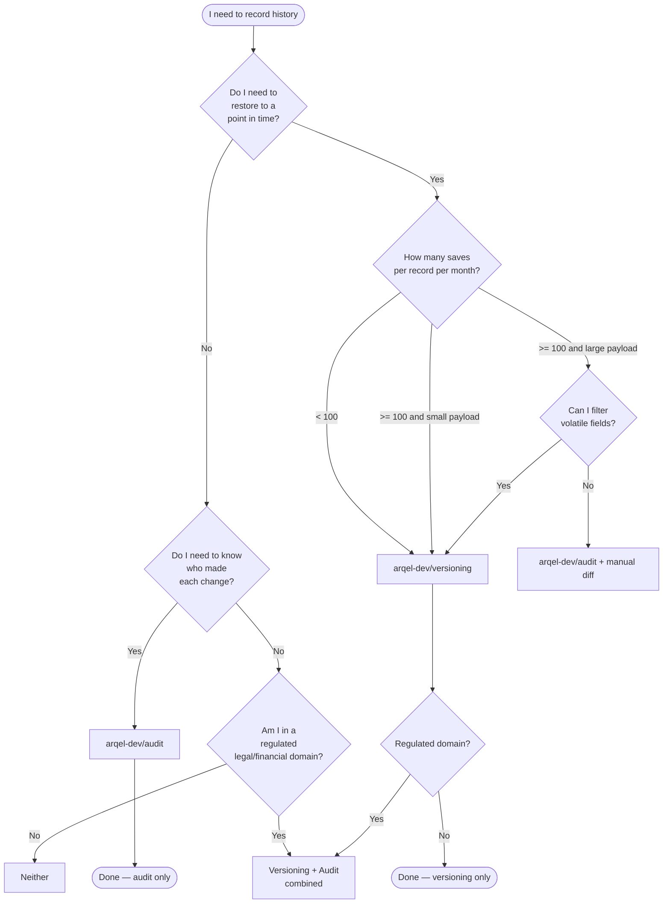

# Versioning vs Audit log — when to use which

> **Comparison document for the `arqel-dev/versioning` and `arqel-dev/audit` packages.**
> Read it alongside the 3 real scenarios in this same folder:
> [CMS Articles](./cms-articles.md), [E-commerce Orders](./ecommerce-orders.md),
> [Legal Contracts](./legal-contracts.md).

## Purpose

Both packages solve "history" problems, but they solve **different**
problems. Confusing them leads to:

- Storage exploding by an order of magnitude (snapshots of volatile
  models).
- Audit log used as a primary source for restore — losing partial
  state in non-audited columns.
- Compliance failing because you stored the snapshot but not _who_
  approved the change.

This doc gives an objective ruler for deciding.

## TL;DR

- **`arqel-dev/versioning`** = full snapshot of a record's _content_
  at a point in time. Allows restore. Use case: "roll the article
  back to yesterday's version".
- **`arqel-dev/audit`** = append-only event log of _who did what and when_.
  Doesn't allow restore (alone). Use case: "who changed the status
  of this order?".
- **Both together** = compliance / legal-tech / financial: snapshot
  to preserve content + audit to preserve human context.

## Comparison table

| Aspect | `arqel-dev/versioning` | `arqel-dev/audit` |
| --- | --- | --- |
| **Storage shape** | Full snapshot of `getAttributes()` per save | Event row with `event_name` + delta |
| **Storage cost** | High (linear in number of saves × model size) | Low (linear in number of events × delta size) |
| **Query pattern** | "Give me version N of this record" | "Give me all events of type X between T1 and T2" |
| **Point-in-time recovery** | Yes, native (`restoreToVersion`) | No — only manual reconstruction by replaying events |
| **Append-only guaranteed** | Yes (`$timestamps=false`, no updates) | Yes (pure event log) |
| **User attribution** | Optional (`created_by_user_id` defensive) | Mandatory by design |
| **Snapshot vs delta** | Snapshot (all columns) + diff in `changes` | Only delta + event payload |
| **Restore capability** | Yes (idempotent, creates a new version) | No — events do not restore state |
| **GDPR right-to-be-forgotten** | Hard — payload may contain PII; needs `pruneOldVersions` or a serializing hook | Easier — anonymize `actor_id`/`payload` |
| **Performance impact (write)** | 1 extra INSERT + JSON encode of full payload | 1 extra INSERT with smaller payload |
| **Schema evolution** | Tolerant (snapshot is JSON, not bound to current schema) | Tolerant (event_name versioned by convention) |
| **Ideal cardinality** | Low-medium (hundreds–thousands of records) | Any (millions+) |
| **Ideal model type** | Editable content (article, contract, configuration) | Transactional, discrete events (order, payment, login) |
| **Long-term retention cost** | May dominate storage; needs aggressive prune | Low; incremental archiving viable |
| **Human-readable diff** | Yes, via per-field `changes` | Indirect (needs replay) |

## Decision tree

## Anti-patterns

### 1. Versioning event logs = catastrophic bloat

The `event_logs` table receives 50k inserts/day. Applying the
`Versionable` trait to it immediately doubles storage volume and
every save triggers prune. **Audit event logs don't need to be versioned** —
they already _are_ an append-only log.

### 2. Audit log as a primary restore source

Trying to reconstruct an Article from "User edited body at T1" +
"User edited title at T2" requires deterministic replay, correct
ordering, and loses non-audited fields. The audit log answers "what
happened", not "what was the state". **For restore, use versioning.**

### 3. Not filtering sensitive payload (PII) in the snapshot

`payload` in `arqel_versions` is raw JSON of `getAttributes()`. If the
model has `cpf`, `password_hash`, `api_token`, they end up stored
in plain text preserved for years. **Before adopting versioning, decide
which fields to remove** (ideally via the trait's `serializing` hook, or
override `getAttributes()` for the version).

### 4. Skipping retention / prune

`keep_versions=0` in production with no prune job = a ticking bomb.
In 6 months the `arqel_versions` table can reach tens of GB and
dominate the backup. **Always configure** `--days=N` or `--keep=N` in
the weekly schedule.

### 5. Versioning and auditing exactly the same fields without coordination

Pure duplication: if every save generates both a Version and an AuditEvent
with the same info, you're paying 2× the storage for the same
information. Coordinate: versioning for _content_, audit for
_intent/context_ (reason, IP, user agent, approval).

## When to use both

Regulated domains (legal-tech, fintech, healthtech, government)
combine the two:

- **Versioning** preserves immutable content (required for
  compliance — the contract as it stood on 2024-03-15).
- **Audit** preserves human context (who approved, source IP,
  declared reason).

See [legal-contracts.md](./legal-contracts.md) for the implementation.

## When not to use either

- Read-only or by-design immutable records (e.g., `Currency`,
  `Country`).
- Cache/lookup tables that can be regenerated.
- Session / temporary data.
- Metrics and telemetry — use the dedicated observability pipeline.

## Related

- [CMS Articles — versioning + restore](./cms-articles.md)
- [E-commerce Orders — audit-only](./ecommerce-orders.md)
- [Legal Contracts — versioning + audit combined](./legal-contracts.md)
- `packages/versioning/SKILL.md`
- `PLANNING/10-fase-3-avancadas.md` § "5. Record versioning"
