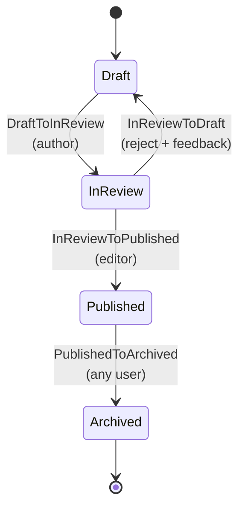

# Article workflow (CMS)

> Example state machine for editorial articles, demonstrating rejection branches with feedback, Gate-based authorization (no `authorizeFor`), and integration with versioning (`arqel-dev/versioning`).

## Overview

An editorial CMS is a use case where the **review flow** is the heart of the product. Unlike orders (where state moves almost always through external systems/events), here the transitions are mostly human: the author submits for review, an editor approves or sends it back with feedback, someone archives it when the content loses relevance. The collaborative nature requires two things this example highlights: (1) **structured feedback on rejection** — the reviewer writes a comment that returns with the article to the author; and (2) **immutable history** that `arqel-dev/workflow` records by default, complemented by **content versions** generated by `arqel-dev/versioning` at key moments.

The workflow is `Draft → InReview → Published → Archived`, with two alternative exits: `InReview → Draft` (rejection with reason) and `Published → Archived` (sunset, any authenticated user). The important design decision here is to use no `authorizeFor` on any transition — instead, all of them authorize via a Gate registered in `AuthServiceProvider`. This makes testing easier (Gates are easy to fake with `Gate::shouldReceive`), keeps the authorization logic grouped in a single place, and lets the product team change rules (for example, "any editor can reject, but only the editor-in-chief can publish") without touching transition classes.

The integration with versioning is the detail that sets this workflow apart: each time the article enters `InReview` or `Published`, a snapshot is created in `versions` (via the `Versionable` trait). This allows rolling back to a previous revision if a publication turns out to be problematic, and seeing the "diff" between versions in the admin UI.

## State diagram



Note that we **do not** allow `Archived → Draft` or `Published → Draft`. If an archived article needs to be edited again, the flow is "duplicate as draft" (an `Action` on the Resource, not a workflow transition). This preserves the publication history intact.

## Eloquent model

```php
<?php

declare(strict_types=1);

namespace App\Models;

use App\Models\ArticleState;
use App\Workflows\Articles\Transitions;
use Arqel\Versioning\Concerns\Versionable;
use Arqel\Workflow\Concerns\HasWorkflow;
use Arqel\Workflow\WorkflowDefinition;
use Illuminate\Database\Eloquent\Model;
use Illuminate\Database\Eloquent\Relations\BelongsTo;

final class Article extends Model
{
    use HasWorkflow;
    use Versionable;

    protected $fillable = [
        'title',
        'slug',
        'body',
        'author_id',
        'editor_id',
        'article_state',
        'review_feedback',
        'published_at',
    ];

    protected $casts = [
        'article_state' => ArticleState::class,
        'published_at'  => 'datetime',
    ];

    /** @var list<string> Attributes versioned by arqel-dev/versioning. */
    protected array $versionedAttributes = ['title', 'slug', 'body'];

    public function arqelWorkflow(): WorkflowDefinition
    {
        return WorkflowDefinition::make('article_state')
            ->states([
                ArticleState\Draft::class     => ['label' => 'Draft',      'color' => 'secondary', 'icon' => 'edit-3'],
                ArticleState\InReview::class  => ['label' => 'In review',  'color' => 'warning',   'icon' => 'eye'],
                ArticleState\Published::class => ['label' => 'Published',  'color' => 'success',   'icon' => 'globe'],
                ArticleState\Archived::class  => ['label' => 'Archived',   'color' => 'muted',     'icon' => 'archive'],
            ])
            ->transitions([
                Transitions\DraftToInReview::class,
                Transitions\InReviewToPublished::class,
                Transitions\InReviewToDraft::class,
                Transitions\PublishedToArchived::class,
            ]);
    }

    public function author(): BelongsTo
    {
        return $this->belongsTo(User::class, 'author_id');
    }

    public function editor(): BelongsTo
    {
        return $this->belongsTo(User::class, 'editor_id');
    }
}
```

`Versionable` automatically creates entries in `versions` on `created`/`updating` hooks — see the `arqel-dev/versioning` SKILL.md. Here we only list relevant attributes in `$versionedAttributes`; changes to `article_state` or `editor_id` do not generate a new version (only content changes do).

## Resource

```php
<?php

declare(strict_types=1);

namespace App\Arqel\Resources;

use App\Models\Article;
use App\Models\ArticleState;
use Arqel\Core\Resource;
use Arqel\Fields\RichText;
use Arqel\Fields\Text;
use Arqel\Fields\Textarea;
use Arqel\Versioning\Fields\VersionHistory;
use Arqel\Workflow\Fields\StateTransitionField;

final class ArticleResource extends Resource
{
    protected static string $model = Article::class;

    public function fields(): array
    {
        return [
            Text::make('title')->required()->maxLength(180),
            Text::make('slug')->required()->unique(ignoreRecord: true),

            StateTransitionField::make('article_state')
                ->label('Editorial status')
                ->showDescription()
                ->showHistory(),

            // Rejection feedback: only visible when the state is Draft and there is prior feedback
            Textarea::make('review_feedback')
                ->label('Editor feedback')
                ->readonly()
                ->visibleWhen(fn (Article $r) =>
                    $r->article_state instanceof ArticleState\Draft && filled($r->review_feedback)
                ),

            RichText::make('body')->required(),

            VersionHistory::make()
                ->label('Version history')
                ->visibleOn(['view']),
        ];
    }
}
```

The `VersionHistory` field (from `arqel-dev/versioning`) renders a visual diff between revisions — letting the editor compare the current version with the published one and decide whether to approve changes.

## Transition class — rejection with feedback

```php
<?php

declare(strict_types=1);

namespace App\Workflows\Articles\Transitions;

use App\Models\Article;
use App\Models\ArticleState;

final class InReviewToDraft
{
    public function __construct(
        private readonly Article $article,
        private readonly string $feedback,
    ) {}

    /** @return list<class-string> */
    public static function from(): array
    {
        return [ArticleState\InReview::class];
    }

    public static function to(): string
    {
        return ArticleState\Draft::class;
    }

    public function handle(): Article
    {
        $this->article->article_state = ArticleState\Draft::class;
        $this->article->review_feedback = $this->feedback;
        $this->article->editor_id = auth()->id();
        $this->article->save();

        return $this->article;
    }
}
```

Authorization is **not** here — it lives on the Gate. This is deliberate: if tomorrow the team decides "any editor can reject, but only the editor-in-chief can publish", the change is a single file (`AuthServiceProvider`).

## Authorization via Gate

```php
<?php

declare(strict_types=1);

namespace App\Providers;

use App\Models\Article;
use App\Models\User;
use Illuminate\Foundation\Support\Providers\AuthServiceProvider as ServiceProvider;
use Illuminate\Support\Facades\Gate;

final class AuthServiceProvider extends ServiceProvider
{
    public function boot(): void
    {
        // The author (article creator) can move from Draft to InReview.
        Gate::define('transition-draft-to-in-review', function (User $user, Article $article): bool {
            return $user->id === $article->author_id || $user->hasRole('editor');
        });

        // Only editors can approve publishing.
        Gate::define('transition-in-review-to-published', function (User $user, Article $article): bool {
            return $user->hasRole('editor');
        });

        // Any editor can reject (return with feedback).
        Gate::define('transition-in-review-to-draft', function (User $user, Article $article): bool {
            return $user->hasRole('editor');
        });

        // Archiving is "cleanup" — any authenticated user can do it (with auditing via history).
        Gate::define('transition-published-to-archived', function (User $user, Article $article): bool {
            return $user !== null;
        });
    }
}
```

The names follow the `transition-{from-slug}-to-{to-slug}` pattern that `TransitionAuthorizer` looks up automatically — the slug is the last segment of the FQCN without the `State` suffix, kebab-case.

## Filter by state on the Table

```php
use App\Models\Article;
use Arqel\Workflow\Filters\StateFilter;

public function table(): Table
{
    return Table::make()
        ->columns([
            TextColumn::make('title'),
            TextColumn::make('author.name'),
            BadgeColumn::make('article_state')->colorsFromWorkflow(Article::class),
            DateTimeColumn::make('published_at')->placeholder('—'),
        ])
        ->filters([
            StateFilter::make('article_state', Article::class)
                ->label('Editorial status'),
        ])
        ->defaultFilters([
            'article_state' => [
                \App\Models\ArticleState\Draft::class,
                \App\Models\ArticleState\InReview::class,
            ],
        ]);
}
```

`defaultFilters` makes the admin open already filtered to "work in progress" (Draft + InReview) — good UX for editors.

## Listener — snapshot + notification

```php
<?php

declare(strict_types=1);

namespace App\Listeners;

use App\Mail\ArticleReviewRequested;
use App\Models\Article;
use App\Models\ArticleState;
use App\Models\User;
use Arqel\Workflow\Events\StateTransitioned;
use Illuminate\Contracts\Queue\ShouldQueue;
use Illuminate\Support\Facades\Mail;

final class NotifyEditorialBoard implements ShouldQueue
{
    public function handle(StateTransitioned $event): void
    {
        if (! $event->record instanceof Article) {
            return;
        }

        match ($event->to) {
            ArticleState\InReview::class => $this->onSubmittedForReview($event->record),
            ArticleState\Published::class => $this->onPublished($event->record),
            ArticleState\Draft::class    => $this->onRejected($event->record, $event->context),
            default => null,
        };
    }

    private function onSubmittedForReview(Article $article): void
    {
        $editors = User::role('editor')->get();
        Mail::to($editors)->send(new ArticleReviewRequested($article));
    }

    private function onPublished(Article $article): void
    {
        // Triggers webhook for CDN purge, Algolia indexing, etc.
        \App\Jobs\PublishArticleSideEffects::dispatch($article);
    }

    /** @param array<string,mixed> $context */
    private function onRejected(Article $article, array $context): void
    {
        if ($article->author === null) {
            return;
        }

        Mail::to($article->author)->send(
            new \App\Mail\ArticleRejected(
                article: $article,
                feedback: $context['feedback'] ?? $article->review_feedback ?? '',
            ),
        );
    }
}
```

Notice how the listener is **a single one** that does `match()` on the destination state — an alternative to three separate listeners. For small listeners it's more readable; for large listeners or ones with distinct dependencies, splitting into multiple classes (as in `order-states.md`) is better.

## Integration with `arqel-dev/versioning`

When the article enters `Published`, the `Versionable` trait already takes care of creating a version with a canonical tag:

```php
// Additional listener, optional — forces a "publication" tag on the created version.
final class TagPublishedVersion
{
    public function handle(StateTransitioned $event): void
    {
        if (! $event->record instanceof Article || $event->to !== ArticleState\Published::class) {
            return;
        }

        $event->record->latestVersion()?->update([
            'tag' => 'published',
            'published_at' => now(),
        ]);
    }
}
```

The `VersionHistory` UI filters by tag `'published'` to show a clean timeline of "published versions" in the admin, ignoring intermediate drafts.

## Decision summary

- **No `authorizeFor` — Gate only**: editorial rules change frequently; concentrating them in `AuthServiceProvider` simplifies review.
- **No `Archived → Draft`**: archiving is final. Going back to editing = duplicate.
- **Feedback in the transition `context`**: the user types it in the controller, it goes to the history's `metadata`, and is also copied to `review_feedback` on the model for easy display.
- **Orthogonal versioning**: `arqel-dev/versioning` handles snapshots; the workflow handles state. They combine but don't depend on each other.
