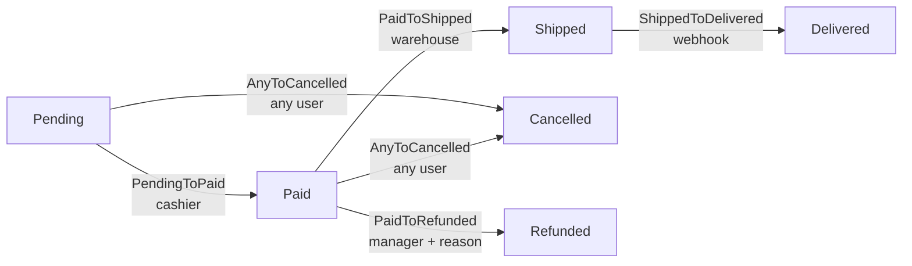

# Order workflow (E-commerce)

> Canonical state machine example for an e-commerce order, exercising role-based authorization, side-effects via webhook, "any-to-X" transitions, and auditing with metadata.

## Overview

E-commerce orders are perhaps the most classic use case for state machines in a backoffice: the stages are well-defined (payment, picking, shipping, delivery), multiple different actors can move the order at distinct points in the flow (customer, cashier, shipping, external system via webhook), and some transitions are **branches** that need to be available at multiple points (`Cancelled`, `Refunded`).

This example covers a linear workflow with two parallel branches: the happy path `Pending → Paid → Shipped → Delivered`, plus the "any-to" transition `→ Cancelled` (available before shipping), and the `Paid → Refunded` branch (manager-only, with mandatory reason). It's a good demo of how `arqel-dev/workflow` combines three layers of authorization (Gate, `authorizeFor`, deny-by-default), captures async side-effects via an event listener, and uses `metadata` in the history to store the Stripe/Mercado Pago `webhook_event_id` for idempotency.

The important design decision here: the `ShippedToDelivered` transition is triggered **only** by a carrier webhook — human users never see this button in the UI. We achieve this by making `authorizeFor()` return `false` for any authenticated user, and the webhook controller calls `->transitionTo()` with `Auth::loginUsingId(null)` (system actor), which bypasses authorization because the transition class treats a `null` user as allowed.

## State diagram



Note that `Cancelled` is reachable from both `Pending` **and** `Paid` (but not after `Shipped` — the order has already left). We implement this with a single `AnyToCancelled` transition class that declares `from(): ['Pending', 'Paid']` instead of two distinct classes — it reduces duplication and centralizes the "can cancel up until packing" rule.

## Eloquent model

```php
<?php

declare(strict_types=1);

namespace App\Models;

use App\Models\OrderState;
use App\Workflows\Orders\Transitions;
use Arqel\Workflow\Concerns\HasWorkflow;
use Arqel\Workflow\WorkflowDefinition;
use Illuminate\Database\Eloquent\Model;

final class Order extends Model
{
    use HasWorkflow;

    protected $fillable = [
        'customer_id',
        'total_cents',
        'order_state',
        'tracking_code',
        'refund_reason',
    ];

    protected $casts = [
        'order_state' => OrderState::class, // spatie state cast (optional)
        'total_cents' => 'integer',
    ];

    public function arqelWorkflow(): WorkflowDefinition
    {
        return WorkflowDefinition::make('order_state')
            ->states([
                OrderState\Pending::class   => ['label' => 'Pending',    'color' => 'warning',     'icon' => 'clock'],
                OrderState\Paid::class      => ['label' => 'Paid',       'color' => 'info',        'icon' => 'credit-card'],
                OrderState\Shipped::class   => ['label' => 'Shipped',    'color' => 'primary',     'icon' => 'truck'],
                OrderState\Delivered::class => ['label' => 'Delivered',  'color' => 'success',     'icon' => 'check-circle'],
                OrderState\Cancelled::class => ['label' => 'Cancelled',  'color' => 'destructive', 'icon' => 'x-circle'],
                OrderState\Refunded::class  => ['label' => 'Refunded',   'color' => 'destructive', 'icon' => 'rotate-ccw'],
            ])
            ->transitions([
                Transitions\PendingToPaid::class,
                Transitions\PaidToShipped::class,
                Transitions\ShippedToDelivered::class,
                Transitions\AnyToCancelled::class,
                Transitions\PaidToRefunded::class,
            ]);
    }
}
```

The `order_state` property is cast via spatie when the app opts in (suggested in `arqel-dev/workflow`'s composer). Without the cast, the column stores the slug or FQCN as a string — the trait resolves it the same way.

## Resource (admin panel)

```php
<?php

declare(strict_types=1);

namespace App\Arqel\Resources;

use App\Models\Order;
use Arqel\Core\Resource;
use Arqel\Fields\Money;
use Arqel\Fields\Text;
use Arqel\Workflow\Fields\StateTransitionField;

final class OrderResource extends Resource
{
    protected static string $model = Order::class;

    protected static ?string $navigationIcon = 'shopping-cart';

    public function fields(): array
    {
        return [
            Text::make('customer.name')->label('Customer')->searchable(),
            Money::make('total_cents')->currency('BRL')->label('Total'),

            StateTransitionField::make('order_state')
                ->label('Order status')
                ->showDescription()
                ->showHistory()
                ->transitionsAttribute('order_state'),

            Text::make('tracking_code')
                ->label('Tracking code')
                ->visibleOn(['view'])
                ->visibleWhen(fn (Order $r) => in_array($r->order_state?->getMorphClass(), ['shipped', 'delivered'], true)),
        ];
    }
}
```

`StateTransitionField` consumes `arqelWorkflow()->toArray()` automatically, renders the current state with color/icon, exposes the buttons for the authorized transitions, and shows the append-only history below (when `showHistory()` is called).

## Transition class with authorizeFor

```php
<?php

declare(strict_types=1);

namespace App\Workflows\Orders\Transitions;

use App\Models\Order;
use App\Models\OrderState;
use Arqel\Workflow\Concerns\RecordsStateTransition;
use Illuminate\Contracts\Auth\Authenticatable;

final class PendingToPaid
{
    use RecordsStateTransition;

    public function __construct(
        private readonly Order $order,
    ) {}

    /** @return list<class-string> */
    public static function from(): array
    {
        return [OrderState\Pending::class];
    }

    public static function to(): string
    {
        return OrderState\Paid::class;
    }

    /**
     * Only users with the `cashier` (or `admin`) role can confirm payment.
     * Returning `false` here hides the button in the UI and blocks the call server-side.
     */
    public static function authorizeFor(?Authenticatable $user, mixed $record): bool
    {
        if ($user === null) {
            return false;
        }

        return $user->hasAnyRole(['cashier', 'admin']);
    }

    public function handle(): Order
    {
        $this->order->order_state = OrderState\Paid::class;
        $this->order->paid_at = now();
        $this->order->save();

        // Dispatches the canonical event — RecordsStateTransition handles this when used via the trait.
        return $this->order;
    }
}
```

For `PaidToShipped` and `PaidToRefunded` we use Gates registered in `AuthServiceProvider`, illustrating the alternative:

```php
// app/Providers/AuthServiceProvider.php
Gate::define('transition-paid-to-shipped', function ($user, Order $order): bool {
    return $user->hasRole('warehouse');
});

Gate::define('transition-paid-to-refunded', function ($user, Order $order): bool {
    return $user->hasRole('manager') && filled($order->refund_reason);
});
```

`arqel-dev/workflow`'s `TransitionAuthorizer` consults `authorizeFor` first (when declared), then falls back to the Gate `transition-{from-slug}-to-{to-slug}`, and finally denies by default. Note that `transition-paid-to-refunded` also validates that `refund_reason` is filled — combining authorization rules and domain validation in the Gate is acceptable when the reason is simple.

## Filter by state on the Table

```php
use App\Models\Order;
use Arqel\Workflow\Filters\StateFilterFactory;

public function table(): Table
{
    return Table::make()
        ->columns([
            TextColumn::make('id')->prefix('#'),
            TextColumn::make('customer.name'),
            BadgeColumn::make('order_state')
                ->colorsFromWorkflow(Order::class),
            DateTimeColumn::make('created_at'),
        ])
        ->filters([
            StateFilterFactory::forResource(Order::class),
        ])
        ->defaultSort('created_at', 'desc');
}
```

The `StateFilterFactory::forResource(Order::class)` factory resolves the field automatically from `arqelWorkflow()->getField()` — no need to repeat `'order_state'`. The generated dropdown shows all states with their configured label/color.

## Audit listener — email on Shipped

```php
<?php

declare(strict_types=1);

namespace App\Listeners;

use App\Mail\OrderShipped;
use App\Models\Order;
use App\Models\OrderState;
use Arqel\Workflow\Events\StateTransitioned;
use Illuminate\Contracts\Queue\ShouldQueue;
use Illuminate\Support\Facades\Mail;

final class NotifyCustomerOfShipment implements ShouldQueue
{
    public function handle(StateTransitioned $event): void
    {
        if (! $event->record instanceof Order) {
            return;
        }

        if ($event->to !== OrderState\Shipped::class) {
            return;
        }

        Mail::to($event->record->customer)
            ->send(new OrderShipped(
                order: $event->record,
                trackingCode: $event->context['tracking_code'] ?? null,
            ));
    }
}
```

Registered in `EventServiceProvider`:

```php
protected $listen = [
    \Arqel\Workflow\Events\StateTransitioned::class => [
        \App\Listeners\NotifyCustomerOfShipment::class,
        // other listeners (broadcast, metrics, etc.)
    ],
];
```

The carrier webhook calls `transitionTo()` passing `metadata` that ends up in the history:

```php
$order->transitionTo(OrderState\Shipped::class, [
    'tracking_code'    => $payload['tracking_code'],
    'webhook_event_id' => $payload['event_id'],   // idempotency
    'carrier'          => $payload['carrier'],
]);
```

The `PersistStateTransitionToHistory` listener (already registered by `WorkflowServiceProvider`) writes the row in `arqel_state_transitions` with `metadata` JSON containing those keys — useful for later investigation and to avoid processing the same webhook twice (the controller does `where('metadata->webhook_event_id', $eventId)->exists()` before transitioning).

## Decision summary

- **`Cancelled` as "any-to"**: a single transition class with `from()` listing the allowed states is simpler than N classes.
- **Webhook as actor**: `ShippedToDelivered::authorizeFor` returns `false` for humans; only the webhook controller (called outside `Auth`) can trigger it.
- **Refund reason in the Gate**: `filled($order->refund_reason)` in the Gate prevents a transition without the field set — the alternative is to validate in the controller.
- **Idempotency via metadata**: `webhook_event_id` in `metadata` lets you re-process duplicate webhooks without side effects.
