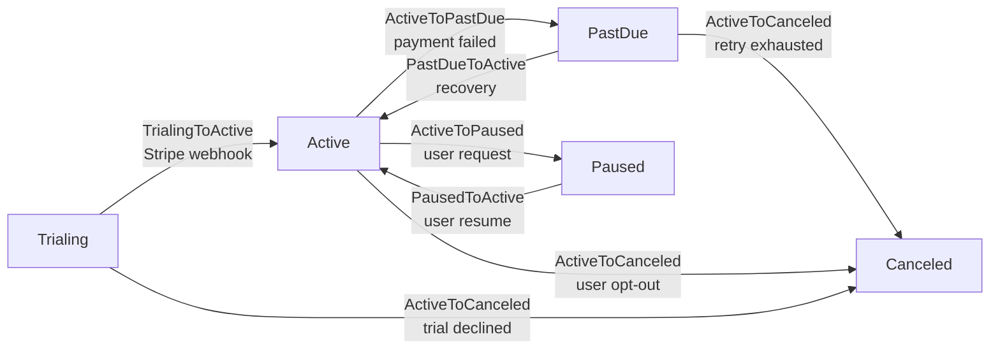

# Subscription workflow (SaaS billing)

> Example state machine for SaaS subscriptions, demonstrating transitions triggered by payment provider (Stripe) webhooks, side-effects in cache/quotas, and heavy use of `metadata` for idempotency.

## Overview

In SaaS billing, a subscription's state machine is the point where the product domain meets the external payment system. **Most transitions are not initiated by a human** — Stripe (or Mercado Pago, or Adyen) sends webhooks saying "payment succeeded", "attempt failed", "customer canceled in the portal". This changes how we think about authorization: the typical "actor" is the system itself, and what we need to guarantee is (a) **idempotency** — the same event cannot be processed twice; (b) **consistent side-effects** — when the subscription enters `PastDue`, that tenant's feature flag cache must be invalidated **before** the user's next HTTP request; and (c) **full traceability** — auditors need to see "which Stripe webhook caused this transition" to reconcile with statements.

The workflow is `Trialing → Active → PastDue → Canceled`, with the `Active → Paused` branch (manual pause by the customer, resumed via `Paused → Active`). `Trialing` is the initial state after signup; `Active` means payment up to date; `PastDue` is failed billing (but still inside the retry window); `Canceled` is terminal (any future downgrade creates a new subscription, doesn't reactivate this one). The `PastDueToActive` transition (recovery — Stripe manages to charge on retry) is the most sensitive: it needs to restore quotas, reactivate features, and must NOT trigger a "welcome" email because the customer is already a customer.

The central design choice in this example is **using the transition's `metadata` as an audit contract**. Every webhook-driven transition carries at minimum `subscription_id` (provider id), `webhook_event_id` (unique Stripe id), `event_type` (`invoice.payment_succeeded`, `invoice.payment_failed`, etc.) and `processed_at`. Before processing, the controller does `StateTransition::where('metadata->webhook_event_id', $eventId)->exists()` to reject duplicates. This pattern replaces Redis idempotency keys and is more auditable.

## State diagram



`ActiveToCanceled` is reachable from `Trialing`, `Active`, and `PastDue` — implemented as a single transition class with `from(): [Trialing, Active, PastDue]`. Users can cancel immediately (direct transition) or at the end of the period (the UI schedules a job for `now()->addDays($daysRemaining)` that triggers the transition). Both paths go through the same class — what changes is the `context`.

## Eloquent model

```php
<?php

declare(strict_types=1);

namespace App\Models;

use App\Models\SubscriptionState;
use App\Workflows\Subscriptions\Transitions;
use Arqel\Workflow\Concerns\HasWorkflow;
use Arqel\Workflow\WorkflowDefinition;
use Illuminate\Database\Eloquent\Model;
use Illuminate\Database\Eloquent\Relations\BelongsTo;

final class Subscription extends Model
{
    use HasWorkflow;

    protected $fillable = [
        'tenant_id',
        'plan_id',
        'subscription_state',
        'stripe_subscription_id',
        'current_period_end',
        'trial_ends_at',
        'canceled_at',
        'paused_until',
    ];

    protected $casts = [
        'subscription_state' => SubscriptionState::class,
        'current_period_end' => 'datetime',
        'trial_ends_at'      => 'datetime',
        'canceled_at'        => 'datetime',
        'paused_until'       => 'datetime',
    ];

    public function arqelWorkflow(): WorkflowDefinition
    {
        return WorkflowDefinition::make('subscription_state')
            ->states([
                SubscriptionState\Trialing::class => ['label' => 'Trialing',         'color' => 'info',        'icon' => 'gift'],
                SubscriptionState\Active::class   => ['label' => 'Active',           'color' => 'success',     'icon' => 'check-circle'],
                SubscriptionState\PastDue::class  => ['label' => 'Payment past due', 'color' => 'warning',     'icon' => 'alert-triangle'],
                SubscriptionState\Paused::class   => ['label' => 'Paused',           'color' => 'secondary',   'icon' => 'pause-circle'],
                SubscriptionState\Canceled::class => ['label' => 'Canceled',         'color' => 'destructive', 'icon' => 'x-octagon'],
            ])
            ->transitions([
                Transitions\TrialingToActive::class,
                Transitions\ActiveToPastDue::class,
                Transitions\PastDueToActive::class,
                Transitions\ActiveToCanceled::class,
                Transitions\ActiveToPaused::class,
                Transitions\PausedToActive::class,
            ]);
    }

    public function tenant(): BelongsTo
    {
        return $this->belongsTo(Tenant::class);
    }

    public function plan(): BelongsTo
    {
        return $this->belongsTo(Plan::class);
    }
}
```

## Resource

```php
<?php

declare(strict_types=1);

namespace App\Arqel\Resources;

use App\Models\Subscription;
use Arqel\Core\Resource;
use Arqel\Fields\DateTime;
use Arqel\Fields\Text;
use Arqel\Workflow\Fields\StateTransitionField;

final class SubscriptionResource extends Resource
{
    protected static string $model = Subscription::class;

    protected static ?string $navigationGroup = 'Billing';

    public function fields(): array
    {
        return [
            Text::make('tenant.name')->label('Tenant')->searchable(),
            Text::make('plan.name')->label('Plan'),
            Text::make('stripe_subscription_id')->label('Stripe ID')->copyable(),

            StateTransitionField::make('subscription_state')
                ->label('Status')
                ->showDescription()
                ->showHistory(),

            DateTime::make('current_period_end')->label('Current period end'),
            DateTime::make('trial_ends_at')->label('Trial ends')->placeholder('—'),
            DateTime::make('canceled_at')->label('Canceled at')->placeholder('—'),
        ];
    }
}
```

## Transition class with authorizeFor — webhook only

```php
<?php

declare(strict_types=1);

namespace App\Workflows\Subscriptions\Transitions;

use App\Models\Subscription;
use App\Models\SubscriptionState;
use Illuminate\Contracts\Auth\Authenticatable;

final class TrialingToActive
{
    public function __construct(
        private readonly Subscription $subscription,
    ) {}

    /** @return list<class-string> */
    public static function from(): array
    {
        return [SubscriptionState\Trialing::class];
    }

    public static function to(): string
    {
        return SubscriptionState\Active::class;
    }

    /**
     * This transition is NEVER initiated by humans — only by the Stripe webhook handler.
     * We deny it for any authenticated user to hide the UI button; the webhook
     * controller calls transitionTo() outside the Auth context, which bypasses this check
     * (TransitionAuthorizer accepts a null user as the "system actor" when authorizeFor authorizes it).
     */
    public static function authorizeFor(?Authenticatable $user, mixed $record): bool
    {
        return $user === null; // system only
    }

    public function handle(): Subscription
    {
        $this->subscription->subscription_state = SubscriptionState\Active::class;
        $this->subscription->trial_ends_at = null;
        $this->subscription->save();

        return $this->subscription;
    }
}
```

## Webhook controller (Stripe)

```php
<?php

declare(strict_types=1);

namespace App\Http\Controllers;

use App\Models\Subscription;
use App\Models\SubscriptionState;
use Arqel\Workflow\Models\StateTransition;
use Illuminate\Http\Request;
use Illuminate\Support\Facades\DB;

final class StripeWebhookController
{
    public function __invoke(Request $request): \Illuminate\Http\Response
    {
        $payload = $this->verifyAndParse($request);
        $eventId = $payload['id'];

        // Idempotency: have we already processed this event?
        if (StateTransition::where('metadata->webhook_event_id', $eventId)->exists()) {
            return response('already_processed', 200);
        }

        $subscription = Subscription::where('stripe_subscription_id', $payload['data']['object']['subscription'])
            ->firstOrFail();

        $context = [
            'subscription_id'  => $payload['data']['object']['subscription'],
            'webhook_event_id' => $eventId,
            'event_type'       => $payload['type'],
            'processed_at'     => now()->toIso8601String(),
        ];

        DB::transaction(function () use ($subscription, $payload, $context): void {
            match ($payload['type']) {
                'invoice.payment_succeeded' => $subscription->subscription_state instanceof SubscriptionState\Trialing
                    ? $subscription->transitionTo(SubscriptionState\Active::class, $context)
                    : ($subscription->subscription_state instanceof SubscriptionState\PastDue
                        ? $subscription->transitionTo(SubscriptionState\Active::class, $context + ['recovery' => true])
                        : null),

                'invoice.payment_failed' => $subscription->transitionTo(SubscriptionState\PastDue::class, $context + [
                    'attempt_count' => $payload['data']['object']['attempt_count'] ?? 1,
                ]),

                'customer.subscription.deleted' => $subscription->transitionTo(SubscriptionState\Canceled::class, $context),

                default => null,
            };
        });

        return response('ok', 200);
    }

    /** @return array<string,mixed> */
    private function verifyAndParse(Request $request): array
    {
        // Stripe signature verification (omitted for brevity)
        return $request->json()->all();
    }
}
```

Note three things: (1) **idempotency via metadata** — the `where('metadata->webhook_event_id', ...)` query takes advantage of Postgres/MySQL JSON index; (2) **transaction wrapping** — the transition and the listener side-effects run in a single commit; (3) the `match` decides the transition based on the current state + event type, but the complexity is contained in the controller.

## Filter by state on the Table

```php
use App\Models\Subscription;
use App\Models\SubscriptionState;
use Arqel\Workflow\Filters\StateFilter;

public function table(): Table
{
    return Table::make()
        ->columns([
            TextColumn::make('tenant.name'),
            TextColumn::make('plan.name'),
            BadgeColumn::make('subscription_state')->colorsFromWorkflow(Subscription::class),
            DateTimeColumn::make('current_period_end'),
        ])
        ->filters([
            StateFilter::make('subscription_state', Subscription::class)
                ->label('Status'),
        ])
        ->defaultFilters([
            'subscription_state' => [
                SubscriptionState\PastDue::class,
                SubscriptionState\Active::class,
            ],
        ])
        ->actions([
            // Billing-ops actions backed by StateFilter filters
            Action::make('retry_failed_payments')
                ->visible(fn () => request('filter.subscription_state') === SubscriptionState\PastDue::class)
                ->action(fn () => RetryFailedPaymentsJob::dispatch()),
        ]);
}
```

## Listener — invalidate cache + adjust quotas

```php
<?php

declare(strict_types=1);

namespace App\Listeners;

use App\Models\Subscription;
use App\Models\SubscriptionState;
use App\Services\FeatureFlagCache;
use App\Services\QuotaManager;
use Arqel\Workflow\Events\StateTransitioned;
use Illuminate\Contracts\Queue\ShouldQueue;
use Illuminate\Support\Facades\Mail;

final class ApplySubscriptionStateSideEffects implements ShouldQueue
{
    public function __construct(
        private readonly FeatureFlagCache $flags,
        private readonly QuotaManager $quotas,
    ) {}

    public function handle(StateTransitioned $event): void
    {
        if (! $event->record instanceof Subscription) {
            return;
        }

        $subscription = $event->record;

        // 1. Always invalidate the tenant's feature flag cache — any state change
        //    can alter what they can/can't use.
        $this->flags->invalidateForTenant($subscription->tenant_id);

        // 2. Adjust quotas according to the destination state.
        match ($event->to) {
            SubscriptionState\Active::class   => $this->quotas->restorePlanQuotas($subscription),
            SubscriptionState\PastDue::class  => $this->quotas->applyGracePeriodLimits($subscription),
            SubscriptionState\Canceled::class => $this->quotas->revokeAll($subscription),
            SubscriptionState\Paused::class   => $this->quotas->freezeUsage($subscription),
            default => null,
        };

        // 3. Retention email when entering PastDue (not Canceled — too late by then).
        if ($event->to === SubscriptionState\PastDue::class && $subscription->tenant?->billingContact !== null) {
            Mail::to($subscription->tenant->billingContact)
                ->send(new \App\Mail\PaymentFailedRetention(
                    subscription: $subscription,
                    attemptCount: (int) ($event->context['attempt_count'] ?? 1),
                    webhookEventId: $event->context['webhook_event_id'] ?? null,
                ));
        }

        // 4. Recovery (PastDue → Active): do NOT send a welcome email.
        //    Log it for the recovery rate metric.
        if ($event->from === SubscriptionState\PastDue::class && $event->to === SubscriptionState\Active::class) {
            \App\Metrics\BillingMetrics::recordRecovery(
                subscriptionId: $subscription->id,
                webhookEventId: $event->context['webhook_event_id'] ?? null,
            );
        }
    }
}
```

Points to note:

- The listener is `ShouldQueue` — side-effects can be slow (distributed cache invalidation, email sending), and delays must not block the webhook ACK to Stripe.
- Feature flag cache invalidation happens **always**, regardless of the destination state — it's cheaper to invalidate than to try to deduce when exactly a flag changed.
- `event->context['webhook_event_id']` is propagated to metrics and emails — letting you reconcile everything with the Stripe dashboard later.

## Metadata in the history — practical example

After a webhook-driven transition, the entry in `arqel_state_transitions` looks like:

```json
{
  "id": 1042,
  "model_type": "App\\Models\\Subscription",
  "model_id": 17,
  "from_state": "App\\Models\\SubscriptionState\\Trialing",
  "to_state": "App\\Models\\SubscriptionState\\Active",
  "transitioned_by_user_id": null,
  "metadata": {
    "subscription_id": "sub_1NxYzABC123",
    "webhook_event_id": "evt_1NxYzABC123",
    "event_type": "invoice.payment_succeeded",
    "processed_at": "2026-04-30T14:32:01+00:00"
  },
  "created_at": "2026-04-30 14:32:01"
}
```

An auditor searching for `evt_1NxYzABC123` in the Stripe Dashboard can match it directly with this row, and vice versa. For `recovery: true`, the column distinguishes a normal successful payment from a recovery from delinquency — a key SaaS metric.

## Decision summary

- **System as actor**: `authorizeFor` returns `true` when the user is `null` for webhooks; humans only see buttons for `Cancel` and `Pause`/`Resume`.
- **Idempotency via `metadata->webhook_event_id`**: replaces Redis idempotency keys; it's more auditable.
- **Side-effects in a `ShouldQueue` listener**: fast webhook ACK to Stripe; real work async.
- **`recovery: true` in the context**: distinguishes retry-success from initial payment — important for emails and metrics.
- **No return from `Canceled`**: terminal state. Reactivation creates a new subscription.
