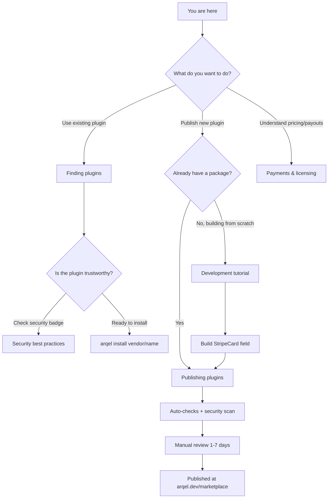

# Arqel Marketplace

> Official hub to discover, publish, and consume Arqel community extensions.

The **Arqel Marketplace** (at `arqel.dev/marketplace`) is the central catalog of community-driven plugins that extend the framework. It is built as an embeddable package (`arqel-dev/marketplace`) and _dogfooded_ by the public instance itself — that is, the official site is an Arqel admin running the marketplace package internally.

## Overview

The marketplace exists to solve three distinct problems:

1. **Discovery** — framework users need a single place to find official or community fields, widgets, integrations, and themes, with filters, ratings, and security badges.
2. **Distribution** — authors need a predictable, audited path to publish packages (Composer + npm) with convention validation, security scanning, and manual moderation.
3. **Monetization** — optionally, premium plugins can be sold via license keys and an 80/20 revenue share (publisher/Arqel).

All of this talks to the Composer/npm ecosystem without reinventing registries — the marketplace is just the discovery + curation + security layer on top of packages that remain hosted on Packagist and the npm registry.

## The 4 plugin types

| Type | PHP package | Companion npm package | Typical examples |
|---|---|---|---|
| **field-pack** | `arqel-dev/fields-*` | `@vendor/arqel-fields-*` | Stripe Card, Mapbox Address, Markdown Editor |
| **widget-pack** | `arqel-dev/widgets-*` | `@vendor/arqel-widgets-*` | Stat cards, charts, calendars |
| **integration** | `arqel-dev/integration-*` | `@vendor/arqel-integration-*` | Slack notify, Algolia search, Sentry |
| **theme** | `arqel-dev/theme-*` | `@vendor/arqel-theme-*` | Dark mode variants, white-label kits |

The additional `language-pack` category covers translations and `tool` covers CLI/Artisan extensions.

## Decision tree

## Sub-documents

- [Finding plugins](./finding-plugins.md) — search, filters, installation, trust.
- [Publishing plugins](./publishing.md) — submission, review queue, status pipeline.
- [Development tutorial](./development-tutorial.md) — step-by-step guide to building a field-pack from scratch.
- [Security best practices](./security-best-practices.md) — vulnerabilities to avoid, license obligations, disclosure.
- [Payments & licensing](./payments-and-licensing.md) — pricing, license keys, payouts, refunds.

## Marketplace vs direct install (Composer/npm)

It may seem redundant to have a marketplace when Composer already distributes PHP packages and npm already distributes JS packages. The trade-offs:

| Aspect | Direct Composer/npm | Marketplace |
|---|---|---|
| **Discovery** | Manual search on Packagist/npm; no Arqel-aware filters | Categories, trending, curated featured, semantic search |
| **Compatibility** | You read `composer.json` and figure out if it works | Constraint `arqel.compat.arqel: '^1.0'` validated by `PluginConventionValidator` |
| **Security** | You trust the author blindly | Automatic scan (`SecurityScanner` + `VulnerabilityDatabase`), auto-delist on `critical` finding |
| **Reviews/ratings** | Does not exist as a channel | `arqel_plugin_reviews` with helpful votes, sort options, moderation queue |
| **Payment** | Paid packages are rare and ad-hoc | License keys `ARQ-XXXX-XXXX-XXXX-XXXX` + automatic revenue share |
| **Updates** | `composer update` with no context | `arqel:plugin:list --validate` shows convention divergence |
| **Speed** | You know exactly what you are doing | Extra learning curve for publishers (submission form, review wait) |

**When to prefer direct install?** Internal company plugins, private packages, or while the plugin is still in alpha and you want to iterate fast. Everything Composer/npm keeps working — the marketplace **complements**, it does not replace.

**When to prefer the marketplace?** Community plugins that will be installed by third parties, any paid plugin, any plugin that touches sensitive data (logs, payments, auth) and therefore benefits from the mandatory security scan.

## Current delivery status

The MKTPLC-* spec is implemented in the following areas (see `packages/marketplace/SKILL.md` for detail):

- ✅ Submission + review workflow (MKTPLC-002)
- ✅ Convention validator + `arqel:plugin:list` command (MKTPLC-003)
- ✅ Reviews + ratings + helpful votes + moderation (MKTPLC-006)
- ✅ Categories + trending + featured (MKTPLC-007)
- ✅ Premium plugins + license keys + payouts schema (MKTPLC-008)
- ✅ Security scanning + auto-delist (MKTPLC-009)
- ⏳ Stats/analytics dashboard (MKTPLC-004)
- ⏳ Real Stripe Connect (MKTPLC-008-stripe-real)

## Reference REST endpoints

The marketplace's public API is consumed by the `arqel.dev/marketplace` site, the `arqel:install` CLI, and third-party integrations (CI checks, corporate dashboards):

| Endpoint | Method | Auth | Description |
|---|---|---|---|
| `/api/marketplace/plugins` | GET | public | Paginated listing with `type` + `search` filters |
| `/api/marketplace/plugins/{slug}` | GET | public | Detail + 5 reviews + versions |
| `/api/marketplace/plugins/{slug}/reviews` | GET | public | Reviews with `helpful`/`recent`/`rating` sort |
| `/api/marketplace/plugins/{slug}/reviews` | POST | Sanctum | Creates review |
| `/api/marketplace/plugins/submit` | POST | Sanctum | Plugin submission (publisher) |
| `/api/marketplace/categories` | GET | public | List categories (root + children) |
| `/api/marketplace/featured` | GET | public | Editor's picks |
| `/api/marketplace/trending` | GET | public | Top 20 by trending score |
| `/api/marketplace/new?days=7` | GET | public | Recent plugins |
| `/api/marketplace/popular` | GET | public | All-time installations leaderboard |
| `/api/marketplace/plugins/{slug}/purchase` | POST | Sanctum | Initiate premium purchase |
| `/api/marketplace/plugins/{slug}/purchase/confirm` | POST | Sanctum | Confirm gateway callback |
| `/api/marketplace/plugins/{slug}/download` | GET | Sanctum | Download (free direct, premium with license) |

Admin endpoints (Gates `marketplace.review`, `marketplace.feature`, `marketplace.refund`, `marketplace.moderate-reviews`, `marketplace.security-scans`) sit under the `/api/marketplace/admin/...` prefix and are opaque to non-admins.

## Next steps

If you are a framework **user**: start at [Finding plugins](./finding-plugins.md).

If you are a **publisher** with a PHP/npm package already built: jump straight to [Publishing plugins](./publishing.md).

If you want to **build a plugin from scratch**: follow the [Development tutorial](./development-tutorial.md).
