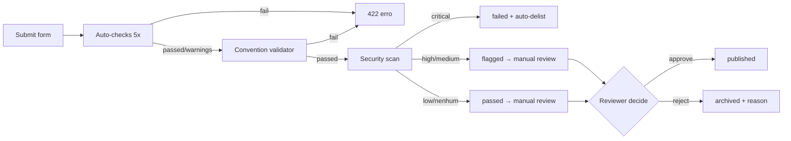

# Publishing plugins

> Complete guide for authors who want to publish plugins on the Arqel Marketplace.

This page describes the publishing pipeline **end-to-end**: account setup, submission, auto-checks, security scan, manual review, follow-up releases, and stats tracking.

## Prerequisites

Before submitting, you need:

1. **PHP package** published on Packagist (`vendor/package`) with `type: arqel-plugin` in `composer.json`.
2. **(Optional) Companion npm package** for the React side, published on the npm registry (`@vendor/package`).
3. **Public GitHub repository** with a `LICENSE` (preferably MIT — see allow-list in [Security best practices](./security-best-practices.md)).
4. **At least one tagged release** (`v0.1.0` or higher, semver-compliant).
5. **Convention compliant** — run `arqel:plugin:list --validate` locally to confirm.

If anything is missing, start with the [Development tutorial](./development-tutorial.md) — it covers setup from zero.

## Step 1 — Publisher account

Create your account at `arqel.dev/marketplace/signup`. The form asks for:

- **Email** (verification mandatory — link expires in 24h).
- **Public display name** that appears next to each of your plugins.
- **GitHub username** for automatic repo linking.
- **Composer vendor namespace** (e.g., `acme`) — you may only submit plugins under that namespace.
- **(Optional) Stripe Connect onboarding** if you intend to publish paid plugins. Can be done later.

The account has three states: `unverified` → `verified` → `publisher`. Only `publisher` can submit — automatic escalation after email verification + GitHub ownership proof via OAuth.

## Step 2 — Submission form

REST endpoint: `POST /api/marketplace/plugins/submit` (Sanctum auth required, controller `PluginSubmissionController`).

Minimum payload:

```json
{
  "composer_package": "acme/stripe-card",
  "npm_package": "@acme/arqel-stripe-fields",
  "github_url": "https://github.com/acme/arqel-stripe-card",
  "type": "field-pack",
  "name": "Stripe Card Field",
  "description": "Renderiza o Stripe Elements Card como um Field Arqel pronto para PaymentMethod.",
  "screenshots": [
    "https://raw.githubusercontent.com/acme/arqel-stripe-card/main/docs/screen-1.png",
    "https://raw.githubusercontent.com/acme/arqel-stripe-card/main/docs/screen-2.png"
  ]
}
```

Validation enforced by `SubmitPluginRequest`:

| Field | Rule |
|---|---|
| `composer_package` | regex `vendor/package`, unique in `arqel_plugins` |
| `npm_package` | optional string |
| `github_url` | valid URL, host `github.com` (warn if other) |
| `type` | enum `field-pack`/`widget-pack`/`integration`/`theme`/`language-pack`/`tool` |
| `name` | 3-100 chars |
| `description` | 20-2000 chars (warn if < 50) |
| `screenshots[]` | array of public URLs (warn if 0) |
| `slug` | derived from `name` via `Str::slug` when absent; uniqueness check |

The `201` response returns `{plugin: {...}, checks: {checks: [...], passed: bool}}` — you immediately see which auto-checks passed. If `passed: false`, the plugin **still** enters with `status=pending`, but the review queue is alerted and approval time grows.

## Step 3 — Auto-checks (no network)

`PluginAutoChecker` runs 5 defensive checks:

1. **`composer_package_format`** — fail if regex invalid.
2. **`github_url_format`** — fail if host is not `github.com`.
3. **`description_length`** — warn if < 50 chars.
4. **`screenshots_count`** — warn if 0.
5. **`name_uniqueness`** — warn if another published plugin already has a similar name.

These checks are instant — no HTTP requests. The intent is to fail fast on obvious errors without holding CI for minutes.

## Step 4 — Convention validation

`PluginConventionValidator` (MKTPLC-003) is the second gatekeeper. It requires your package's `composer.json` to contain:

```json
{
  "name": "acme/stripe-card",
  "type": "arqel-plugin",
  "description": "Stripe Card Field for Arqel",
  "license": "MIT",
  "keywords": ["arqel", "plugin", "field", "stripe", "payments"],
  "extra": {
    "arqel": {
      "plugin-type": "field-pack",
      "category": "integrations",
      "compat": {
        "arqel": "^1.0"
      },
      "installation-instructions": "https://github.com/acme/arqel-stripe-card#installation"
    }
  }
}
```

Errors (fail):

- `type` is not `arqel-plugin`.
- `extra.arqel.plugin-type` missing or outside the enum.
- `extra.arqel.compat.arqel` is not a valid semver constraint.
- `extra.arqel.category` missing or empty.

Warnings (passes but flags):

- `extra.arqel.installation-instructions` missing.
- `keywords` does not include `arqel` + `plugin`.

And the companion npm `package.json` needs **one of these two**:

```json
{
  "arqel": { "plugin-type": "field-pack" }
}
```

or

```json
{
  "peerDependencies": { "@arqel-dev/types": "^1.0" }
}
```

## Step 5 — Security scan

After validation, `SecurityScanner` (MKTPLC-009) creates an `arqel_plugin_security_scans` row in `running` and runs four stages:

1. **Vulnerability lookup** — queries `VulnerabilityDatabase` (default `StaticVulnerabilityDatabase` returning empty; host apps can rebind to a real GitHub Advisory Database). Each composer + npm package is checked.
2. **License check** — compares `composer.json#license` against the allow-list (`MIT`, `Apache-2.0`, `BSD-2-Clause`, `BSD-3-Clause`). Anything outside becomes a `low` warning.
3. **Suspicious patterns** — current placeholder (TODO MKTPLC-009-static-analysis). In the future, static scan for `eval`, `exec`, `file_get_contents` on user-input URLs, etc.
4. **Severity rollup** — takes the maximum across all findings.

Outcome:

| Max severity | Action |
|---|---|
| `critical` | `status=failed` + auto-delist (`status=archived`) + dispatch `PluginAutoDelistedEvent` |
| `high` or `medium` | `status=flagged` + alert for manual review |
| `low` or none | `status=passed` |

If your plugin is `flagged`, **do not panic** — open the scan detail page in the admin dashboard, read the findings, and respond with remediation. The human reviewer decides case by case.

## Step 6 — Manual review

Plugins with `status=pending` enter the moderation queue (`GET /admin/plugins?status=pending`, Gate `marketplace.review`). The human reviewer:

1. Reads description + screenshots.
2. Visits `github_url` and skims the code (especially the service provider and any `Http`/`Process`/`Storage` calls).
3. Confirms the plugin does not violate guidelines (no adversarial crypto, no opaque telemetry collection, no abandonware dependency).
4. Approves or rejects via `POST /admin/plugins/{slug}/review`.

Expected timeline:

| Scenario | Time |
|---|---|
| Auto-checks passed + scan passed + reviewer available | 1-2 days |
| Warnings in auto-checks or scan flagged | 3-5 days |
| Rejected and re-submitted after fix | 5-7 days |
| Large backlog (framework major releases) | up to 14 days |

Approved → `status=published` + dispatch `PluginApproved` event → plugin appears in `/api/marketplace/plugins`. Rejected → `status=archived` + `rejection_reason` populated + dispatch `PluginRejected`. You receive email with the reason (email integration is TBD; for now you check via `GET /publisher/plugins`).

## Step 7 — Follow-up releases

Each new version of your plugin generates a row in `arqel_plugin_versions`:

```http
POST /api/marketplace/plugins/{slug}/versions
{
  "version": "1.2.0",
  "changelog": "Adicionado suporte a Stripe Connect Express. Fix em currency=EUR.",
  "released_at": "2026-05-15T14:00:00Z"
}
```

Versions follow strict semver. The marketplace does **not** automatically re-run the security scan on every release (expensive) — but it runs daily via the scheduled `arqel:marketplace:scan`. You can force a scan from the dashboard when you ship a vulnerability fix.

When publishing a release with a **breaking change**, update `extra.arqel.compat.arqel` in the new tag's `composer.json`. Users on a framework version <`compat.arqel` will keep receiving the previous version through the Composer resolver — no extra action from the marketplace.

## Step 8 — Statistics

The publisher dashboard (`/marketplace/publisher/dashboard`) consumes four endpoints:

```http
GET /api/marketplace/publisher/plugins
GET /api/marketplace/publisher/plugins/{slug}/installations?days=30
GET /api/marketplace/publisher/plugins/{slug}/reviews
GET /api/marketplace/publisher/payouts
```

Each returns metrics filtered by `publisher_user_id = auth()->id()`. Full stats detail lives in [MKTPLC-004 — analytics](https://github.com/arqel-dev/arqel/blob/main/PLANNING/11-fase-4-ecossistema.md) (future delivery).

For paid plugins you also see aggregated purchases + pending payouts:

```http
GET /api/marketplace/publisher/payouts?per_page=20
```

Details in [Payments & licensing](./payments-and-licensing.md).

## Visual pipeline



## Publisher checklist

Before submitting, confirm:

- [ ] `composer.json#type === "arqel-plugin"`
- [ ] `extra.arqel.plugin-type` correct
- [ ] `extra.arqel.compat.arqel` is a valid semver constraint
- [ ] `extra.arqel.category` populated
- [ ] `keywords` includes `arqel` + `plugin`
- [ ] `LICENSE` in the repository (MIT preferred)
- [ ] README with installation, usage example, screenshots
- [ ] At least 1 tagged GitHub release
- [ ] Package published on Packagist
- [ ] (Optional) companion npm package published
- [ ] Local auto-checks via `arqel:plugin:list --validate`

## Next steps

- Want to build a plugin from scratch? See the [Development tutorial](./development-tutorial.md).
- Want to enable payments? See [Payments & licensing](./payments-and-licensing.md).
- Plugin rejected for security? See [Security best practices](./security-best-practices.md).
