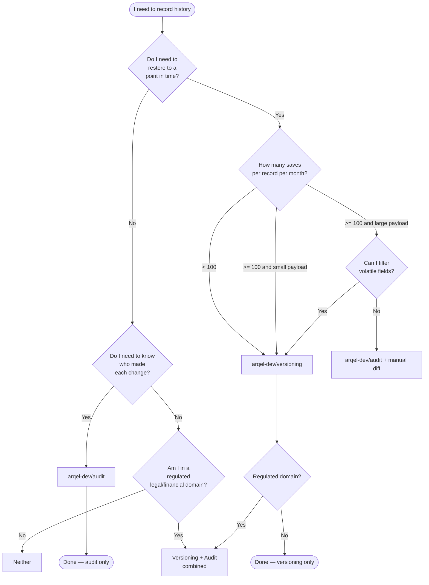

# Versioning vs Audit log — cuándo usar cuál

> **Documento de comparación entre los paquetes `arqel-dev/versioning` y `arqel-dev/audit`.**
> Léelo junto con los 3 escenarios reales en esta misma carpeta:
> [CMS Articles](./cms-articles.md), [E-commerce Orders](./ecommerce-orders.md),
> [Legal Contracts](./legal-contracts.md).

## Propósito

Ambos paquetes resuelven problemas de "historial", pero resuelven problemas
**diferentes**. Confundirlos lleva a:

- Almacenamiento explotando un orden de magnitud (snapshots de modelos
  volátiles).
- Audit log usado como fuente primaria de restore — perdiendo estado
  parcial en columnas no auditadas.
- Compliance fallando porque almacenaste el snapshot pero no _quién_
  aprobó el cambio.

Este doc da una regla objetiva para decidir.

## TL;DR

- **`arqel-dev/versioning`** = snapshot completo del _contenido_ de un
  registro en un punto en el tiempo. Permite restore. Caso de uso: "rollback
  del artículo a la versión de ayer".
- **`arqel-dev/audit`** = log de eventos append-only de _quién hizo qué y cuándo_.
  No permite restore (solo). Caso de uso: "¿quién cambió el estado
  de este pedido?".
- **Ambos juntos** = compliance / legal-tech / financiero: snapshot
  para preservar contenido + audit para preservar contexto humano.

## Tabla de comparación

| Aspecto | `arqel-dev/versioning` | `arqel-dev/audit` |
| --- | --- | --- |
| **Forma de almacenamiento** | Snapshot completo de `getAttributes()` por save | Fila de evento con `event_name` + delta |
| **Costo de almacenamiento** | Alto (lineal en número de saves × tamaño del modelo) | Bajo (lineal en número de eventos × tamaño del delta) |
| **Patrón de query** | "Dame la versión N de este registro" | "Dame todos los eventos del tipo X entre T1 y T2" |
| **Recovery point-in-time** | Sí, nativo (`restoreToVersion`) | No — solo reconstrucción manual replicando eventos |
| **Append-only garantizado** | Sí (`$timestamps=false`, sin updates) | Sí (event log puro) |
| **Atribución de usuario** | Opcional (`created_by_user_id` defensivo) | Obligatoria por diseño |
| **Snapshot vs delta** | Snapshot (todas las columnas) + diff en `changes` | Solo delta + payload del evento |
| **Capacidad de restore** | Sí (idempotente, crea una nueva versión) | No — los eventos no restauran estado |
| **GDPR right-to-be-forgotten** | Difícil — el payload puede contener PII; necesita `pruneOldVersions` o un hook serializador | Más fácil — anonimizar `actor_id`/`payload` |
| **Impacto de performance (write)** | 1 INSERT extra + JSON encode del payload completo | 1 INSERT extra con payload menor |
| **Evolución de schema** | Tolerante (snapshot es JSON, no atado al schema actual) | Tolerante (event_name versionado por convención) |
| **Cardinalidad ideal** | Baja-media (cientos–miles de registros) | Cualquiera (millones+) |
| **Tipo de modelo ideal** | Contenido editable (artículo, contrato, configuración) | Eventos transaccionales discretos (pedido, pago, login) |
| **Costo de retención a largo plazo** | Puede dominar el storage; necesita prune agresivo | Bajo; archivado incremental viable |
| **Diff legible para humanos** | Sí, vía `changes` por field | Indirecto (necesita replay) |

## Árbol de decisión

## Anti-patrones

### 1. Versionar event logs = bloat catastrófico

La tabla `event_logs` recibe 50k inserts/día. Aplicar el trait
`Versionable` a ella inmediatamente duplica el volumen de almacenamiento y
cada save dispara prune. **Los event logs de auditoría no necesitan ser versionados** —
ya _son_ un log append-only.

### 2. Audit log como fuente primaria de restore

Tratar de reconstruir un Article a partir de "User edited body at T1" +
"User edited title at T2" requiere replay determinista, ordering
correcto, y pierde campos no auditados. El audit log responde "qué
ocurrió", no "cuál era el estado". **Para restore, usa versioning.**

### 3. No filtrar payload sensible (PII) en el snapshot

`payload` en `arqel_versions` es JSON crudo de `getAttributes()`. Si el
modelo tiene `cpf`, `password_hash`, `api_token`, terminan almacenados
en texto plano preservados durante años. **Antes de adoptar versioning, decide
qué fields remover** (idealmente vía el hook `serializing` del trait, o
sobrescribiendo `getAttributes()` para la versión).

### 4. Saltarse retention / prune

`keep_versions=0` en producción sin job de prune = bomba de tiempo.
En 6 meses la tabla `arqel_versions` puede llegar a decenas de GB y
dominar el backup. **Siempre configura** `--days=N` o `--keep=N` en
el schedule semanal.

### 5. Versionar y auditar exactamente los mismos fields sin coordinación

Duplicación pura: si cada save genera tanto una Version como un AuditEvent
con la misma info, estás pagando 2× el storage por la misma
información. Coordina: versioning para _contenido_, audit para
_intención/contexto_ (razón, IP, user agent, aprobación).

## Cuándo usar ambos

Los dominios regulados (legal-tech, fintech, healthtech, gobierno)
combinan los dos:

- **Versioning** preserva contenido inmutable (requerido para
  compliance — el contrato tal como estaba el 2024-03-15).
- **Audit** preserva contexto humano (quién aprobó, IP de origen,
  razón declarada).

Mira [legal-contracts.md](./legal-contracts.md) para la implementación.

## Cuándo no usar ninguno

- Registros read-only o inmutables por diseño (e.g., `Currency`,
  `Country`).
- Tablas de cache/lookup que pueden ser regeneradas.
- Datos de sesión / temporales.
- Métricas y telemetría — usa el pipeline de observabilidad dedicado.

## Relacionado

- [CMS Articles — versioning + restore](./cms-articles.md)
- [E-commerce Orders — solo audit](./ecommerce-orders.md)
- [Legal Contracts — versioning + audit combinados](./legal-contracts.md)
- `packages/versioning/SKILL.md`
- `PLANNING/10-fase-3-avancadas.md` § "5. Record versioning"
