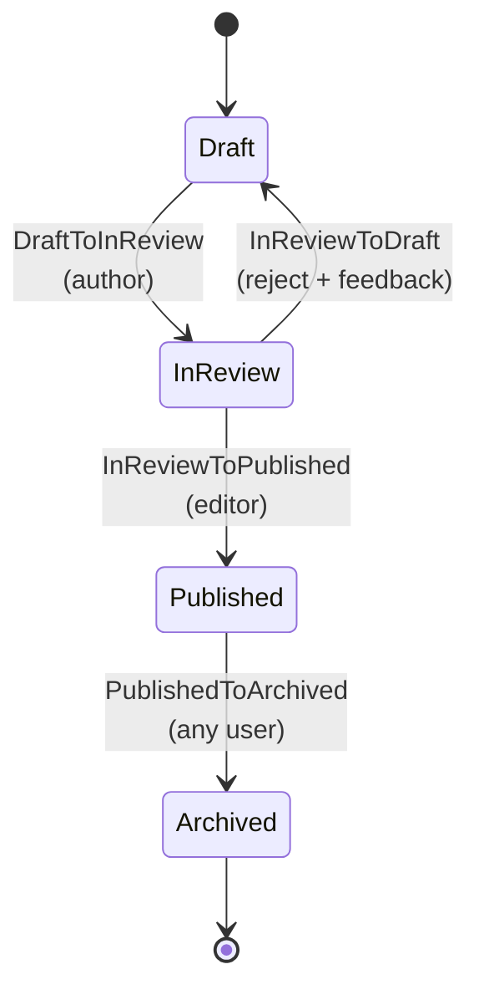

# Workflow de artículo (CMS)

> Ejemplo de state machine para artículos editoriales, demostrando branches de rechazo con feedback, autorización basada en Gate (sin `authorizeFor`) e integración con versioning (`arqel-dev/versioning`).

## Resumen

Un CMS editorial es un caso de uso donde el **flujo de revisión** es el corazón del producto. A diferencia de los pedidos (donde el estado se mueve casi siempre por sistemas/eventos externos), aquí las transiciones son mayoritariamente humanas: el autor envía a revisión, un editor aprueba o lo devuelve con feedback, alguien lo archiva cuando el contenido pierde relevancia. La naturaleza colaborativa requiere dos cosas que este ejemplo destaca: (1) **feedback estructurado en el rechazo** — el revisor escribe un comentario que vuelve con el artículo al autor; y (2) **historial inmutable** que `arqel-dev/workflow` registra por defecto, complementado por **versiones de contenido** generadas por `arqel-dev/versioning` en momentos clave.

El workflow es `Draft → InReview → Published → Archived`, con dos salidas alternativas: `InReview → Draft` (rechazo con razón) y `Published → Archived` (sunset, cualquier usuario autenticado). La decisión de diseño importante aquí es no usar `authorizeFor` en ninguna transición — en cambio, todas autorizan vía un Gate registrado en `AuthServiceProvider`. Esto facilita el testing (los Gates son fáciles de fakear con `Gate::shouldReceive`), mantiene la lógica de autorización agrupada en un único lugar, y permite que el equipo de producto cambie reglas (por ejemplo, "cualquier editor puede rechazar, pero solo el editor-jefe puede publicar") sin tocar las clases de transición.

La integración con versioning es el detalle que diferencia este workflow: cada vez que el artículo entra en `InReview` o `Published`, se crea un snapshot en `versions` (vía el trait `Versionable`). Esto permite hacer rollback a una revisión previa si una publicación resulta problemática, y ver el "diff" entre versiones en la UI admin.

## Diagrama de estados



Nota que **no** permitimos `Archived → Draft` ni `Published → Draft`. Si un artículo archivado necesita ser editado de nuevo, el flujo es "duplicar como draft" (un `Action` en el Resource, no una transición de workflow). Esto preserva el historial de publicación intacto.

## Modelo Eloquent

```php
<?php

declare(strict_types=1);

namespace App\Models;

use App\Models\ArticleState;
use App\Workflows\Articles\Transitions;
use Arqel\Versioning\Concerns\Versionable;
use Arqel\Workflow\Concerns\HasWorkflow;
use Arqel\Workflow\WorkflowDefinition;
use Illuminate\Database\Eloquent\Model;
use Illuminate\Database\Eloquent\Relations\BelongsTo;

final class Article extends Model
{
    use HasWorkflow;
    use Versionable;

    protected $fillable = [
        'title',
        'slug',
        'body',
        'author_id',
        'editor_id',
        'article_state',
        'review_feedback',
        'published_at',
    ];

    protected $casts = [
        'article_state' => ArticleState::class,
        'published_at'  => 'datetime',
    ];

    /** @var list<string> Attributes versioned by arqel-dev/versioning. */
    protected array $versionedAttributes = ['title', 'slug', 'body'];

    public function arqelWorkflow(): WorkflowDefinition
    {
        return WorkflowDefinition::make('article_state')
            ->states([
                ArticleState\Draft::class     => ['label' => 'Draft',      'color' => 'secondary', 'icon' => 'edit-3'],
                ArticleState\InReview::class  => ['label' => 'In review',  'color' => 'warning',   'icon' => 'eye'],
                ArticleState\Published::class => ['label' => 'Published',  'color' => 'success',   'icon' => 'globe'],
                ArticleState\Archived::class  => ['label' => 'Archived',   'color' => 'muted',     'icon' => 'archive'],
            ])
            ->transitions([
                Transitions\DraftToInReview::class,
                Transitions\InReviewToPublished::class,
                Transitions\InReviewToDraft::class,
                Transitions\PublishedToArchived::class,
            ]);
    }

    public function author(): BelongsTo
    {
        return $this->belongsTo(User::class, 'author_id');
    }

    public function editor(): BelongsTo
    {
        return $this->belongsTo(User::class, 'editor_id');
    }
}
```

`Versionable` automáticamente crea entradas en `versions` en los hooks `created`/`updating` — mira el SKILL.md de `arqel-dev/versioning`. Aquí solo listamos atributos relevantes en `$versionedAttributes`; los cambios a `article_state` o `editor_id` no generan una nueva versión (solo los cambios de contenido lo hacen).

## Resource

```php
<?php

declare(strict_types=1);

namespace App\Arqel\Resources;

use App\Models\Article;
use App\Models\ArticleState;
use Arqel\Core\Resource;
use Arqel\Fields\RichText;
use Arqel\Fields\Text;
use Arqel\Fields\Textarea;
use Arqel\Versioning\Fields\VersionHistory;
use Arqel\Workflow\Fields\StateTransitionField;

final class ArticleResource extends Resource
{
    protected static string $model = Article::class;

    public function fields(): array
    {
        return [
            Text::make('title')->required()->maxLength(180),
            Text::make('slug')->required()->unique(ignoreRecord: true),

            StateTransitionField::make('article_state')
                ->label('Editorial status')
                ->showDescription()
                ->showHistory(),

            // Rejection feedback: only visible when the state is Draft and there is prior feedback
            Textarea::make('review_feedback')
                ->label('Editor feedback')
                ->readonly()
                ->visibleWhen(fn (Article $r) =>
                    $r->article_state instanceof ArticleState\Draft && filled($r->review_feedback)
                ),

            RichText::make('body')->required(),

            VersionHistory::make()
                ->label('Version history')
                ->visibleOn(['view']),
        ];
    }
}
```

El field `VersionHistory` (de `arqel-dev/versioning`) renderiza un diff visual entre revisiones — permitiendo al editor comparar la versión actual con la publicada y decidir si aprueba los cambios.

## Clase de transición — rechazo con feedback

```php
<?php

declare(strict_types=1);

namespace App\Workflows\Articles\Transitions;

use App\Models\Article;
use App\Models\ArticleState;

final class InReviewToDraft
{
    public function __construct(
        private readonly Article $article,
        private readonly string $feedback,
    ) {}

    /** @return list<class-string> */
    public static function from(): array
    {
        return [ArticleState\InReview::class];
    }

    public static function to(): string
    {
        return ArticleState\Draft::class;
    }

    public function handle(): Article
    {
        $this->article->article_state = ArticleState\Draft::class;
        $this->article->review_feedback = $this->feedback;
        $this->article->editor_id = auth()->id();
        $this->article->save();

        return $this->article;
    }
}
```

La autorización **no** está aquí — vive en el Gate. Esto es deliberado: si mañana el equipo decide "cualquier editor puede rechazar, pero solo el editor-jefe puede publicar", el cambio es un único archivo (`AuthServiceProvider`).

## Autorización vía Gate

```php
<?php

declare(strict_types=1);

namespace App\Providers;

use App\Models\Article;
use App\Models\User;
use Illuminate\Foundation\Support\Providers\AuthServiceProvider as ServiceProvider;
use Illuminate\Support\Facades\Gate;

final class AuthServiceProvider extends ServiceProvider
{
    public function boot(): void
    {
        // The author (article creator) can move from Draft to InReview.
        Gate::define('transition-draft-to-in-review', function (User $user, Article $article): bool {
            return $user->id === $article->author_id || $user->hasRole('editor');
        });

        // Only editors can approve publishing.
        Gate::define('transition-in-review-to-published', function (User $user, Article $article): bool {
            return $user->hasRole('editor');
        });

        // Any editor can reject (return with feedback).
        Gate::define('transition-in-review-to-draft', function (User $user, Article $article): bool {
            return $user->hasRole('editor');
        });

        // Archiving is "cleanup" — any authenticated user can do it (with auditing via history).
        Gate::define('transition-published-to-archived', function (User $user, Article $article): bool {
            return $user !== null;
        });
    }
}
```

Los nombres siguen el patrón `transition-{from-slug}-to-{to-slug}` que `TransitionAuthorizer` busca automáticamente — el slug es el último segmento del FQCN sin el sufijo `State`, kebab-case.

## Filtro por estado en la Table

```php
use App\Models\Article;
use Arqel\Workflow\Filters\StateFilter;

public function table(): Table
{
    return Table::make()
        ->columns([
            TextColumn::make('title'),
            TextColumn::make('author.name'),
            BadgeColumn::make('article_state')->colorsFromWorkflow(Article::class),
            DateTimeColumn::make('published_at')->placeholder('—'),
        ])
        ->filters([
            StateFilter::make('article_state', Article::class)
                ->label('Editorial status'),
        ])
        ->defaultFilters([
            'article_state' => [
                \App\Models\ArticleState\Draft::class,
                \App\Models\ArticleState\InReview::class,
            ],
        ]);
}
```

`defaultFilters` hace que el admin abra ya filtrado a "trabajo en progreso" (Draft + InReview) — buena UX para editores.

## Listener — snapshot + notificación

```php
<?php

declare(strict_types=1);

namespace App\Listeners;

use App\Mail\ArticleReviewRequested;
use App\Models\Article;
use App\Models\ArticleState;
use App\Models\User;
use Arqel\Workflow\Events\StateTransitioned;
use Illuminate\Contracts\Queue\ShouldQueue;
use Illuminate\Support\Facades\Mail;

final class NotifyEditorialBoard implements ShouldQueue
{
    public function handle(StateTransitioned $event): void
    {
        if (! $event->record instanceof Article) {
            return;
        }

        match ($event->to) {
            ArticleState\InReview::class => $this->onSubmittedForReview($event->record),
            ArticleState\Published::class => $this->onPublished($event->record),
            ArticleState\Draft::class    => $this->onRejected($event->record, $event->context),
            default => null,
        };
    }

    private function onSubmittedForReview(Article $article): void
    {
        $editors = User::role('editor')->get();
        Mail::to($editors)->send(new ArticleReviewRequested($article));
    }

    private function onPublished(Article $article): void
    {
        // Triggers webhook for CDN purge, Algolia indexing, etc.
        \App\Jobs\PublishArticleSideEffects::dispatch($article);
    }

    /** @param array<string,mixed> $context */
    private function onRejected(Article $article, array $context): void
    {
        if ($article->author === null) {
            return;
        }

        Mail::to($article->author)->send(
            new \App\Mail\ArticleRejected(
                article: $article,
                feedback: $context['feedback'] ?? $article->review_feedback ?? '',
            ),
        );
    }
}
```

Observa cómo el listener es **uno solo** que hace `match()` en el estado destino — una alternativa a tres listeners separados. Para listeners pequeños es más legible; para listeners grandes o con dependencias distintas, dividir en múltiples clases (como en `order-states.md`) es mejor.

## Integración con `arqel-dev/versioning`

Cuando el artículo entra en `Published`, el trait `Versionable` ya se encarga de crear una versión con un tag canónico:

```php
// Additional listener, optional — forces a "publication" tag on the created version.
final class TagPublishedVersion
{
    public function handle(StateTransitioned $event): void
    {
        if (! $event->record instanceof Article || $event->to !== ArticleState\Published::class) {
            return;
        }

        $event->record->latestVersion()?->update([
            'tag' => 'published',
            'published_at' => now(),
        ]);
    }
}
```

La UI `VersionHistory` filtra por tag `'published'` para mostrar una timeline limpia de "versiones publicadas" en el admin, ignorando los drafts intermedios.

## Resumen de decisiones

- **Sin `authorizeFor` — solo Gate**: las reglas editoriales cambian frecuentemente; concentrarlas en `AuthServiceProvider` simplifica la revisión.
- **Sin `Archived → Draft`**: archivar es final. Volver a editar = duplicar.
- **Feedback en el `context` de la transición**: el usuario lo escribe en el controlador, va al `metadata` del history, y también se copia a `review_feedback` en el modelo para fácil display.
- **Versioning ortogonal**: `arqel-dev/versioning` maneja snapshots; el workflow maneja estado. Se combinan pero no dependen el uno del otro.
