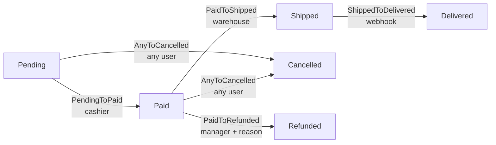

# Workflow de pedido (E-commerce)

> Ejemplo canónico de state machine para un pedido de e-commerce, ejercitando autorización por roles, side-effects vía webhook, transiciones "any-to-X" y auditoría con metadata.

## Resumen

Los pedidos de e-commerce son quizá el caso de uso más clásico para state machines en un backoffice: las etapas están bien definidas (pago, picking, envío, entrega), múltiples actores diferentes pueden mover el pedido en distintos puntos del flujo (cliente, cajero, envíos, sistema externo vía webhook), y algunas transiciones son **branches** que necesitan estar disponibles en múltiples puntos (`Cancelled`, `Refunded`).

Este ejemplo cubre un workflow lineal con dos branches paralelos: el happy path `Pending → Paid → Shipped → Delivered`, más la transición "any-to" `→ Cancelled` (disponible antes del envío), y el branch `Paid → Refunded` (solo manager, con razón obligatoria). Es una buena demo de cómo `arqel-dev/workflow` combina tres capas de autorización (Gate, `authorizeFor`, deny-by-default), captura side-effects asíncronos vía un event listener, y usa `metadata` en el history para almacenar el `webhook_event_id` de Stripe/Mercado Pago para idempotencia.

La decisión de diseño importante aquí: la transición `ShippedToDelivered` se dispara **solo** por un webhook de transportadora — los usuarios humanos nunca ven este botón en la UI. Lo logramos haciendo que `authorizeFor()` devuelva `false` para cualquier usuario autenticado, y el controlador del webhook llama a `->transitionTo()` con `Auth::loginUsingId(null)` (system actor), que bypasea la autorización porque la clase de transición trata un usuario `null` como permitido.

## Diagrama de estados



Nota que `Cancelled` es alcanzable desde `Pending` **y** `Paid` (pero no después de `Shipped` — el pedido ya salió). Lo implementamos con una única clase de transición `AnyToCancelled` que declara `from(): ['Pending', 'Paid']` en lugar de dos clases distintas — reduce duplicación y centraliza la regla "se puede cancelar hasta el packing".

## Modelo Eloquent

```php
<?php

declare(strict_types=1);

namespace App\Models;

use App\Models\OrderState;
use App\Workflows\Orders\Transitions;
use Arqel\Workflow\Concerns\HasWorkflow;
use Arqel\Workflow\WorkflowDefinition;
use Illuminate\Database\Eloquent\Model;

final class Order extends Model
{
    use HasWorkflow;

    protected $fillable = [
        'customer_id',
        'total_cents',
        'order_state',
        'tracking_code',
        'refund_reason',
    ];

    protected $casts = [
        'order_state' => OrderState::class, // spatie state cast (optional)
        'total_cents' => 'integer',
    ];

    public function arqelWorkflow(): WorkflowDefinition
    {
        return WorkflowDefinition::make('order_state')
            ->states([
                OrderState\Pending::class   => ['label' => 'Pending',    'color' => 'warning',     'icon' => 'clock'],
                OrderState\Paid::class      => ['label' => 'Paid',       'color' => 'info',        'icon' => 'credit-card'],
                OrderState\Shipped::class   => ['label' => 'Shipped',    'color' => 'primary',     'icon' => 'truck'],
                OrderState\Delivered::class => ['label' => 'Delivered',  'color' => 'success',     'icon' => 'check-circle'],
                OrderState\Cancelled::class => ['label' => 'Cancelled',  'color' => 'destructive', 'icon' => 'x-circle'],
                OrderState\Refunded::class  => ['label' => 'Refunded',   'color' => 'destructive', 'icon' => 'rotate-ccw'],
            ])
            ->transitions([
                Transitions\PendingToPaid::class,
                Transitions\PaidToShipped::class,
                Transitions\ShippedToDelivered::class,
                Transitions\AnyToCancelled::class,
                Transitions\PaidToRefunded::class,
            ]);
    }
}
```

La propiedad `order_state` se castea vía spatie cuando la app opta in (sugerido en el composer de `arqel-dev/workflow`). Sin el cast, la columna almacena el slug o FQCN como string — el trait lo resuelve igual.

## Resource (admin panel)

```php
<?php

declare(strict_types=1);

namespace App\Arqel\Resources;

use App\Models\Order;
use Arqel\Core\Resource;
use Arqel\Fields\Money;
use Arqel\Fields\Text;
use Arqel\Workflow\Fields\StateTransitionField;

final class OrderResource extends Resource
{
    protected static string $model = Order::class;

    protected static ?string $navigationIcon = 'shopping-cart';

    public function fields(): array
    {
        return [
            Text::make('customer.name')->label('Customer')->searchable(),
            Money::make('total_cents')->currency('BRL')->label('Total'),

            StateTransitionField::make('order_state')
                ->label('Order status')
                ->showDescription()
                ->showHistory()
                ->transitionsAttribute('order_state'),

            Text::make('tracking_code')
                ->label('Tracking code')
                ->visibleOn(['view'])
                ->visibleWhen(fn (Order $r) => in_array($r->order_state?->getMorphClass(), ['shipped', 'delivered'], true)),
        ];
    }
}
```

`StateTransitionField` consume `arqelWorkflow()->toArray()` automáticamente, renderiza el estado actual con color/icono, expone los botones para las transiciones autorizadas, y muestra el historial append-only debajo (cuando se llama `showHistory()`).

## Clase de transición con authorizeFor

```php
<?php

declare(strict_types=1);

namespace App\Workflows\Orders\Transitions;

use App\Models\Order;
use App\Models\OrderState;
use Arqel\Workflow\Concerns\RecordsStateTransition;
use Illuminate\Contracts\Auth\Authenticatable;

final class PendingToPaid
{
    use RecordsStateTransition;

    public function __construct(
        private readonly Order $order,
    ) {}

    /** @return list<class-string> */
    public static function from(): array
    {
        return [OrderState\Pending::class];
    }

    public static function to(): string
    {
        return OrderState\Paid::class;
    }

    /**
     * Only users with the `cashier` (or `admin`) role can confirm payment.
     * Returning `false` here hides the button in the UI and blocks the call server-side.
     */
    public static function authorizeFor(?Authenticatable $user, mixed $record): bool
    {
        if ($user === null) {
            return false;
        }

        return $user->hasAnyRole(['cashier', 'admin']);
    }

    public function handle(): Order
    {
        $this->order->order_state = OrderState\Paid::class;
        $this->order->paid_at = now();
        $this->order->save();

        // Dispatches the canonical event — RecordsStateTransition handles this when used via the trait.
        return $this->order;
    }
}
```

Para `PaidToShipped` y `PaidToRefunded` usamos Gates registrados en `AuthServiceProvider`, ilustrando la alternativa:

```php
// app/Providers/AuthServiceProvider.php
Gate::define('transition-paid-to-shipped', function ($user, Order $order): bool {
    return $user->hasRole('warehouse');
});

Gate::define('transition-paid-to-refunded', function ($user, Order $order): bool {
    return $user->hasRole('manager') && filled($order->refund_reason);
});
```

El `TransitionAuthorizer` de `arqel-dev/workflow` consulta `authorizeFor` primero (cuando está declarado), luego cae al Gate `transition-{from-slug}-to-{to-slug}`, y finalmente niega por defecto. Nota que `transition-paid-to-refunded` también valida que `refund_reason` esté lleno — combinar reglas de autorización y validación de dominio en el Gate es aceptable cuando la razón es simple.

## Filtro por estado en la Table

```php
use App\Models\Order;
use Arqel\Workflow\Filters\StateFilterFactory;

public function table(): Table
{
    return Table::make()
        ->columns([
            TextColumn::make('id')->prefix('#'),
            TextColumn::make('customer.name'),
            BadgeColumn::make('order_state')
                ->colorsFromWorkflow(Order::class),
            DateTimeColumn::make('created_at'),
        ])
        ->filters([
            StateFilterFactory::forResource(Order::class),
        ])
        ->defaultSort('created_at', 'desc');
}
```

La factory `StateFilterFactory::forResource(Order::class)` resuelve el field automáticamente desde `arqelWorkflow()->getField()` — sin necesidad de repetir `'order_state'`. El dropdown generado muestra todos los estados con su label/color configurados.

## Listener de auditoría — email en Shipped

```php
<?php

declare(strict_types=1);

namespace App\Listeners;

use App\Mail\OrderShipped;
use App\Models\Order;
use App\Models\OrderState;
use Arqel\Workflow\Events\StateTransitioned;
use Illuminate\Contracts\Queue\ShouldQueue;
use Illuminate\Support\Facades\Mail;

final class NotifyCustomerOfShipment implements ShouldQueue
{
    public function handle(StateTransitioned $event): void
    {
        if (! $event->record instanceof Order) {
            return;
        }

        if ($event->to !== OrderState\Shipped::class) {
            return;
        }

        Mail::to($event->record->customer)
            ->send(new OrderShipped(
                order: $event->record,
                trackingCode: $event->context['tracking_code'] ?? null,
            ));
    }
}
```

Registrado en `EventServiceProvider`:

```php
protected $listen = [
    \Arqel\Workflow\Events\StateTransitioned::class => [
        \App\Listeners\NotifyCustomerOfShipment::class,
        // other listeners (broadcast, metrics, etc.)
    ],
];
```

El webhook de la transportadora llama a `transitionTo()` pasando `metadata` que termina en el history:

```php
$order->transitionTo(OrderState\Shipped::class, [
    'tracking_code'    => $payload['tracking_code'],
    'webhook_event_id' => $payload['event_id'],   // idempotency
    'carrier'          => $payload['carrier'],
]);
```

El listener `PersistStateTransitionToHistory` (ya registrado por `WorkflowServiceProvider`) escribe la fila en `arqel_state_transitions` con `metadata` JSON conteniendo esas claves — útil para investigación posterior y para evitar procesar el mismo webhook dos veces (el controlador hace `where('metadata->webhook_event_id', $eventId)->exists()` antes de transicionar).

## Resumen de decisiones

- **`Cancelled` como "any-to"**: una única clase de transición con `from()` listando los estados permitidos es más simple que N clases.
- **Webhook como actor**: `ShippedToDelivered::authorizeFor` devuelve `false` para humanos; solo el controlador del webhook (llamado fuera de `Auth`) puede dispararlo.
- **Razón de reembolso en el Gate**: `filled($order->refund_reason)` en el Gate previene una transición sin el campo seteado — la alternativa es validar en el controlador.
- **Idempotencia vía metadata**: `webhook_event_id` en `metadata` te permite re-procesar webhooks duplicados sin side effects.
