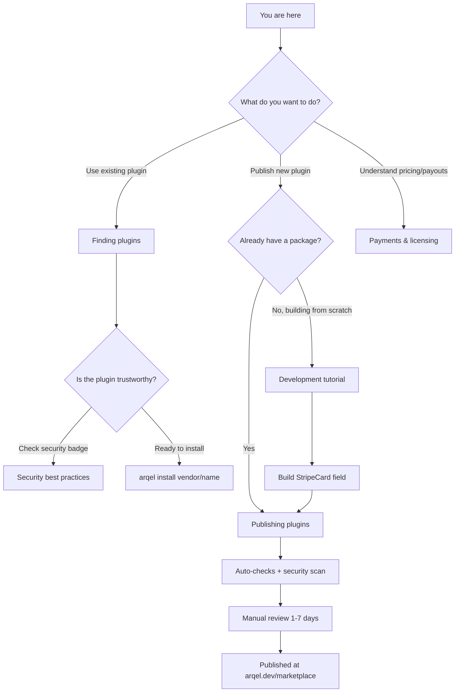

# Arqel Marketplace

> Hub oficial para descubrir, publicar y consumir extensiones de la comunidad Arqel.

El **Arqel Marketplace** (en `arqel.dev/marketplace`) es el catálogo central de plugins impulsados por la comunidad que extienden el framework. Está construido como un paquete embebible (`arqel-dev/marketplace`) y _dogfooded_ por la propia instancia pública — es decir, el sitio oficial es un admin Arqel que ejecuta el paquete del marketplace internamente.

## Visión general

El marketplace existe para resolver tres problemas distintos:

1. **Descubrimiento** — los usuarios del framework necesitan un único lugar para encontrar fields, widgets, integraciones y temas oficiales o de la comunidad, con filtros, ratings y badges de seguridad.
2. **Distribución** — los autores necesitan una vía predecible y auditada para publicar paquetes (Composer + npm) con validación de convenciones, escaneo de seguridad y moderación manual.
3. **Monetización** — opcionalmente, los plugins premium pueden venderse mediante license keys y un revenue share 80/20 (publisher/Arqel).

Todo esto dialoga con el ecosistema Composer/npm sin reinventar registries — el marketplace es solo la capa de descubrimiento + curación + seguridad sobre paquetes que siguen alojados en Packagist y el npm registry.

## Los 4 tipos de plugin

| Tipo | Paquete PHP | Paquete npm asociado | Ejemplos típicos |
|---|---|---|---|
| **field-pack** | `arqel-dev/fields-*` | `@vendor/arqel-fields-*` | Stripe Card, Mapbox Address, Markdown Editor |
| **widget-pack** | `arqel-dev/widgets-*` | `@vendor/arqel-widgets-*` | Stat cards, charts, calendars |
| **integration** | `arqel-dev/integration-*` | `@vendor/arqel-integration-*` | Slack notify, Algolia search, Sentry |
| **theme** | `arqel-dev/theme-*` | `@vendor/arqel-theme-*` | Variantes dark mode, kits white-label |

La categoría adicional `language-pack` cubre traducciones y `tool` cubre extensiones CLI/Artisan.

## Árbol de decisión

## Sub-documentos

- [Encontrar plugins](./finding-plugins.md) — búsqueda, filtros, instalación, confianza.
- [Publicar plugins](./publishing.md) — submission, cola de revisión, pipeline de estados.
- [Tutorial de desarrollo](./development-tutorial.md) — guía paso a paso para construir un field-pack desde cero.
- [Buenas prácticas de seguridad](./security-best-practices.md) — vulnerabilidades a evitar, obligaciones de licencia, disclosure.
- [Pagos y licencias](./payments-and-licensing.md) — pricing, license keys, payouts, reembolsos.

## Marketplace vs instalación directa (Composer/npm)

Puede parecer redundante tener un marketplace cuando Composer ya distribuye paquetes PHP y npm ya distribuye paquetes JS. Los trade-offs:

| Aspecto | Composer/npm directo | Marketplace |
|---|---|---|
| **Descubrimiento** | Búsqueda manual en Packagist/npm; sin filtros conscientes de Arqel | Categorías, trending, featured curado, búsqueda semántica |
| **Compatibilidad** | Lees `composer.json` y averiguas si funciona | Constraint `arqel.compat.arqel: '^1.0'` validada por `PluginConventionValidator` |
| **Seguridad** | Confías a ciegas en el autor | Escaneo automático (`SecurityScanner` + `VulnerabilityDatabase`), auto-delist ante hallazgo `critical` |
| **Reviews/ratings** | No existe como canal | `arqel_plugin_reviews` con votos útiles, opciones de orden, cola de moderación |
| **Pago** | Paquetes pagos son raros y ad-hoc | License keys `ARQ-XXXX-XXXX-XXXX-XXXX` + revenue share automático |
| **Actualizaciones** | `composer update` sin contexto | `arqel:plugin:list --validate` muestra divergencias de convención |
| **Velocidad** | Sabes exactamente lo que haces | Curva de aprendizaje extra para publishers (formulario de submission, espera de review) |

**¿Cuándo preferir instalación directa?** Plugins internos de empresa, paquetes privados, o mientras el plugin aún está en alpha y quieres iterar rápido. Todo lo de Composer/npm sigue funcionando — el marketplace **complementa**, no reemplaza.

**¿Cuándo preferir el marketplace?** Plugins de la comunidad que serán instalados por terceros, cualquier plugin pago, cualquier plugin que toque datos sensibles (logs, pagos, auth) y por tanto se beneficie del escaneo de seguridad obligatorio.

## Estado actual de entrega

La spec MKTPLC-* está implementada en las siguientes áreas (ver `packages/marketplace/SKILL.md` para detalle):

- ✅ Workflow de submission + review (MKTPLC-002)
- ✅ Validador de convenciones + comando `arqel:plugin:list` (MKTPLC-003)
- ✅ Reviews + ratings + votos útiles + moderación (MKTPLC-006)
- ✅ Categorías + trending + featured (MKTPLC-007)
- ✅ Plugins premium + license keys + schema de payouts (MKTPLC-008)
- ✅ Escaneo de seguridad + auto-delist (MKTPLC-009)
- ⏳ Dashboard de stats/analytics (MKTPLC-004)
- ⏳ Stripe Connect real (MKTPLC-008-stripe-real)

## Endpoints REST de referencia

La API pública del marketplace es consumida por el sitio `arqel.dev/marketplace`, la CLI `arqel:install` e integraciones de terceros (CI checks, dashboards corporativos):

| Endpoint | Método | Auth | Descripción |
|---|---|---|---|
| `/api/marketplace/plugins` | GET | público | Listado paginado con filtros `type` + `search` |
| `/api/marketplace/plugins/{slug}` | GET | público | Detalle + 5 reviews + versiones |
| `/api/marketplace/plugins/{slug}/reviews` | GET | público | Reviews con orden `helpful`/`recent`/`rating` |
| `/api/marketplace/plugins/{slug}/reviews` | POST | Sanctum | Crea review |
| `/api/marketplace/plugins/submit` | POST | Sanctum | Submission de plugin (publisher) |
| `/api/marketplace/categories` | GET | público | Lista categorías (root + children) |
| `/api/marketplace/featured` | GET | público | Editor's picks |
| `/api/marketplace/trending` | GET | público | Top 20 por trending score |
| `/api/marketplace/new?days=7` | GET | público | Plugins recientes |
| `/api/marketplace/popular` | GET | público | Leaderboard de instalaciones de todo el tiempo |
| `/api/marketplace/plugins/{slug}/purchase` | POST | Sanctum | Inicia compra premium |
| `/api/marketplace/plugins/{slug}/purchase/confirm` | POST | Sanctum | Confirma callback del gateway |
| `/api/marketplace/plugins/{slug}/download` | GET | Sanctum | Descarga (gratis directo, premium con license) |

Los endpoints admin (Gates `marketplace.review`, `marketplace.feature`, `marketplace.refund`, `marketplace.moderate-reviews`, `marketplace.security-scans`) viven bajo el prefijo `/api/marketplace/admin/...` y son opacos para no-admins.

## Próximos pasos

Si eres **usuario** del framework: empieza por [Encontrar plugins](./finding-plugins.md).

Si eres **publisher** con un paquete PHP/npm ya construido: salta directo a [Publicar plugins](./publishing.md).

Si quieres **construir un plugin desde cero**: sigue el [Tutorial de desarrollo](./development-tutorial.md).
