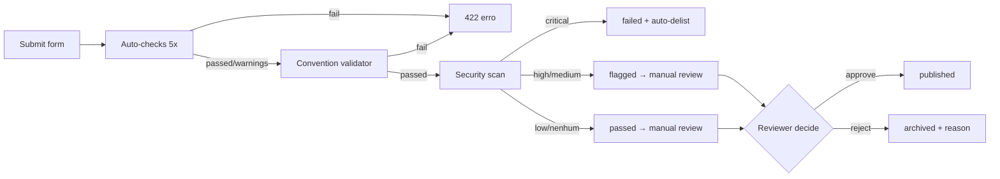

# Publicar plugins

> Guía completa para autores que quieren publicar plugins en el Arqel Marketplace.

Esta página describe el pipeline de publicación **end-to-end**: configuración de cuenta, submission, auto-checks, escaneo de seguridad, revisión manual, releases posteriores y seguimiento de stats.

## Prerrequisitos

Antes de hacer la submission necesitas:

1. **Paquete PHP** publicado en Packagist (`vendor/package`) con `type: arqel-plugin` en `composer.json`.
2. **(Opcional) Paquete npm asociado** para el lado React, publicado en el npm registry (`@vendor/package`).
3. **Repositorio GitHub público** con un `LICENSE` (preferiblemente MIT — ver allow-list en [Buenas prácticas de seguridad](./security-best-practices.md)).
4. **Al menos un release tagged** (`v0.1.0` o superior, semver-compliant).
5. **Cumplimiento de convenciones** — ejecuta `arqel:plugin:list --validate` localmente para confirmar.

Si te falta algo, empieza por el [Tutorial de desarrollo](./development-tutorial.md) — cubre la configuración desde cero.

## Paso 1 — Cuenta de publisher

Crea tu cuenta en `arqel.dev/marketplace/signup`. El formulario pide:

- **Email** (verificación obligatoria — el enlace expira en 24h).
- **Nombre público de visualización** que aparece junto a cada uno de tus plugins.
- **Usuario de GitHub** para vinculación automática del repo.
- **Namespace de vendor Composer** (ej., `acme`) — solo puedes hacer submission de plugins bajo ese namespace.
- **(Opcional) Onboarding de Stripe Connect** si tienes intención de publicar plugins pagos. Puede hacerse después.

La cuenta tiene tres estados: `unverified` → `verified` → `publisher`. Solo `publisher` puede hacer submission — escalado automático tras verificación de email + prueba de propiedad de GitHub vía OAuth.

## Paso 2 — Formulario de submission

Endpoint REST: `POST /api/marketplace/plugins/submit` (auth Sanctum requerida, controller `PluginSubmissionController`).

Payload mínimo:

```json
{
  "composer_package": "acme/stripe-card",
  "npm_package": "@acme/arqel-stripe-fields",
  "github_url": "https://github.com/acme/arqel-stripe-card",
  "type": "field-pack",
  "name": "Stripe Card Field",
  "description": "Renderiza o Stripe Elements Card como um Field Arqel pronto para PaymentMethod.",
  "screenshots": [
    "https://raw.githubusercontent.com/acme/arqel-stripe-card/main/docs/screen-1.png",
    "https://raw.githubusercontent.com/acme/arqel-stripe-card/main/docs/screen-2.png"
  ]
}
```

Validación impuesta por `SubmitPluginRequest`:

| Campo | Regla |
|---|---|
| `composer_package` | regex `vendor/package`, único en `arqel_plugins` |
| `npm_package` | string opcional |
| `github_url` | URL válida, host `github.com` (warn si otro) |
| `type` | enum `field-pack`/`widget-pack`/`integration`/`theme`/`language-pack`/`tool` |
| `name` | 3-100 chars |
| `description` | 20-2000 chars (warn si < 50) |
| `screenshots[]` | array de URLs públicas (warn si 0) |
| `slug` | derivado de `name` vía `Str::slug` cuando ausente; check de unicidad |

La respuesta `201` devuelve `{plugin: {...}, checks: {checks: [...], passed: bool}}` — ves inmediatamente qué auto-checks pasaron. Si `passed: false`, el plugin **igual** entra con `status=pending`, pero la cola de revisión queda alertada y el tiempo de aprobación crece.

## Paso 3 — Auto-checks (sin red)

`PluginAutoChecker` ejecuta 5 checks defensivos:

1. **`composer_package_format`** — falla si el regex es inválido.
2. **`github_url_format`** — falla si el host no es `github.com`.
3. **`description_length`** — warn si < 50 chars.
4. **`screenshots_count`** — warn si 0.
5. **`name_uniqueness`** — warn si otro plugin publicado ya tiene un nombre similar.

Estos checks son instantáneos — sin requests HTTP. La intención es fallar rápido ante errores obvios sin retener CI durante minutos.

## Paso 4 — Validación de convenciones

`PluginConventionValidator` (MKTPLC-003) es el segundo gatekeeper. Requiere que el `composer.json` de tu paquete contenga:

```json
{
  "name": "acme/stripe-card",
  "type": "arqel-plugin",
  "description": "Stripe Card Field for Arqel",
  "license": "MIT",
  "keywords": ["arqel", "plugin", "field", "stripe", "payments"],
  "extra": {
    "arqel": {
      "plugin-type": "field-pack",
      "category": "integrations",
      "compat": {
        "arqel": "^1.0"
      },
      "installation-instructions": "https://github.com/acme/arqel-stripe-card#installation"
    }
  }
}
```

Errores (fail):

- `type` no es `arqel-plugin`.
- `extra.arqel.plugin-type` ausente o fuera del enum.
- `extra.arqel.compat.arqel` no es un constraint semver válido.
- `extra.arqel.category` ausente o vacío.

Warnings (pasa pero marca):

- `extra.arqel.installation-instructions` ausente.
- `keywords` no incluye `arqel` + `plugin`.

Y el `package.json` npm asociado necesita **uno de estos dos**:

```json
{
  "arqel": { "plugin-type": "field-pack" }
}
```

o

```json
{
  "peerDependencies": { "@arqel-dev/types": "^1.0" }
}
```

## Paso 5 — Escaneo de seguridad

Tras la validación, `SecurityScanner` (MKTPLC-009) crea una fila `arqel_plugin_security_scans` en `running` y ejecuta cuatro etapas:

1. **Vulnerability lookup** — consulta `VulnerabilityDatabase` (por defecto `StaticVulnerabilityDatabase` que devuelve vacío; las apps host pueden rebindear a una GitHub Advisory Database real). Cada paquete composer + npm es chequeado.
2. **License check** — compara `composer.json#license` contra el allow-list (`MIT`, `Apache-2.0`, `BSD-2-Clause`, `BSD-3-Clause`). Cualquier cosa fuera se vuelve un warning `low`.
3. **Patrones sospechosos** — placeholder actual (TODO MKTPLC-009-static-analysis). En el futuro, scan estático para `eval`, `exec`, `file_get_contents` sobre URLs de input del usuario, etc.
4. **Severity rollup** — toma el máximo entre todos los hallazgos.

Resultado:

| Severidad máx. | Acción |
|---|---|
| `critical` | `status=failed` + auto-delist (`status=archived`) + dispatch `PluginAutoDelistedEvent` |
| `high` o `medium` | `status=flagged` + alerta para revisión manual |
| `low` o ninguna | `status=passed` |

Si tu plugin queda `flagged`, **no entres en pánico** — abre la página de detalle del scan en el dashboard admin, lee los hallazgos y responde con remediation. El revisor humano decide caso a caso.

## Paso 6 — Revisión manual

Los plugins con `status=pending` entran a la cola de moderación (`GET /admin/plugins?status=pending`, Gate `marketplace.review`). El revisor humano:

1. Lee descripción + screenshots.
2. Visita `github_url` y revisa el código (especialmente el service provider y cualquier llamada `Http`/`Process`/`Storage`).
3. Confirma que el plugin no viola guidelines (sin crypto adversarial, sin recolección opaca de telemetría, sin dependencia abandonware).
4. Aprueba o rechaza vía `POST /admin/plugins/{slug}/review`.

Timeline esperado:

| Escenario | Tiempo |
|---|---|
| Auto-checks passed + scan passed + revisor disponible | 1-2 días |
| Warnings en auto-checks o scan flagged | 3-5 días |
| Rechazado y re-enviado tras fix | 5-7 días |
| Backlog grande (releases mayores del framework) | hasta 14 días |

Aprobado → `status=published` + dispatch del evento `PluginApproved` → el plugin aparece en `/api/marketplace/plugins`. Rechazado → `status=archived` + `rejection_reason` poblado + dispatch `PluginRejected`. Recibes email con el motivo (la integración de email está TBD; por ahora consultas vía `GET /publisher/plugins`).

## Paso 7 — Releases posteriores

Cada nueva versión de tu plugin genera una fila en `arqel_plugin_versions`:

```http
POST /api/marketplace/plugins/{slug}/versions
{
  "version": "1.2.0",
  "changelog": "Adicionado suporte a Stripe Connect Express. Fix em currency=EUR.",
  "released_at": "2026-05-15T14:00:00Z"
}
```

Las versiones siguen semver estricto. El marketplace **no** re-ejecuta automáticamente el escaneo de seguridad en cada release (caro) — pero corre diariamente vía el agendado `arqel:marketplace:scan`. Puedes forzar un scan desde el dashboard cuando shippeas un fix de vulnerabilidad.

Cuando publicas un release con un **breaking change**, actualiza `extra.arqel.compat.arqel` en el `composer.json` del nuevo tag. Los usuarios en una versión del framework <`compat.arqel` seguirán recibiendo la versión anterior a través del resolver de Composer — sin acción extra del marketplace.

## Paso 8 — Estadísticas

El dashboard del publisher (`/marketplace/publisher/dashboard`) consume cuatro endpoints:

```http
GET /api/marketplace/publisher/plugins
GET /api/marketplace/publisher/plugins/{slug}/installations?days=30
GET /api/marketplace/publisher/plugins/{slug}/reviews
GET /api/marketplace/publisher/payouts
```

Cada uno devuelve métricas filtradas por `publisher_user_id = auth()->id()`. Detalle completo de stats vive en [MKTPLC-004 — analytics](https://github.com/arqel-dev/arqel/blob/main/PLANNING/11-fase-4-ecossistema.md) (entrega futura).

Para plugins pagos también ves compras agregadas + payouts pendientes:

```http
GET /api/marketplace/publisher/payouts?per_page=20
```

Detalles en [Pagos y licencias](./payments-and-licensing.md).

## Pipeline visual



## Checklist del publisher

Antes de hacer submission, confirma:

- [ ] `composer.json#type === "arqel-plugin"`
- [ ] `extra.arqel.plugin-type` correcto
- [ ] `extra.arqel.compat.arqel` es un constraint semver válido
- [ ] `extra.arqel.category` poblado
- [ ] `keywords` incluye `arqel` + `plugin`
- [ ] `LICENSE` en el repositorio (MIT preferido)
- [ ] README con instalación, ejemplo de uso, screenshots
- [ ] Al menos 1 release tagged en GitHub
- [ ] Paquete publicado en Packagist
- [ ] (Opcional) paquete npm asociado publicado
- [ ] Auto-checks locales vía `arqel:plugin:list --validate`

## Próximos pasos

- ¿Quieres construir un plugin desde cero? Mira el [Tutorial de desarrollo](./development-tutorial.md).
- ¿Quieres habilitar pagos? Mira [Pagos y licencias](./payments-and-licensing.md).
- ¿Plugin rechazado por seguridad? Mira [Buenas prácticas de seguridad](./security-best-practices.md).
