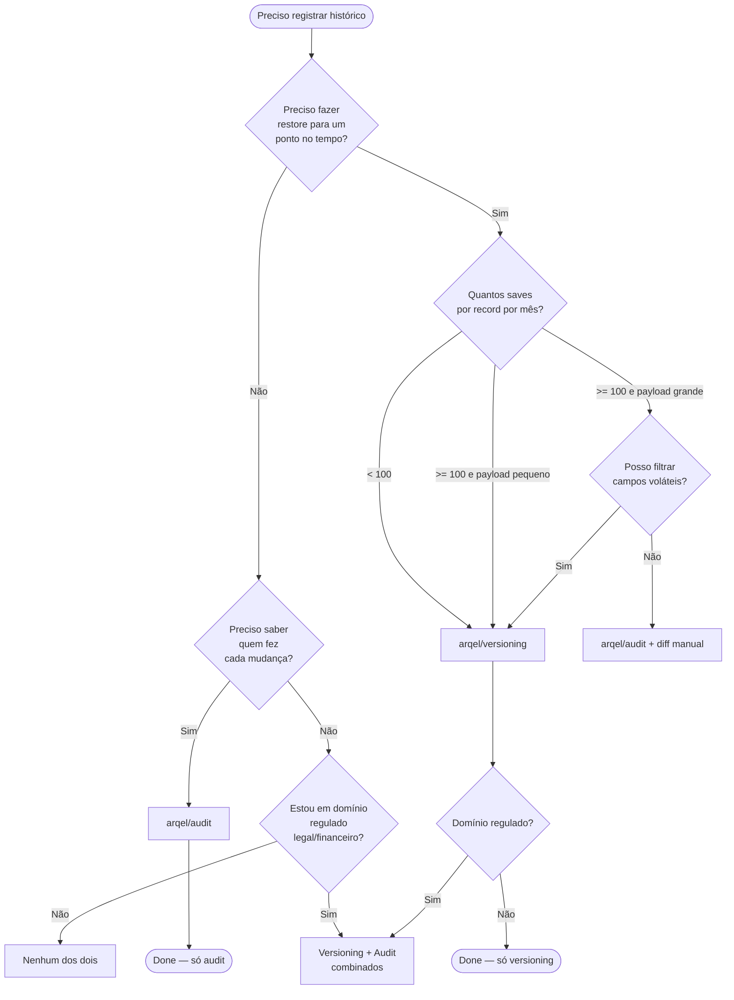

# Versioning vs Audit log — quando usar qual

> **Documento comparativo do pacote `arqel/versioning` versus `arqel/audit`.**
> Lê-se em conjunto com os 3 cenários reais nesta mesma pasta:
> [CMS Articles](./cms-articles.md), [E-commerce Orders](./ecommerce-orders.md),
> [Legal Contracts](./legal-contracts.md).

## Purpose

Ambos os pacotes resolvem problemas de "histórico", mas resolvem
problemas **diferentes**. Confundir os dois leva a:

- Storage explodindo em ordem de grandeza (snapshots de modelos
  voláteis).
- Audit log usado como fonte primária de restore — perdendo o estado
  parcial em colunas não auditadas.
- Compliance falhando porque você gravou snapshot mas não _quem_
  aprovou a mudança.

Este doc dá uma régua objetiva para decidir.

## TL;DR

- **`arqel/versioning`** = snapshot completo do _conteúdo_ do registro
  num ponto do tempo. Permite restore. Caso de uso: "voltar artigo
  para a versão de ontem".
- **`arqel/audit`** = event log apêndice-only de _quem fez o quê e quando_.
  Não permite restore (sozinho). Caso de uso: "quem mudou o status
  desse pedido?".
- **Ambos juntos** = compliance / legal-tech / financeiro: snapshot
  para preservar conteúdo + audit para preservar contexto humano.

## Tabela comparativa

| Aspecto | `arqel/versioning` | `arqel/audit` |
| --- | --- | --- |
| **Forma de armazenamento** | Snapshot completo do `getAttributes()` por save | Event row com `event_name` + delta |
| **Custo de storage** | Alto (linear no nº de saves × tamanho do model) | Baixo (linear no nº de eventos × tamanho do delta) |
| **Padrão de query** | "Me dê a versão N deste record" | "Me dê todos os eventos do tipo X entre T1 e T2" |
| **Point-in-time recovery** | Sim, nativo (`restoreToVersion`) | Não — só reconstrução manual replicando eventos |
| **Append-only garantido** | Sim (`$timestamps=false`, sem updates) | Sim (event log puro) |
| **User attribution** | Opcional (`created_by_user_id` defensivo) | Mandatório por design |
| **Snapshot vs delta** | Snapshot (todas colunas) + diff em `changes` | Apenas delta + payload do evento |
| **Restore capability** | Sim (idempotente, cria nova version) | Não — eventos não restauram estado |
| **GDPR right-to-be-forgotten** | Difícil — payload pode conter PII; precisa `pruneOldVersions` ou hook serializing | Mais fácil — anonimizar `actor_id`/`payload` |
| **Performance impact (write)** | 1 INSERT extra + JSON encode do payload completo | 1 INSERT extra com payload menor |
| **Schema evolution** | Tolerante (snapshot é JSON, não atado ao schema atual) | Tolerante (event_name versionado por convenção) |
| **Cardinalidade ideal** | Baixa-média (centenas-milhares de records) | Qualquer (milhões+) |
| **Tipo de model ideal** | Conteúdo editável (artigo, contrato, configuração) | Transacional, eventos discretos (pedido, pagamento, login) |
| **Custo de retenção a longo prazo** | Pode dominar storage; precisa prune agressivo | Baixo; arquivamento incremental viável |
| **Diff legível por humano** | Sim, via `changes` por campo | Indireto (precisa replay) |

## Decision tree

## Anti-patterns

### 1. Versionar logs de eventos = bloat catastrófico

Tabela `event_logs` recebe 50k inserts/dia. Aplicar `Versionable`
trait nela duplica imediatamente o volume de storage e cada save
dispara prune. **Audit log de eventos não precisa ser versionado** —
ele já _é_ um log apêndice-only.

### 2. Audit log como fonte primária de restore

Tentar reconstruir um Article a partir de "User editou body em T1" +
"User editou title em T2" exige replay determinístico, ordem
correta, e perde campos não auditados. O audit log responde "o que
aconteceu", não "qual era o estado". **Para restore, use versioning.**

### 3. Não filtrar payload sensível (PII) no snapshot

`payload` em `arqel_versions` é JSON cru de `getAttributes()`. Se o
model tem `cpf`, `password_hash`, `api_token`, eles ficam gravados
em texto preservado por anos. **Antes de adotar versioning, decida
quais campos remover** (idealmente via hook `serializing` no trait, ou
override de `getAttributes()` para a versão).

### 4. Skip retention / prune

`keep_versions=0` em produção sem job de prune = bomba relógio. Em 6
meses a tabela `arqel_versions` pode chegar a dezenas de GB e
dominar o backup. **Sempre configure** `--days=N` ou `--keep=N` no
schedule semanal.

### 5. Versionar e auditar exatamente os mesmos campos sem coordenação

Duplicação pura: se cada save gera tanto Version quanto AuditEvent
com a mesma info, você está pagando 2× o storage para a mesma
informação. Coordene: versioning para _conteúdo_, audit para
_intenção/contexto_ (motivo, IP, user agent, aprovação).

## Quando usar ambos

Domínios regulados (legal-tech, fintech, healthtech, governo)
combinam os dois:

- **Versioning** preserva o conteúdo imutável (necessário para
  compliance — o contrato como estava em 2024-03-15).
- **Audit** preserva o contexto humano (quem aprovou, IP de origem,
  motivo declarado).

Ver [legal-contracts.md](./legal-contracts.md) para implementação.

## Quando não usar nenhum dos dois

- Records read-only ou imutáveis por design (e.g., `Currency`,
  `Country`).
- Tabelas de cache/lookup que podem ser regeneradas.
- Dados de sessão / temporários.
- Métricas e telemetria — use o pipeline de observabilidade dedicado.

## Related

- [CMS Articles — versioning + restore](./cms-articles.md)
- [E-commerce Orders — audit-only](./ecommerce-orders.md)
- [Legal Contracts — versioning + audit combinados](./legal-contracts.md)
- `packages/versioning/SKILL.md`
- `PLANNING/10-fase-3-avancadas.md` § "5. Record versioning"
