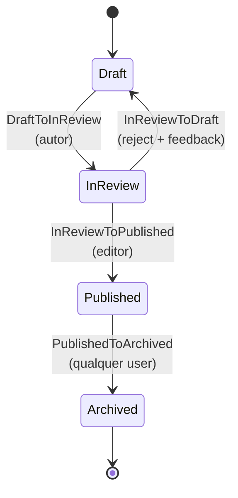

# Workflow de Artigos (CMS)

> Exemplo de máquina de estados para artigos editoriais, demonstrando ramos de rejeição com feedback, autorização via Gate (sem `authorizeFor`) e integração com versionamento (`arqel/versioning`).

## Visão geral

CMS editorial é um caso de uso onde o **fluxo de revisão** é o coração do produto. Diferente de pedidos (onde o estado avança quase sempre por sistemas/eventos externos), aqui as transições são quase todas humanas: autor envia para revisão, editor aprova ou devolve com feedback, alguém arquiva quando o conteúdo perde relevância. A natureza colaborativa exige duas coisas que este exemplo destaca: (1) **feedback estruturado na rejeição** — o reviewer escreve um comentário que volta junto com o artigo para o autor; e (2) **histórico imutável** que o `arqel/workflow` grava por padrão, complementado por **versões do conteúdo** geradas pelo `arqel/versioning` em momentos-chave.

O workflow é `Draft → InReview → Published → Archived`, com duas saídas alternativas: `InReview → Draft` (rejeição com motivo) e `Published → Archived` (sunset, qualquer pessoa autenticada). A decisão importante de design aqui é não usar `authorizeFor` em nenhuma transition — em vez disso, todas autorizam via Gate registrada em `AuthServiceProvider`. Isso facilita testes (Gates são fáceis de fakeAr com `Gate::shouldReceive`), mantém a lógica de autorização agrupada num único lugar e permite que o time de produto altere regras (por exemplo, "qualquer editor pode rejeitar, mas só o editor-chefe pode publicar") sem mexer em transition classes.

A integração com versionamento é o detalhe que diferencia este workflow: cada vez que o artigo entra em `InReview` ou `Published`, um snapshot é criado em `versions` (via trait `Versionable`). Isso permite voltar a uma revisão anterior se uma publicação se mostrar problemática, e ver o "diff" entre versões na UI do admin.

## Diagrama de estados



Note que **não** permitimos `Archived → Draft` ou `Published → Draft`. Se um artigo arquivado precisa voltar à edição, o fluxo é "duplicar como rascunho" (uma `Action` no Resource, não uma transition de workflow). Isso preserva o histórico de publicação intacto.

## Model Eloquent

```php
<?php

declare(strict_types=1);

namespace App\Models;

use App\Models\ArticleState;
use App\Workflows\Articles\Transitions;
use Arqel\Versioning\Concerns\Versionable;
use Arqel\Workflow\Concerns\HasWorkflow;
use Arqel\Workflow\WorkflowDefinition;
use Illuminate\Database\Eloquent\Model;
use Illuminate\Database\Eloquent\Relations\BelongsTo;

final class Article extends Model
{
    use HasWorkflow;
    use Versionable;

    protected $fillable = [
        'title',
        'slug',
        'body',
        'author_id',
        'editor_id',
        'article_state',
        'review_feedback',
        'published_at',
    ];

    protected $casts = [
        'article_state' => ArticleState::class,
        'published_at'  => 'datetime',
    ];

    /** @var list<string> Atributos versionados pelo arqel/versioning. */
    protected array $versionedAttributes = ['title', 'slug', 'body'];

    public function arqelWorkflow(): WorkflowDefinition
    {
        return WorkflowDefinition::make('article_state')
            ->states([
                ArticleState\Draft::class     => ['label' => 'Rascunho',   'color' => 'secondary', 'icon' => 'edit-3'],
                ArticleState\InReview::class  => ['label' => 'Em revisão', 'color' => 'warning',   'icon' => 'eye'],
                ArticleState\Published::class => ['label' => 'Publicado',  'color' => 'success',   'icon' => 'globe'],
                ArticleState\Archived::class  => ['label' => 'Arquivado',  'color' => 'muted',     'icon' => 'archive'],
            ])
            ->transitions([
                Transitions\DraftToInReview::class,
                Transitions\InReviewToPublished::class,
                Transitions\InReviewToDraft::class,
                Transitions\PublishedToArchived::class,
            ]);
    }

    public function author(): BelongsTo
    {
        return $this->belongsTo(User::class, 'author_id');
    }

    public function editor(): BelongsTo
    {
        return $this->belongsTo(User::class, 'editor_id');
    }
}
```

`Versionable` cria entradas em `versions` automaticamente nos hooks `created`/`updating` — ver `arqel/versioning` SKILL.md. Aqui só listamos os atributos relevantes em `$versionedAttributes`; mudanças em `article_state` ou `editor_id` não geram nova versão (só alterações no conteúdo).

## Resource

```php
<?php

declare(strict_types=1);

namespace App\Arqel\Resources;

use App\Models\Article;
use App\Models\ArticleState;
use Arqel\Core\Resource;
use Arqel\Fields\RichText;
use Arqel\Fields\Text;
use Arqel\Fields\Textarea;
use Arqel\Versioning\Fields\VersionHistory;
use Arqel\Workflow\Fields\StateTransitionField;

final class ArticleResource extends Resource
{
    protected static string $model = Article::class;

    public function fields(): array
    {
        return [
            Text::make('title')->required()->maxLength(180),
            Text::make('slug')->required()->unique(ignoreRecord: true),

            StateTransitionField::make('article_state')
                ->label('Status editorial')
                ->showDescription()
                ->showHistory(),

            // Feedback de rejeição: visível apenas quando estado é Draft e há feedback prévio
            Textarea::make('review_feedback')
                ->label('Feedback do editor')
                ->readonly()
                ->visibleWhen(fn (Article $r) =>
                    $r->article_state instanceof ArticleState\Draft && filled($r->review_feedback)
                ),

            RichText::make('body')->required(),

            VersionHistory::make()
                ->label('Histórico de versões')
                ->visibleOn(['view']),
        ];
    }
}
```

O campo `VersionHistory` (do `arqel/versioning`) renderiza um diff visual entre revisões — permite ao editor comparar a versão atual com a publicada e decidir se aprova mudanças.

## Transition class — rejeição com feedback

```php
<?php

declare(strict_types=1);

namespace App\Workflows\Articles\Transitions;

use App\Models\Article;
use App\Models\ArticleState;

final class InReviewToDraft
{
    public function __construct(
        private readonly Article $article,
        private readonly string $feedback,
    ) {}

    /** @return list<class-string> */
    public static function from(): array
    {
        return [ArticleState\InReview::class];
    }

    public static function to(): string
    {
        return ArticleState\Draft::class;
    }

    public function handle(): Article
    {
        $this->article->article_state = ArticleState\Draft::class;
        $this->article->review_feedback = $this->feedback;
        $this->article->editor_id = auth()->id();
        $this->article->save();

        return $this->article;
    }
}
```

A autorização **não** está aqui — está na Gate. Isso é proposital: se amanhã o time decidir "qualquer editor pode rejeitar, mas só o editor-chefe pode publicar", a mudança é um único arquivo (`AuthServiceProvider`).

## Authorization via Gate

```php
<?php

declare(strict_types=1);

namespace App\Providers;

use App\Models\Article;
use App\Models\User;
use Illuminate\Foundation\Support\Providers\AuthServiceProvider as ServiceProvider;
use Illuminate\Support\Facades\Gate;

final class AuthServiceProvider extends ServiceProvider
{
    public function boot(): void
    {
        // Autor (criador do artigo) pode mover de Draft para InReview.
        Gate::define('transition-draft-to-in-review', function (User $user, Article $article): bool {
            return $user->id === $article->author_id || $user->hasRole('editor');
        });

        // Apenas editores podem aprovar publicação.
        Gate::define('transition-in-review-to-published', function (User $user, Article $article): bool {
            return $user->hasRole('editor');
        });

        // Qualquer editor pode rejeitar (devolver com feedback).
        Gate::define('transition-in-review-to-draft', function (User $user, Article $article): bool {
            return $user->hasRole('editor');
        });

        // Arquivar é "limpeza" — qualquer user autenticado pode (com auditoria via histórico).
        Gate::define('transition-published-to-archived', function (User $user, Article $article): bool {
            return $user !== null;
        });
    }
}
```

Os nomes seguem o pattern `transition-{from-slug}-to-{to-slug}` que o `TransitionAuthorizer` busca automaticamente — o slug é a última parte do FQCN sem o sufixo `State`, kebab-case.

## Filter por estado na Table

```php
use App\Models\Article;
use Arqel\Workflow\Filters\StateFilter;

public function table(): Table
{
    return Table::make()
        ->columns([
            TextColumn::make('title'),
            TextColumn::make('author.name'),
            BadgeColumn::make('article_state')->colorsFromWorkflow(Article::class),
            DateTimeColumn::make('published_at')->placeholder('—'),
        ])
        ->filters([
            StateFilter::make('article_state', Article::class)
                ->label('Status editorial'),
        ])
        ->defaultFilters([
            'article_state' => [
                \App\Models\ArticleState\Draft::class,
                \App\Models\ArticleState\InReview::class,
            ],
        ]);
}
```

`defaultFilters` faz o admin abrir já filtrado em "trabalho em andamento" (Draft + InReview) — bom UX para editores.

## Listener — snapshot + notificação

```php
<?php

declare(strict_types=1);

namespace App\Listeners;

use App\Mail\ArticleReviewRequested;
use App\Models\Article;
use App\Models\ArticleState;
use App\Models\User;
use Arqel\Workflow\Events\StateTransitioned;
use Illuminate\Contracts\Queue\ShouldQueue;
use Illuminate\Support\Facades\Mail;

final class NotifyEditorialBoard implements ShouldQueue
{
    public function handle(StateTransitioned $event): void
    {
        if (! $event->record instanceof Article) {
            return;
        }

        match ($event->to) {
            ArticleState\InReview::class => $this->onSubmittedForReview($event->record),
            ArticleState\Published::class => $this->onPublished($event->record),
            ArticleState\Draft::class    => $this->onRejected($event->record, $event->context),
            default => null,
        };
    }

    private function onSubmittedForReview(Article $article): void
    {
        $editors = User::role('editor')->get();
        Mail::to($editors)->send(new ArticleReviewRequested($article));
    }

    private function onPublished(Article $article): void
    {
        // Dispara webhook para CDN purge, indexação no Algolia, etc.
        \App\Jobs\PublishArticleSideEffects::dispatch($article);
    }

    /** @param array<string,mixed> $context */
    private function onRejected(Article $article, array $context): void
    {
        if ($article->author === null) {
            return;
        }

        Mail::to($article->author)->send(
            new \App\Mail\ArticleRejected(
                article: $article,
                feedback: $context['feedback'] ?? $article->review_feedback ?? '',
            ),
        );
    }
}
```

Note como o listener é **um único** que faz `match()` no estado destino — alternativa a três listeners separados. Para listeners pequenos é mais legível; para listeners grandes ou com dependências distintas, separar em múltiplas classes (como em `order-states.md`) é melhor.

## Integração com `arqel/versioning`

Quando o artigo entra em `Published`, o `Versionable` trait já cuida de criar uma versão com tag canônica:

```php
// Listener adicional, opcional — força tag de "publicação" na versão criada.
final class TagPublishedVersion
{
    public function handle(StateTransitioned $event): void
    {
        if (! $event->record instanceof Article || $event->to !== ArticleState\Published::class) {
            return;
        }

        $event->record->latestVersion()?->update([
            'tag' => 'published',
            'published_at' => now(),
        ]);
    }
}
```

A UI de `VersionHistory` filtra por tag `'published'` para mostrar uma timeline limpa de "versões publicadas" no admin, ignorando rascunhos intermediários.

## Resumo das decisões

- **Sem `authorizeFor` — só Gate**: regras editoriais mudam frequentemente; concentrá-las em `AuthServiceProvider` simplifica revisão.
- **Sem `Archived → Draft`**: arquivamento é definitivo. Voltar editoria = duplicar.
- **Feedback no `context` da transition**: usuário escreve no controller, vai para `metadata` do histórico, e também copia para `review_feedback` no model para fácil exibição.
- **Versionamento ortogonal**: `arqel/versioning` cuida de snapshots; o workflow cuida do estado. Combinam mas não dependem.
