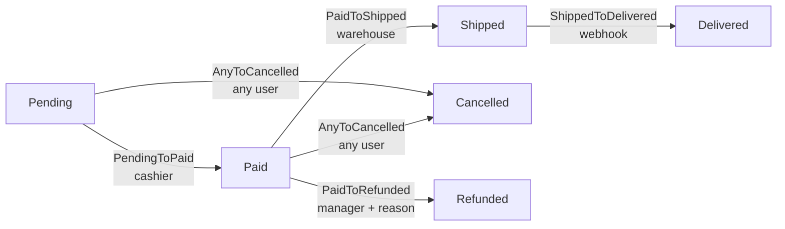

# Workflow de Pedidos (E-commerce)

> Exemplo canônico de máquina de estados para um pedido de e-commerce, exercitando autorização por papel, side-effects via webhook, transições "any-to-X" e auditoria com metadata.

## Visão geral

Pedidos em e-commerce são, talvez, o caso de uso mais clássico para máquinas de estados em backoffice: os estágios são bem definidos (pagamento, separação, expedição, entrega), múltiplos atores diferentes podem mover o pedido em pontos distintos do fluxo (cliente, caixa, expedição, sistema externo via webhook), e algumas transições são **bifurcações** que precisam estar disponíveis em vários pontos (`Cancelled`, `Refunded`).

Este exemplo cobre um workflow linear com dois ramos paralelos: o caminho feliz `Pending → Paid → Shipped → Delivered`, mais a transição "any-to" `→ Cancelled` (disponível antes da expedição), e o ramo `Paid → Refunded` (gerência apenas, com motivo obrigatório). É uma boa demonstração de como o `arqel-dev/workflow` combina três camadas de autorização (Gate, `authorizeFor`, deny-by-default), captura side-effects assíncronos via listener de evento e usa `metadata` no histórico para guardar o `webhook_event_id` de Stripe/Mercado Pago para idempotência.

A escolha de design importante aqui é: a transição `ShippedToDelivered` é disparada **apenas** por um webhook de transportadora — usuários humanos nunca veem este botão na UI. Conseguimos isso fazendo `authorizeFor()` retornar `false` para qualquer usuário autenticado, e o controller do webhook chama `->transitionTo()` com `Auth::loginUsingId(null)` (system actor), que ignora a autorização porque a transition class trata `null` user como permitido.

## Diagrama de estados



Note que `Cancelled` é alcançável a partir de `Pending` **e** `Paid` (mas não depois de `Shipped` — o pedido já saiu). Implementamos isso com uma única transition class `AnyToCancelled` que declara `from(): ['Pending', 'Paid']` em vez de duas classes distintas — reduz duplicação e centraliza regra de "pode cancelar até embalar".

## Model Eloquent

```php
<?php

declare(strict_types=1);

namespace App\Models;

use App\Models\OrderState;
use App\Workflows\Orders\Transitions;
use Arqel\Workflow\Concerns\HasWorkflow;
use Arqel\Workflow\WorkflowDefinition;
use Illuminate\Database\Eloquent\Model;

final class Order extends Model
{
    use HasWorkflow;

    protected $fillable = [
        'customer_id',
        'total_cents',
        'order_state',
        'tracking_code',
        'refund_reason',
    ];

    protected $casts = [
        'order_state' => OrderState::class, // spatie state cast (opcional)
        'total_cents' => 'integer',
    ];

    public function arqelWorkflow(): WorkflowDefinition
    {
        return WorkflowDefinition::make('order_state')
            ->states([
                OrderState\Pending::class   => ['label' => 'Pendente',   'color' => 'warning',     'icon' => 'clock'],
                OrderState\Paid::class      => ['label' => 'Pago',       'color' => 'info',        'icon' => 'credit-card'],
                OrderState\Shipped::class   => ['label' => 'Enviado',    'color' => 'primary',     'icon' => 'truck'],
                OrderState\Delivered::class => ['label' => 'Entregue',   'color' => 'success',     'icon' => 'check-circle'],
                OrderState\Cancelled::class => ['label' => 'Cancelado',  'color' => 'destructive', 'icon' => 'x-circle'],
                OrderState\Refunded::class  => ['label' => 'Reembolsado','color' => 'destructive', 'icon' => 'rotate-ccw'],
            ])
            ->transitions([
                Transitions\PendingToPaid::class,
                Transitions\PaidToShipped::class,
                Transitions\ShippedToDelivered::class,
                Transitions\AnyToCancelled::class,
                Transitions\PaidToRefunded::class,
            ]);
    }
}
```

A propriedade `order_state` é castada via spatie quando o app opta in (suggest no composer do `arqel-dev/workflow`). Sem o cast, a coluna armazena a slug ou o FQCN como string — o trait resolve igual.

## Resource (admin panel)

```php
<?php

declare(strict_types=1);

namespace App\Arqel\Resources;

use App\Models\Order;
use Arqel\Core\Resource;
use Arqel\Fields\Money;
use Arqel\Fields\Text;
use Arqel\Workflow\Fields\StateTransitionField;

final class OrderResource extends Resource
{
    protected static string $model = Order::class;

    protected static ?string $navigationIcon = 'shopping-cart';

    public function fields(): array
    {
        return [
            Text::make('customer.name')->label('Cliente')->searchable(),
            Money::make('total_cents')->currency('BRL')->label('Total'),

            StateTransitionField::make('order_state')
                ->label('Status do pedido')
                ->showDescription()
                ->showHistory()
                ->transitionsAttribute('order_state'),

            Text::make('tracking_code')
                ->label('Código de rastreio')
                ->visibleOn(['view'])
                ->visibleWhen(fn (Order $r) => in_array($r->order_state?->getMorphClass(), ['shipped', 'delivered'], true)),
        ];
    }
}
```

O `StateTransitionField` consome `arqelWorkflow()->toArray()` automaticamente, renderiza o estado atual com cor/ícone, expõe os botões das transições autorizadas e mostra o histórico append-only abaixo (quando `showHistory()` é chamado).

## Transition class com authorizeFor

```php
<?php

declare(strict_types=1);

namespace App\Workflows\Orders\Transitions;

use App\Models\Order;
use App\Models\OrderState;
use Arqel\Workflow\Concerns\RecordsStateTransition;
use Illuminate\Contracts\Auth\Authenticatable;

final class PendingToPaid
{
    use RecordsStateTransition;

    public function __construct(
        private readonly Order $order,
    ) {}

    /** @return list<class-string> */
    public static function from(): array
    {
        return [OrderState\Pending::class];
    }

    public static function to(): string
    {
        return OrderState\Paid::class;
    }

    /**
     * Apenas usuários com papel `cashier` (ou `admin`) podem confirmar pagamento.
     * Retornar `false` aqui esconde o botão da UI e bloqueia a chamada server-side.
     */
    public static function authorizeFor(?Authenticatable $user, mixed $record): bool
    {
        if ($user === null) {
            return false;
        }

        return $user->hasAnyRole(['cashier', 'admin']);
    }

    public function handle(): Order
    {
        $this->order->order_state = OrderState\Paid::class;
        $this->order->paid_at = now();
        $this->order->save();

        // Dispara o evento canônico — RecordsStateTransition cuida disso quando usado pelo trait.
        return $this->order;
    }
}
```

Para `PaidToShipped` e `PaidToRefunded` usamos Gates registradas em `AuthServiceProvider`, ilustrando a alternativa:

```php
// app/Providers/AuthServiceProvider.php
Gate::define('transition-paid-to-shipped', function ($user, Order $order): bool {
    return $user->hasRole('warehouse');
});

Gate::define('transition-paid-to-refunded', function ($user, Order $order): bool {
    return $user->hasRole('manager') && filled($order->refund_reason);
});
```

O `TransitionAuthorizer` do `arqel-dev/workflow` consulta primeiro `authorizeFor` (quando declarado), cai para a Gate `transition-{from-slug}-to-{to-slug}` em seguida, e finalmente nega por padrão. Note que `transition-paid-to-refunded` também valida `refund_reason` preenchido — combinar regras de autorização e validação de domínio na Gate é aceitável quando o motivo é simples.

## Filtro por estado na Table

```php
use App\Models\Order;
use Arqel\Workflow\Filters\StateFilterFactory;

public function table(): Table
{
    return Table::make()
        ->columns([
            TextColumn::make('id')->prefix('#'),
            TextColumn::make('customer.name'),
            BadgeColumn::make('order_state')
                ->colorsFromWorkflow(Order::class),
            DateTimeColumn::make('created_at'),
        ])
        ->filters([
            StateFilterFactory::forResource(Order::class),
        ])
        ->defaultSort('created_at', 'desc');
}
```

A factory `StateFilterFactory::forResource(Order::class)` resolve o campo automaticamente a partir do `arqelWorkflow()->getField()` — não precisa repetir `'order_state'`. O dropdown gerado mostra todos os estados com label/cor configuradas.

## Listener de auditoria — email no Shipped

```php
<?php

declare(strict_types=1);

namespace App\Listeners;

use App\Mail\OrderShipped;
use App\Models\Order;
use App\Models\OrderState;
use Arqel\Workflow\Events\StateTransitioned;
use Illuminate\Contracts\Queue\ShouldQueue;
use Illuminate\Support\Facades\Mail;

final class NotifyCustomerOfShipment implements ShouldQueue
{
    public function handle(StateTransitioned $event): void
    {
        if (! $event->record instanceof Order) {
            return;
        }

        if ($event->to !== OrderState\Shipped::class) {
            return;
        }

        Mail::to($event->record->customer)
            ->send(new OrderShipped(
                order: $event->record,
                trackingCode: $event->context['tracking_code'] ?? null,
            ));
    }
}
```

Registrado em `EventServiceProvider`:

```php
protected $listen = [
    \Arqel\Workflow\Events\StateTransitioned::class => [
        \App\Listeners\NotifyCustomerOfShipment::class,
        // outros listeners (broadcast, métricas, etc.)
    ],
];
```

O webhook da transportadora chama `transitionTo()` passando `metadata` que vai parar no histórico:

```php
$order->transitionTo(OrderState\Shipped::class, [
    'tracking_code'    => $payload['tracking_code'],
    'webhook_event_id' => $payload['event_id'],   // idempotência
    'carrier'          => $payload['carrier'],
]);
```

O listener `PersistStateTransitionToHistory` (já registrado pelo `WorkflowServiceProvider`) grava o registro em `arqel_state_transitions` com `metadata` JSON contendo essas chaves — útil para investigação posterior e para evitar processar o mesmo webhook duas vezes (o controller faz `where('metadata->webhook_event_id', $eventId)->exists()` antes de transicionar).

## Resumo das decisões

- **`Cancelled` como "any-to"**: uma única transition class com `from()` listando estados permitidos é mais simples que N classes.
- **Webhook como ator**: `ShippedToDelivered::authorizeFor` retorna `false` para humanos; só o controller de webhook (chamado fora de `Auth`) pode disparar.
- **Motivo de refund na Gate**: `filled($order->refund_reason)` na Gate impede transição sem campo preenchido — alternativa é validar no controller.
- **Idempotência por metadata**: `webhook_event_id` no `metadata` permite re-processar webhooks duplicados sem efeito colateral.
