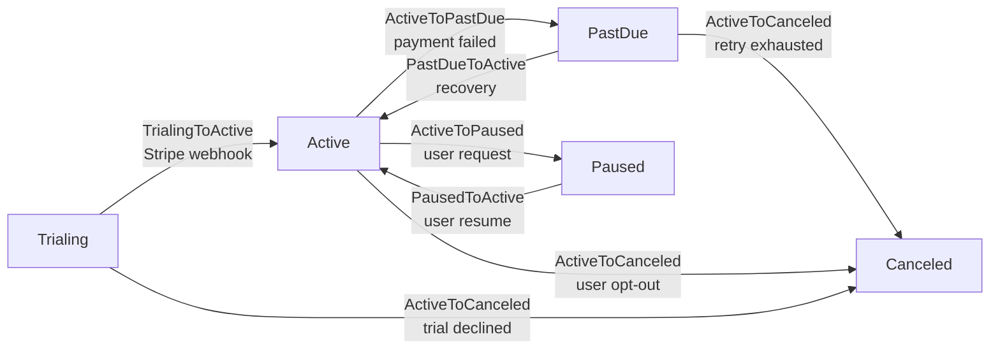

# Workflow de Assinaturas (SaaS billing)

> Exemplo de máquina de estados para assinaturas SaaS, demonstrando transições disparadas por webhooks de provider de pagamento (Stripe), side-effects em cache/quotas e uso intensivo de `metadata` para idempotência.

## Visão geral

Em SaaS billing, a máquina de estados de uma assinatura é o ponto onde o domínio do produto encontra o sistema de pagamento externo. **A maior parte das transições não é iniciada por um humano** — Stripe (ou Mercado Pago, ou Adyen) envia webhooks dizendo "pagamento confirmado", "tentativa falhou", "cliente cancelou no portal". Isso muda a forma como pensamos autorização: o "ator" típico é o próprio sistema, e o que precisamos garantir é (a) **idempotência** — o mesmo evento não pode ser processado duas vezes; (b) **side-effects consistentes** — quando a assinatura entra em `PastDue`, o cache de feature flags daquele tenant precisa ser invalidado **antes** da próxima request HTTP do usuário; e (c) **rastreabilidade total** — auditores precisam ver "qual webhook do Stripe causou esta transição" para reconciliar com extratos.

O workflow é `Trialing → Active → PastDue → Canceled`, com a bifurcação `Active → Paused` (pause manual pelo cliente, retomada via `Paused → Active`). `Trialing` é o estado inicial após signup; `Active` significa pagamento em dia; `PastDue` é cobrança falhou (mas ainda dentro da janela de retry); `Canceled` é terminal (qualquer downgrade futuro cria nova subscription, não reativa esta). A transição `PastDueToActive` (recovery — Stripe consegue cobrar no retry) é a mais sensível: precisa restaurar quotas, reativar features, e NÃO deve disparar email de "bem-vindo" porque o cliente já é cliente.

A escolha de design central deste exemplo é **usar `metadata` da transição como contrato de auditoria**. Toda transição vinda de webhook carrega no mínimo `subscription_id` (id do provider), `webhook_event_id` (id único Stripe), `event_type` (`invoice.payment_succeeded`, `invoice.payment_failed`, etc.) e `processed_at`. Antes de processar, o controller faz `StateTransition::where('metadata->webhook_event_id', $eventId)->exists()` para rejeitar duplicatas. Esse padrão substitui idempotency keys em Redis e é mais auditável.

## Diagrama de estados



`ActiveToCanceled` é alcançável de `Trialing`, `Active` e `PastDue` — implementado como uma única transition class com `from(): [Trialing, Active, PastDue]`. Usuários podem cancelar imediatamente (transição direta) ou no fim do período (a UI agenda um job para `now()->addDays($daysRemaining)` que dispara a transition). Ambos os caminhos passam pela mesma classe — o que muda é o `context`.

## Model Eloquent

```php
<?php

declare(strict_types=1);

namespace App\Models;

use App\Models\SubscriptionState;
use App\Workflows\Subscriptions\Transitions;
use Arqel\Workflow\Concerns\HasWorkflow;
use Arqel\Workflow\WorkflowDefinition;
use Illuminate\Database\Eloquent\Model;
use Illuminate\Database\Eloquent\Relations\BelongsTo;

final class Subscription extends Model
{
    use HasWorkflow;

    protected $fillable = [
        'tenant_id',
        'plan_id',
        'subscription_state',
        'stripe_subscription_id',
        'current_period_end',
        'trial_ends_at',
        'canceled_at',
        'paused_until',
    ];

    protected $casts = [
        'subscription_state' => SubscriptionState::class,
        'current_period_end' => 'datetime',
        'trial_ends_at'      => 'datetime',
        'canceled_at'        => 'datetime',
        'paused_until'       => 'datetime',
    ];

    public function arqelWorkflow(): WorkflowDefinition
    {
        return WorkflowDefinition::make('subscription_state')
            ->states([
                SubscriptionState\Trialing::class => ['label' => 'Em teste',     'color' => 'info',        'icon' => 'gift'],
                SubscriptionState\Active::class   => ['label' => 'Ativa',         'color' => 'success',     'icon' => 'check-circle'],
                SubscriptionState\PastDue::class  => ['label' => 'Pagamento atrasado', 'color' => 'warning', 'icon' => 'alert-triangle'],
                SubscriptionState\Paused::class   => ['label' => 'Pausada',       'color' => 'secondary',   'icon' => 'pause-circle'],
                SubscriptionState\Canceled::class => ['label' => 'Cancelada',     'color' => 'destructive', 'icon' => 'x-octagon'],
            ])
            ->transitions([
                Transitions\TrialingToActive::class,
                Transitions\ActiveToPastDue::class,
                Transitions\PastDueToActive::class,
                Transitions\ActiveToCanceled::class,
                Transitions\ActiveToPaused::class,
                Transitions\PausedToActive::class,
            ]);
    }

    public function tenant(): BelongsTo
    {
        return $this->belongsTo(Tenant::class);
    }

    public function plan(): BelongsTo
    {
        return $this->belongsTo(Plan::class);
    }
}
```

## Resource

```php
<?php

declare(strict_types=1);

namespace App\Arqel\Resources;

use App\Models\Subscription;
use Arqel\Core\Resource;
use Arqel\Fields\DateTime;
use Arqel\Fields\Text;
use Arqel\Workflow\Fields\StateTransitionField;

final class SubscriptionResource extends Resource
{
    protected static string $model = Subscription::class;

    protected static ?string $navigationGroup = 'Billing';

    public function fields(): array
    {
        return [
            Text::make('tenant.name')->label('Tenant')->searchable(),
            Text::make('plan.name')->label('Plano'),
            Text::make('stripe_subscription_id')->label('Stripe ID')->copyable(),

            StateTransitionField::make('subscription_state')
                ->label('Status')
                ->showDescription()
                ->showHistory(),

            DateTime::make('current_period_end')->label('Fim do período atual'),
            DateTime::make('trial_ends_at')->label('Fim do trial')->placeholder('—'),
            DateTime::make('canceled_at')->label('Cancelada em')->placeholder('—'),
        ];
    }
}
```

## Transition class com authorizeFor — webhook only

```php
<?php

declare(strict_types=1);

namespace App\Workflows\Subscriptions\Transitions;

use App\Models\Subscription;
use App\Models\SubscriptionState;
use Illuminate\Contracts\Auth\Authenticatable;

final class TrialingToActive
{
    public function __construct(
        private readonly Subscription $subscription,
    ) {}

    /** @return list<class-string> */
    public static function from(): array
    {
        return [SubscriptionState\Trialing::class];
    }

    public static function to(): string
    {
        return SubscriptionState\Active::class;
    }

    /**
     * Esta transição NUNCA é iniciada por humanos — só pelo webhook handler do Stripe.
     * Negamos para qualquer usuário autenticado para esconder o botão da UI; o webhook
     * controller chama transitionTo() fora do contexto de Auth, o que bypassa esta checagem
     * (TransitionAuthorizer aceita user null como "system actor" quando authorizeFor o autoriza).
     */
    public static function authorizeFor(?Authenticatable $user, mixed $record): bool
    {
        return $user === null; // só sistema
    }

    public function handle(): Subscription
    {
        $this->subscription->subscription_state = SubscriptionState\Active::class;
        $this->subscription->trial_ends_at = null;
        $this->subscription->save();

        return $this->subscription;
    }
}
```

## Webhook controller (Stripe)

```php
<?php

declare(strict_types=1);

namespace App\Http\Controllers;

use App\Models\Subscription;
use App\Models\SubscriptionState;
use Arqel\Workflow\Models\StateTransition;
use Illuminate\Http\Request;
use Illuminate\Support\Facades\DB;

final class StripeWebhookController
{
    public function __invoke(Request $request): \Illuminate\Http\Response
    {
        $payload = $this->verifyAndParse($request);
        $eventId = $payload['id'];

        // Idempotência: já processamos este event?
        if (StateTransition::where('metadata->webhook_event_id', $eventId)->exists()) {
            return response('already_processed', 200);
        }

        $subscription = Subscription::where('stripe_subscription_id', $payload['data']['object']['subscription'])
            ->firstOrFail();

        $context = [
            'subscription_id'  => $payload['data']['object']['subscription'],
            'webhook_event_id' => $eventId,
            'event_type'       => $payload['type'],
            'processed_at'     => now()->toIso8601String(),
        ];

        DB::transaction(function () use ($subscription, $payload, $context): void {
            match ($payload['type']) {
                'invoice.payment_succeeded' => $subscription->subscription_state instanceof SubscriptionState\Trialing
                    ? $subscription->transitionTo(SubscriptionState\Active::class, $context)
                    : ($subscription->subscription_state instanceof SubscriptionState\PastDue
                        ? $subscription->transitionTo(SubscriptionState\Active::class, $context + ['recovery' => true])
                        : null),

                'invoice.payment_failed' => $subscription->transitionTo(SubscriptionState\PastDue::class, $context + [
                    'attempt_count' => $payload['data']['object']['attempt_count'] ?? 1,
                ]),

                'customer.subscription.deleted' => $subscription->transitionTo(SubscriptionState\Canceled::class, $context),

                default => null,
            };
        });

        return response('ok', 200);
    }

    /** @return array<string,mixed> */
    private function verifyAndParse(Request $request): array
    {
        // Stripe signature verification (omitido por brevidade)
        return $request->json()->all();
    }
}
```

Note três coisas: (1) **idempotência via metadata** — a query `where('metadata->webhook_event_id', ...)` aproveita índice JSON do Postgres/MySQL; (2) **transaction wrapping** — a transição e os side-effects do listener rodam num único commit; (3) o `match` decide a transição com base no estado atual + tipo de evento, mas a complexidade fica contida no controller.

## Filter por estado na Table

```php
use App\Models\Subscription;
use App\Models\SubscriptionState;
use Arqel\Workflow\Filters\StateFilter;

public function table(): Table
{
    return Table::make()
        ->columns([
            TextColumn::make('tenant.name'),
            TextColumn::make('plan.name'),
            BadgeColumn::make('subscription_state')->colorsFromWorkflow(Subscription::class),
            DateTimeColumn::make('current_period_end'),
        ])
        ->filters([
            StateFilter::make('subscription_state', Subscription::class)
                ->label('Status'),
        ])
        ->defaultFilters([
            'subscription_state' => [
                SubscriptionState\PastDue::class,
                SubscriptionState\Active::class,
            ],
        ])
        ->actions([
            // Ações de billing-ops apoiadas em filtros do StateFilter
            Action::make('retry_failed_payments')
                ->visible(fn () => request('filter.subscription_state') === SubscriptionState\PastDue::class)
                ->action(fn () => RetryFailedPaymentsJob::dispatch()),
        ]);
}
```

## Listener — invalidar cache + ajustar quotas

```php
<?php

declare(strict_types=1);

namespace App\Listeners;

use App\Models\Subscription;
use App\Models\SubscriptionState;
use App\Services\FeatureFlagCache;
use App\Services\QuotaManager;
use Arqel\Workflow\Events\StateTransitioned;
use Illuminate\Contracts\Queue\ShouldQueue;
use Illuminate\Support\Facades\Mail;

final class ApplySubscriptionStateSideEffects implements ShouldQueue
{
    public function __construct(
        private readonly FeatureFlagCache $flags,
        private readonly QuotaManager $quotas,
    ) {}

    public function handle(StateTransitioned $event): void
    {
        if (! $event->record instanceof Subscription) {
            return;
        }

        $subscription = $event->record;

        // 1. Sempre invalida o cache de feature flags do tenant — qualquer mudança de
        //    estado pode alterar o que ele pode/não pode usar.
        $this->flags->invalidateForTenant($subscription->tenant_id);

        // 2. Ajusta quotas conforme o estado destino.
        match ($event->to) {
            SubscriptionState\Active::class   => $this->quotas->restorePlanQuotas($subscription),
            SubscriptionState\PastDue::class  => $this->quotas->applyGracePeriodLimits($subscription),
            SubscriptionState\Canceled::class => $this->quotas->revokeAll($subscription),
            SubscriptionState\Paused::class   => $this->quotas->freezeUsage($subscription),
            default => null,
        };

        // 3. Email de retenção quando entra em PastDue (não em Canceled — tarde demais).
        if ($event->to === SubscriptionState\PastDue::class && $subscription->tenant?->billingContact !== null) {
            Mail::to($subscription->tenant->billingContact)
                ->send(new \App\Mail\PaymentFailedRetention(
                    subscription: $subscription,
                    attemptCount: (int) ($event->context['attempt_count'] ?? 1),
                    webhookEventId: $event->context['webhook_event_id'] ?? null,
                ));
        }

        // 4. Recovery (PastDue → Active): NÃO envia email de boas-vindas.
        //    Loga para métrica de recovery rate.
        if ($event->from === SubscriptionState\PastDue::class && $event->to === SubscriptionState\Active::class) {
            \App\Metrics\BillingMetrics::recordRecovery(
                subscriptionId: $subscription->id,
                webhookEventId: $event->context['webhook_event_id'] ?? null,
            );
        }
    }
}
```

Pontos a notar:

- O listener é `ShouldQueue` — side-effects podem ser lentos (invalidação de cache distribuída, envio de email), e atrasos não devem bloquear o webhook ACK ao Stripe.
- A invalidação de cache de feature flags acontece **sempre**, independente do estado destino — é mais barato invalidar do que tentar deduzir quando exatamente um flag mudou.
- `event->context['webhook_event_id']` é propagado para métricas e emails — permite reconciliar tudo com o dashboard do Stripe depois.

## Metadata no histórico — exemplo prático

Após uma transição via webhook, a entrada em `arqel_state_transitions` fica:

```json
{
  "id": 1042,
  "model_type": "App\\Models\\Subscription",
  "model_id": 17,
  "from_state": "App\\Models\\SubscriptionState\\Trialing",
  "to_state": "App\\Models\\SubscriptionState\\Active",
  "transitioned_by_user_id": null,
  "metadata": {
    "subscription_id": "sub_1NxYzABC123",
    "webhook_event_id": "evt_1NxYzABC123",
    "event_type": "invoice.payment_succeeded",
    "processed_at": "2026-04-30T14:32:01+00:00"
  },
  "created_at": "2026-04-30 14:32:01"
}
```

Um auditor pesquisando por `evt_1NxYzABC123` no Stripe Dashboard pode bater diretamente com este registro, e vice-versa. Para `recovery: true`, a coluna distingue um pagamento bem-sucedido normal de uma recuperação de inadimplência — métrica chave em SaaS.

## Resumo das decisões

- **Sistema como ator**: `authorizeFor` retorna `true` quando user é `null` para webhooks; humanos vêem botões apenas para `Cancel` e `Pause`/`Resume`.
- **Idempotência via `metadata->webhook_event_id`**: substitui Redis idempotency keys; é mais auditável.
- **Side-effects no listener `ShouldQueue`**: webhook ACK rápido para Stripe; trabalho real assíncrono.
- **`recovery: true` no context**: distingue retry-success de pagamento inicial — importante para emails e métricas.
- **Sem retorno de `Canceled`**: estado terminal. Reativação cria nova subscription.
