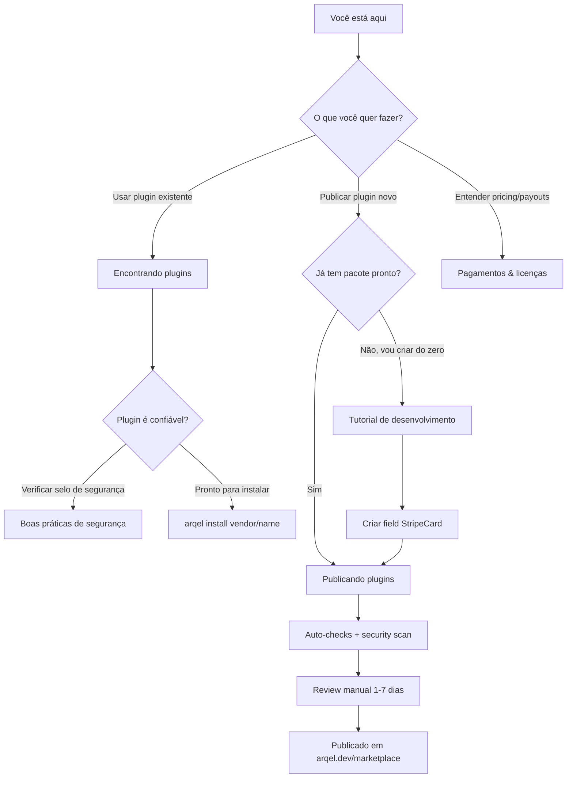

# Marketplace Arqel

> Hub oficial para descobrir, publicar e consumir extensões da comunidade Arqel.

O **Arqel Marketplace** (em `arqel.dev/marketplace`) é o catálogo central de plugins community-driven que estendem o framework. Ele foi construído como um pacote embeddable (`arqel/marketplace`) e _dogfooded_ pela própria instância pública — ou seja, o site oficial é um admin Arqel rodando o marketplace package internamente.

## Visão geral

O marketplace existe para resolver três problemas distintos:

1. **Descoberta** — usuários do framework precisam de um lugar único para encontrar fields, widgets, integrações e temas oficiais ou da comunidade, com filtros, ratings e badges de segurança.
2. **Distribuição** — autores precisam de um caminho previsível e auditado para publicar pacotes (Composer + npm) com validação de convenção, scan de segurança e moderação manual.
3. **Monetização** — opcionalmente, plugins premium podem ser comercializados via license keys e revenue share 80/20 (publisher/Arqel).

Tudo isso conversa com o ecossistema Composer/npm sem reinventar registries — o marketplace é apenas a camada de discovery + curadoria + segurança em cima de pacotes que continuam hospedados em Packagist e npm registry.

## Os 4 tipos de plugin

| Tipo | Pacote PHP | Pacote npm companion | Exemplos típicos |
|---|---|---|---|
| **field-pack** | `arqel/fields-*` | `@vendor/arqel-fields-*` | Stripe Card, Mapbox Address, Markdown Editor |
| **widget-pack** | `arqel/widgets-*` | `@vendor/arqel-widgets-*` | Stat cards, charts, calendários |
| **integration** | `arqel/integration-*` | `@vendor/arqel-integration-*` | Slack notify, Algolia search, Sentry |
| **theme** | `arqel/theme-*` | `@vendor/arqel-theme-*` | Dark mode variants, white-label kits |

A categoria adicional `language-pack` cobre traduções e a `tool` cobre extensões CLI/Artisan.

## Decision tree

## Sub-documentos

- [Encontrando plugins](./finding-plugins.md) — busca, filtros, instalação, confiança.
- [Publicando plugins](./publishing.md) — submission, review queue, status pipeline.
- [Tutorial de desenvolvimento](./development-tutorial.md) — passo a passo para criar um field-pack do zero.
- [Boas práticas de segurança](./security-best-practices.md) — vulnerabilidades a evitar, license obligations, disclosure.
- [Pagamentos & licenças](./payments-and-licensing.md) — pricing, license keys, payouts, refunds.

## Marketplace vs install direto (Composer/npm)

Pode parecer redundante ter um marketplace quando Composer já distribui pacotes PHP e npm já distribui pacotes JS. Os trade-offs:

| Aspecto | Composer/npm direto | Marketplace |
|---|---|---|
| **Descoberta** | Busca manual em Packagist/npm; sem filtros Arqel-aware | Categorias, trending, featured curados, busca semântica |
| **Compatibilidade** | Você lê `composer.json` e descobre se funciona | Constraint `arqel.compat.arqel: '^1.0'` validado pelo `PluginConventionValidator` |
| **Segurança** | Você confia no autor cegamente | Scan automático (`SecurityScanner` + `VulnerabilityDatabase`), auto-delist em finding `critical` |
| **Reviews/ratings** | Não existe canalmente | `arqel_plugin_reviews` com helpful votes, sort options, moderation queue |
| **Pagamento** | Pacotes pagos são raros e ad-hoc | License keys `ARQ-XXXX-XXXX-XXXX-XXXX` + revenue share automático |
| **Atualizações** | `composer update` sem contexto | `arqel:plugin:list --validate` mostra divergência de convenção |
| **Velocidade** | Você sabe exatamente o que está fazendo | Curva extra para publishers (form de submissão, review wait) |

**Quando preferir install direto?** Plugins internos de empresa, pacotes privados, ou enquanto o plugin ainda está em alpha e você quer iterar rápido. Tudo que é Composer/npm continua funcionando — o marketplace **complementa**, não substitui.

**Quando preferir marketplace?** Plugins community que vão ser instalados por terceiros, qualquer plugin pago, qualquer plugin que toca dados sensíveis (logs, payments, auth) e portanto ganha com o security scan obrigatório.

## Status atual da entrega

A spec MKTPLC-* está implementada nas seguintes áreas (ver `packages/marketplace/SKILL.md` para detalhe):

- ✅ Submission + review workflow (MKTPLC-002)
- ✅ Validador de convention + comando `arqel:plugin:list` (MKTPLC-003)
- ✅ Reviews + ratings + helpful votes + moderation (MKTPLC-006)
- ✅ Categorias + trending + featured (MKTPLC-007)
- ✅ Premium plugins + license keys + payouts schema (MKTPLC-008)
- ✅ Security scanning + auto-delist (MKTPLC-009)
- ⏳ Stats/analytics dashboard (MKTPLC-004)
- ⏳ Stripe Connect real (MKTPLC-008-stripe-real)

## Endpoints REST de referência

A API pública do marketplace é consumida tanto pelo site `arqel.dev/marketplace` quanto pelo CLI `arqel:install` e por integrations terceiras (CI checks, dashboards corporativos):

| Endpoint | Método | Auth | Descrição |
|---|---|---|---|
| `/api/marketplace/plugins` | GET | público | Listing paginado com `type` + `search` filters |
| `/api/marketplace/plugins/{slug}` | GET | público | Detail + 5 reviews + versions |
| `/api/marketplace/plugins/{slug}/reviews` | GET | público | Reviews com sort `helpful`/`recent`/`rating` |
| `/api/marketplace/plugins/{slug}/reviews` | POST | Sanctum | Cria review |
| `/api/marketplace/plugins/submit` | POST | Sanctum | Submit de plugin (publisher) |
| `/api/marketplace/categories` | GET | público | Lista categorias (raiz + children) |
| `/api/marketplace/featured` | GET | público | Editor's picks |
| `/api/marketplace/trending` | GET | público | Top 20 por trending score |
| `/api/marketplace/new?days=7` | GET | público | Plugins recentes |
| `/api/marketplace/popular` | GET | público | All-time installations leaderboard |
| `/api/marketplace/plugins/{slug}/purchase` | POST | Sanctum | Initiate compra premium |
| `/api/marketplace/plugins/{slug}/purchase/confirm` | POST | Sanctum | Confirm callback do gateway |
| `/api/marketplace/plugins/{slug}/download` | GET | Sanctum | Download (free direto, premium com license) |

Endpoints admin (Gates `marketplace.review`, `marketplace.feature`, `marketplace.refund`, `marketplace.moderate-reviews`, `marketplace.security-scans`) ficam sob prefixo `/api/marketplace/admin/...` e são opacos para non-admins.

## Próximos passos

Se você é **usuário** do framework: comece em [Encontrando plugins](./finding-plugins.md).

Se você é **publisher** com um pacote PHP/npm já pronto: vá direto para [Publicando plugins](./publishing.md).

Se você quer **criar um plugin do zero**: siga o [Tutorial de desenvolvimento](./development-tutorial.md).
