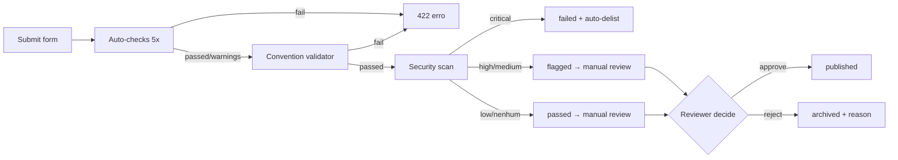

# Publicando plugins

> Guia completo para autores que querem publicar plugins no Arqel Marketplace.

Esta página descreve o pipeline de publicação **de ponta a ponta**: setup de conta, submissão, auto-checks, security scan, review manual, releases subsequentes e tracking de estatísticas.

## Pré-requisitos

Antes de submeter, você precisa ter:

1. **Pacote PHP** publicado em Packagist (`vendor/package`) com `type: arqel-plugin` no `composer.json`.
2. **(Opcional) Pacote npm companion** para o lado React, publicado em npm registry (`@vendor/package`).
3. **Repositório público no GitHub** com `LICENSE` (preferencialmente MIT — ver allow-list em [Boas práticas de segurança](./security-best-practices.md)).
4. **Pelo menos 1 release tagueado** (`v0.1.0` ou superior, semver-compliant).
5. **Convention compliant** — rode `arqel:plugin:list --validate` localmente para garantir.

Se algum desses estiver faltando, abra primeiro o [Tutorial de desenvolvimento](./development-tutorial.md) — ele cobre setup de zero.

## Passo 1 — Conta de publisher

Crie sua conta em `arqel.dev/marketplace/signup`. O form pede:

- **Email** (verificação obrigatória — link expira em 24h).
- **Display name** público que aparecerá ao lado de cada plugin seu.
- **GitHub username** para vinculação automática de repos.
- **Composer vendor namespace** (ex: `acme`) — você só pode submeter plugins sob esse namespace.
- **(Opcional) Stripe Connect onboarding** se você pretende publicar plugins pagos. Pode ser feito depois.

A conta tem três estados: `unverified` → `verified` → `publisher`. Apenas `publisher` pode submeter — escalação automática após verificar email + provar ownership do GitHub via OAuth.

## Passo 2 — Form de submissão

Endpoint REST: `POST /api/marketplace/plugins/submit` (auth Sanctum required, controller `PluginSubmissionController`).

Payload mínimo:

```json
{
  "composer_package": "acme/stripe-card",
  "npm_package": "@acme/arqel-stripe-fields",
  "github_url": "https://github.com/acme/arqel-stripe-card",
  "type": "field-pack",
  "name": "Stripe Card Field",
  "description": "Renderiza o Stripe Elements Card como um Field Arqel pronto para PaymentMethod.",
  "screenshots": [
    "https://raw.githubusercontent.com/acme/arqel-stripe-card/main/docs/screen-1.png",
    "https://raw.githubusercontent.com/acme/arqel-stripe-card/main/docs/screen-2.png"
  ]
}
```

Validação aplicada por `SubmitPluginRequest`:

| Campo | Regra |
|---|---|
| `composer_package` | regex `vendor/package`, único em `arqel_plugins` |
| `npm_package` | string opcional |
| `github_url` | URL válida, host `github.com` (warn se outro) |
| `type` | enum `field-pack`/`widget-pack`/`integration`/`theme`/`language-pack`/`tool` |
| `name` | 3-100 chars |
| `description` | 20-2000 chars (warn se < 50) |
| `screenshots[]` | array de URLs públicas (warn se 0) |
| `slug` | derivado de `name` via `Str::slug` quando ausente; uniqueness check |

A resposta `201` traz `{plugin: {...}, checks: {checks: [...], passed: bool}}` — você verá imediatamente quais auto-checks passaram. Se `passed: false`, o plugin **ainda** entra com `status=pending`, mas a review queue é alertada e o tempo de aprovação aumenta.

## Passo 3 — Auto-checks (sem rede)

O `PluginAutoChecker` roda 5 verificações defensivas:

1. **`composer_package_format`** — fail se regex inválida.
2. **`github_url_format`** — fail se host não é `github.com`.
3. **`description_length`** — warn se < 50 chars.
4. **`screenshots_count`** — warn se 0.
5. **`name_uniqueness`** — warn se outro plugin published já tem nome similar.

Esses checks são instantâneos — não fazem HTTP requests. A intenção é falhar rápido em erros óbvios sem prender CI por minutos.

## Passo 4 — Convention validation

O `PluginConventionValidator` (MKTPLC-003) é o segundo gatekeeper. Ele exige que o `composer.json` do seu pacote contenha:

```json
{
  "name": "acme/stripe-card",
  "type": "arqel-plugin",
  "description": "Stripe Card Field for Arqel",
  "license": "MIT",
  "keywords": ["arqel", "plugin", "field", "stripe", "payments"],
  "extra": {
    "arqel": {
      "plugin-type": "field-pack",
      "category": "integrations",
      "compat": {
        "arqel": "^1.0"
      },
      "installation-instructions": "https://github.com/acme/arqel-stripe-card#installation"
    }
  }
}
```

Erros (fail):

- `type` não é `arqel-plugin`.
- `extra.arqel.plugin-type` ausente ou fora do enum.
- `extra.arqel.compat.arqel` não é constraint semver válida.
- `extra.arqel.category` ausente ou vazia.

Warnings (passa mas alerta):

- `extra.arqel.installation-instructions` ausente.
- `keywords` não inclui `arqel` + `plugin`.

E o `package.json` do companion npm precisa de **um dos dois**:

```json
{
  "arqel": { "plugin-type": "field-pack" }
}
```

ou

```json
{
  "peerDependencies": { "@arqel-dev/types": "^1.0" }
}
```

## Passo 5 — Security scan

Após validation, o `SecurityScanner` (MKTPLC-009) cria uma row `arqel_plugin_security_scans` em `running` e roda quatro etapas:

1. **Vulnerability lookup** — consulta `VulnerabilityDatabase` (default `StaticVulnerabilityDatabase` retornando empty; host apps podem rebindar para GitHub Advisory Database real). Cada package composer + npm é consultado.
2. **License check** — confere `composer.json#license` contra allow-list (`MIT`, `Apache-2.0`, `BSD-2-Clause`, `BSD-3-Clause`). Fora da lista vira warning `low`.
3. **Suspicious patterns** — placeholder atual (TODO MKTPLC-009-static-analysis). No futuro, scan estático para `eval`, `exec`, `file_get_contents` em URLs de user input, etc.
4. **Severity rollup** — pega o máximo de todos findings.

Resultado:

| Severity máxima | Ação |
|---|---|
| `critical` | `status=failed` + auto-delist (`status=archived`) + dispatch `PluginAutoDelistedEvent` |
| `high` ou `medium` | `status=flagged` + alerta para review manual |
| `low` ou nenhum | `status=passed` |

Se seu plugin é `flagged`, **não se desespere** — abra a página de detalhe do scan no admin dashboard, leia os findings e responda com remediation. O reviewer humano decide caso a caso.

## Passo 6 — Review manual

Plugins com `status=pending` entram na fila de moderação (`GET /admin/plugins?status=pending`, Gate `marketplace.review`). O reviewer humano:

1. Lê descrição + screenshots.
2. Visita `github_url` e dá uma olhada no código (especialmente service provider e qualquer `Http`/`Process`/`Storage` call).
3. Confere se o plugin não viola guidelines (sem cripto adversarial, sem coleta de telemetria opaca, sem dependência abandonware).
4. Aprova ou rejeita via `POST /admin/plugins/{slug}/review`.

Timeline esperada:

| Cenário | Tempo |
|---|---|
| Auto-checks passed + scan passed + reviewer disponível | 1-2 dias |
| Warnings em auto-checks ou scan flagged | 3-5 dias |
| Rejeitado e re-submetido após fix | 5-7 dias |
| Backlog grande (releases majores do framework) | até 14 dias |

Aprovado → `status=published` + dispatch `PluginApproved` event → plugin aparece em `/api/marketplace/plugins`. Rejeitado → `status=archived` + `rejection_reason` populado + dispatch `PluginRejected`. Você recebe email com motivo (integração de email é TBD; por enquanto você consulta via `GET /publisher/plugins`).

## Passo 7 — Releases subsequentes

Cada nova versão do seu plugin gera uma row em `arqel_plugin_versions`:

```http
POST /api/marketplace/plugins/{slug}/versions
{
  "version": "1.2.0",
  "changelog": "Adicionado suporte a Stripe Connect Express. Fix em currency=EUR.",
  "released_at": "2026-05-15T14:00:00Z"
}
```

Versões seguem semver estrito. O marketplace **não** re-roda security scan automaticamente em toda release (caro) — mas roda diariamente via `arqel:marketplace:scan` agendado. Você pode forçar scan via dashboard quando shippa fix de vulnerability.

Ao publicar release com **breaking change**, atualize `extra.arqel.compat.arqel` no `composer.json` do tag novo. Usuários com framework <`compat.arqel` continuarão recebendo a versão antiga via Composer resolver — sem ação extra do marketplace.

## Passo 8 — Estatísticas

A dashboard do publisher (`/marketplace/publisher/dashboard`) consome quatro endpoints:

```http
GET /api/marketplace/publisher/plugins
GET /api/marketplace/publisher/plugins/{slug}/installations?days=30
GET /api/marketplace/publisher/plugins/{slug}/reviews
GET /api/marketplace/publisher/payouts
```

Cada um retorna métricas filtradas por `publisher_user_id = auth()->id()`. Detalhe completo de stats fica em [MKTPLC-004 — analytics](https://github.com/arqel-dev/arqel/blob/main/PLANNING/11-fase-4-ecossistema.md) (entrega futura).

Para plugins pagos, você também enxerga purchases agregadas + payouts pendentes:

```http
GET /api/marketplace/publisher/payouts?per_page=20
```

Detalhes em [Pagamentos & licenças](./payments-and-licensing.md).

## Pipeline visual



## Checklist do publisher

Antes de submeter, confira:

- [ ] `composer.json#type === "arqel-plugin"`
- [ ] `extra.arqel.plugin-type` correto
- [ ] `extra.arqel.compat.arqel` é semver constraint válida
- [ ] `extra.arqel.category` populada
- [ ] `keywords` inclui `arqel` + `plugin`
- [ ] `LICENSE` no repositório (MIT preferível)
- [ ] README com installation, usage example, screenshots
- [ ] Pelo menos 1 release tagueado em GitHub
- [ ] Pacote publicado em Packagist
- [ ] (Opcional) Pacote npm companion publicado
- [ ] Auto-checks locais via `arqel:plugin:list --validate`

## Próximos passos

- Quer construir um plugin do zero? Veja [Tutorial de desenvolvimento](./development-tutorial.md).
- Quer ativar pagamento? Veja [Pagamentos & licenças](./payments-and-licensing.md).
- Plugin foi rejeitado por security? Veja [Boas práticas de segurança](./security-best-practices.md).
